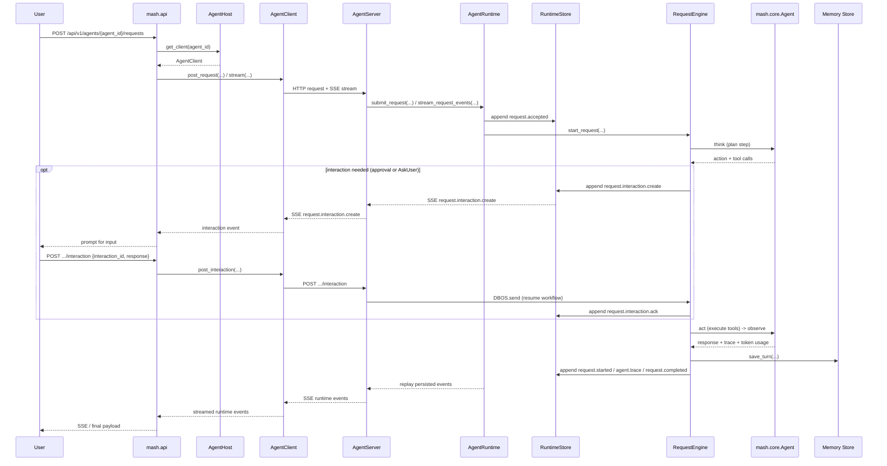

# Contributing to Mash

## Development Setup

```bash
git clone https://github.com/imsid/mashpy.git
cd mashpy
uv venv
uv sync
source .venv/bin/activate
```

## Running Tests

```bash
uv run --extra dev pytest -q tests/mash
```

Test directories mirror the source layout:

| Change area | Test directory |
|---|---|
| Runtime | `tests/mash/runtime` |
| API | `tests/mash/api` |
| CLI / REPL | `tests/mash/cli` |
| Workflows | `tests/mash/workflows` |

Before submitting broad changes, run the full suite:

```bash
uv run --extra dev pytest -q tests/mash
```

## Repo Structure

```text
src/mash/          Mash package: SDK, runtime, API, CLI, workflows
tests/             Test suites (mirrors src/ layout)
docs/              Product brief, deployment guide, RFCs
Dockerfile         Base image for Mash host deployments
```

## Subsystem Documentation

Use these module READMEs as the source of truth when changing a subsystem:

- [Package overview](src/mash/README.md) — top-level boundaries
- [Runtime](src/mash/runtime/README.md) — host composition, request execution,
  persistence, structured output
- [Workflows](src/mash/workflows/README.md) — code-defined workflows, dynamic
  publishing, task state, DBOS orchestration
- [Skills](src/mash/skills/README.md) — filesystem and inline skills, dynamic
  registration
- [API](src/mash/api/README.md) — HTTP surface, request/response shapes,
  telemetry endpoints
- [CLI](src/mash/cli/README.md) — `mash` commands and REPL slash commands
- [LLM providers](src/mash/core/llm/README.md) — provider adapters, normalized
  contracts, provider-native structured output
- [Masher](src/mash/agents/masher/README.md) — built-in trace digest and online
  eval worker
- [Core](src/mash/core/README.md)
- [Tools](src/mash/tools/README.md)
- [Agents](src/mash/agents/README.md)
- [Memory](src/mash/memory/README.md)
- [MCP](src/mash/mcp/README.md)
- [Logging](src/mash/logging/README.md)

## Request Flow

A Mash request flows through the host API, into an agent runtime, through the
durable request engine, and back out as replayable runtime events:



## RFCs

- [Host-to-Agent Protocol (H2A)](docs/rfcs/host-to-agent-protocol.md)
