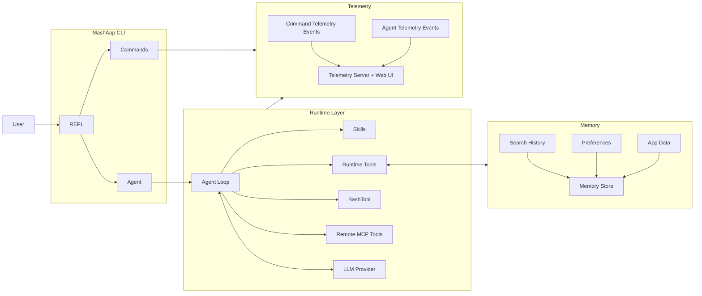

# mashpy

Platform for building CLI-native agent applications.

MashPy gives you reusable pieces for interactive agent CLIs: a REPL, slash commands, memory, an LLM think/act loop, skills, runtime tools, `BashTool`, MCP integration, and telemetry.

## Install

```bash
pip install mashpy
```

Or with `uv`:

```bash
uv add mashpy
```

Validate the installation:

```bash
mash --version
```

The PyPI package is framework-only and ships the `mash` library plus a thin `mash` CLI for install validation. App-specific CLIs in `src/apps/*` (for example `db-agent`, `codebase-agent`, `pocket-agent`) are not part of the published PyPI artifact.

## What MashPy Does

Each line typed in a Mash app follows one of two paths:

1. Slash command path (`/help`, `/prefs`, `/app_data`, etc.): command handlers run immediately in the CLI.
2. Agent path (normal message): Mash builds context, runs the agent loop, executes tools, and persists/logs the turn.

This lets you combine deterministic CLI controls with model-driven tool execution in one interface.

## High-Level Flow



How to read this diagram:

1. `REPL` receives user input and routes slash commands to `Commands`.
2. Non-command messages go through `Agent` into the `Agent Loop`.
3. The `Agent Loop` can call local `Runtime Tools`, `BashTool`, `Remote MCP Tools` and `Skills`.
4. State is persisted in the `Memory Store`.
5. Command, agent, and MCP events are written as JSONL and visualized in telemetry.

## Core Modules

### REPL

The REPL handles interactive input, command auto-completion, and history persistence. It is the entrypoint UX for every Mash app session.

### Commands

Slash commands provide deterministic control without involving the model. `MashApp` registers these built-ins out of the box:

- `/help` (`/h`, `/?`) - list available slash commands.
- `/exit` (`/quit`, `/q`) - exit the application.
- `/clear` (`/cls`) - clear terminal output.
- `/session` - show app name, session id, model, max steps, and session token total.
- `/prefs` - view preferences, or `set`/`clear` persistent preferences.
- `/app_data` - `list`, `get`, `set`, or `delete` app-scoped JSON data.
- `/history [limit]` - print saved conversation turns (optionally capped).
- `/compact` - summarize conversation into a checkpoint turn.

### Memory Store

`SQLiteStore` persists conversation turns, signals, preferences, and app data. This gives both commands and tools durable state across turns and sessions.

### Agent Loop

The agent runs a bounded think/act/observe loop (`max_steps`) for non-command messages. It builds context from prompt + recent history, calls tools when needed, and writes final response metadata (including token usage).

### Skills

Skills are discoverable instructions stored in local `SKILL.md` files and registered via `SkillRegistry`. When `skills_enabled=True`, Mash auto-injects a `Skill` tool so the model can load skill content at runtime.

### Runtime Tools

`MashApp` auto-registers runtime tools for memory access (enabled by default):

- `get_conversation` - fetch conversation history for the current session.
- `get_preferences` - read stored user preferences.
- `set_preferences` - update stored user preferences.
- `list_app_data` - list stored app-scoped key/value entries.
- `set_app_data` - persist app-scoped key/value data.

### BashTool

`BashTool` is an opt-in execution tool for shell commands in a persistent bash session. Register it explicitly in your app when you want repository inspection or CLI automation from the agent.

- `bash` - execute shell commands with timeout controls and output truncation safeguards.

### Remote MCP Tools

`MCPManager` manages remote MCP server connections, optional tool allowlists, and tool invocation. Remote MCP tools are adapted into normal Mash tools so the agent can call them like local tools.

### Telemetry

`EventLogger` writes structured JSONL events for commands, LLM calls, agent steps, and MCP activity. The telemetry server exposes:

- `/api/logs` for snapshots
- `/api/stream` for live SSE tailing

## How to Write a New App

### 1) Simple app

```python
from pathlib import Path

from mash.cli.app import MashApp
from mash.cli.commands import Command
from mash.core.agent import Agent
from mash.core.config import AgentConfig
from mash.core.llm import AnthropicProvider
from mash.memory.store import SQLiteStore
from mash.skills.registry import SkillRegistry
from mash.tools.bash import BashTool
from mash.tools.registry import ToolRegistry

APP_ID = "hello-mash"


class HelloMashApp(MashApp):
    def __init__(self) -> None:
        store = SQLiteStore(Path(".mash/hello-mash.db"))

        tools = ToolRegistry()
        tools.register(BashTool(working_dir="."))

        agent = Agent(
            llm=AnthropicProvider(app_id=APP_ID),
            tools=tools,
            skills=SkillRegistry(),
            config=AgentConfig(
                app_id=APP_ID,
                system_prompt="You are a concise CLI assistant.",
                skills_enabled=False,
            ),
        )

        super().__init__(
            app_name="Hello Mash",
            agent=agent,
            store=store,
            cached_files=[],
            log_destination=Path.home() / ".mash" / "logs" / "hello-mash.jsonl",
            mcp_servers=[],
        )

    def register_commands(self) -> None:
        self.register_command(
            Command(
                name="ping",
                help="Check app responsiveness",
                handler=lambda ctx, _args: ctx.renderer.info("pong"),
            )
        )


if __name__ == "__main__":
    HelloMashApp().run()
```

Run it:

```bash
python my_app.py
```

### 2) App with skills enabled

```python
from pathlib import Path

from mash.cli.app import MashApp
from mash.core.agent import Agent
from mash.core.config import AgentConfig
from mash.core.llm import AnthropicProvider
from mash.memory.store import SQLiteStore
from mash.skills.base import Skill
from mash.skills.registry import SkillRegistry
from mash.tools.registry import ToolRegistry

APP_ID = "hello-skills"


class HelloSkillsApp(MashApp):
    def __init__(self) -> None:
        store = SQLiteStore(Path(".mash/hello-skills.db"))

        skills = SkillRegistry()
        skills.register(
            Skill(
                type="custom",
                name="repo-audit",
                description="Checklist for auditing a repository",
                location=str(Path("./mash/skills/repo-audit").resolve()),
            )
        )

        agent = Agent(
            llm=AnthropicProvider(app_id=APP_ID),
            tools=ToolRegistry(),
            skills=skills,
            config=AgentConfig(
                app_id=APP_ID,
                system_prompt="You are a CLI agent that can load skills when needed.",
                skills_enabled=True,
            ),
        )

        super().__init__(
            app_name="Hello Skills",
            agent=agent,
            store=store,
            cached_files=[],
            log_destination=Path.home() / ".mash" / "logs" / "hello-skills.jsonl",
            mcp_servers=[],
        )
```

Skill requirements:

1. `location` must point to a folder containing `SKILL.md`.
2. Set `skills_enabled=True` in `AgentConfig`.
3. Register at least one skill in `SkillRegistry`.

## Add Remote MCP Tools

To register remote MCP tools at startup, pass `mcp_servers` to `MashApp`:

```python
mcp_servers = [
    {
        "name": "github",
        "url": "https://api.githubcopilot.com/mcp/",
        "description": "GitHub MCP tools",
        "headers": {"Authorization": "Bearer <token>"},
        "allowed_tools": ["list_issues", "issue_read"],
    }
]
```

Mash will connect to each server, fetch tool definitions, and expose them as callable tools in the agent runtime.

## Telemetry

Mash writes traces to your configured JSONL log. To start the telemetry server, run:

```bash
make telemetry-dev TELEMETRY_LOG=src/apps/db/logs/db.jsonl
```

Default endpoints:

- API/SSE: `http://127.0.0.1:8765`
- Web UI: `http://127.0.0.1:5173`
