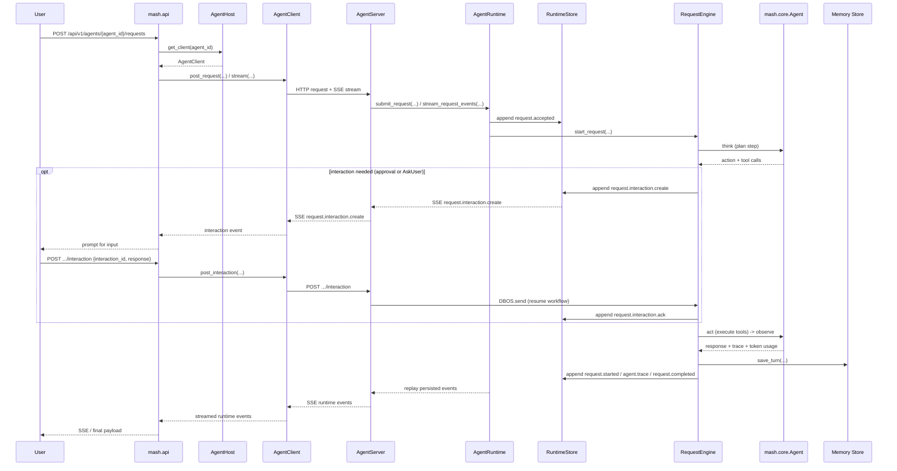

# mashpy

Mash is an SDK and host runtime for building self-hosted multi-agent applications.
It gives app developers a Python `AgentSpec` contract, a host API for composing
agents and workflows, a FastAPI server for deployment, and a CLI/REPL for talking
to a running host.

## What Is Mash?

Mash is organized around three surfaces:

- **SDK and runtime**: define agents, tools, skills, workflows, memory, and request
  execution.
- **API server**: serve a Mash host over HTTP, including request streaming,
  workflow routes, and telemetry.
- **CLI**: connect to a running host, open an interactive REPL, inspect sessions,
  and run workflows.

`pilot/` is the in-repo example host app. It uses the same public Mash contracts
that external host apps use, and adds Pilot-specific REPL commands such as
`/changelog [N]`.

At a high level, a Mash request flows through the host API, into an agent
runtime, through the durable request engine, and back out as replayable runtime
events:



## What Is In This Repo?

```text
src/mash/                  Mash package: SDK, runtime, API, CLI, workflows
pilot/                     Example Mash host app built on the SDK
docs/rfcs/                 Protocol and design RFCs
tests/                     Mash and Pilot test suites
Dockerfile                 Base image for Mash host deployments
```

## Quick Start

Create and activate the repo environment:

```bash
uv venv
uv sync
source .venv/bin/activate
```

Run the main test suites:

```bash
uv run --extra dev pytest -q tests/mash
uv run --extra dev pytest -q tests/pilot
```

## Run Pilot Locally

Start the Pilot host:

```bash
mash host serve --host-app pilot.spec:build_host --host 127.0.0.1 --port 8001
```

In another terminal, connect the Mash CLI:

```bash
mash connect --api-base-url http://127.0.0.1:8001 --api-key secret --agent pilot
mash status
mash agents
```

Open the Pilot REPL, which includes Pilot-only commands such as `/changelog [N]`:

```bash
pilot repl
```

Example messages inside the REPL:

```text
> Summarize how HostBuilder wires the primary agent, subagents, and workflows. Cite the key files.
> Trace how an accepted request moves through AgentRuntime, RuntimeStore, and RequestEngine.
> Explain when request.waiting is emitted and what that means for a busy session.
> Compare src/mash/runtime and src/mash/workflows responsibilities in this repo.
/changelog 5
```

The API server also serves the telemetry UI at:

- [http://127.0.0.1:8001/telemetry](http://127.0.0.1:8001/telemetry)

## Build Your Own Host

A Mash app defines one or more `AgentSpec`s and returns a host from
`build_host()`:

```python
from mash.core.config import AgentConfig
from mash.core.llm import AnthropicProvider
from mash.runtime import AgentSpec, HostBuilder
from mash.skills import SkillRegistry
from mash.tools import ToolRegistry


class PrimaryAgent(AgentSpec):
    def get_agent_id(self) -> str:
        return "primary"

    def build_tools(self) -> ToolRegistry:
        return ToolRegistry()

    def build_skills(self) -> SkillRegistry:
        return SkillRegistry()

    def build_llm(self):
        return AnthropicProvider(app_id="primary")

    def build_agent_config(self) -> AgentConfig:
        return AgentConfig(
            app_id="primary",
            system_prompt="You are helpful.",
        )


def build_host():
    return HostBuilder().primary(PrimaryAgent()).build()
```

Serve it with:

```bash
mash host serve --host-app my_app:build_host --host 0.0.0.0 --port 8000
```

For containerized deployments, use the root [Dockerfile](Dockerfile) as the base
host image and configure startup with `MASH_HOST_APP`, `MASH_DATA_DIR`, and
`MASH_DATABASE_URL`.

## Documentation Map

- [Product brief](docs/product-brief.md): product-level pitch of what Mash
  offers and where it fits.
- [Mash package](src/mash/README.md): package overview and boundaries.
- [Runtime](src/mash/runtime/README.md): host composition, request execution,
  persistence, structured output, and runtime internals.
- [Workflows](src/mash/workflows/README.md): code-defined workflows, dynamic
  publishing, task state, and DBOS orchestration.
- [Skills](src/mash/skills/README.md): filesystem and inline skills plus dynamic
  skill registration.
- [API](src/mash/api/README.md): HTTP surface, request/response shapes, telemetry,
  and dynamic publishing endpoints.
- [CLI](src/mash/cli/README.md): `mash` commands and REPL slash commands.
- [LLM providers](src/mash/core/llm/README.md): provider adapters, normalized LLM
  contracts, and provider-native structured output.
- [Masher](src/mash/agents/masher/README.md): built-in workflow-only trace
  digest and online eval worker.
- [Pilot](pilot/README.md): example host composition and Pilot-specific REPL
  behavior.

Other useful module guides:

- [Core](src/mash/core/README.md)
- [Tools](src/mash/tools/README.md)
- [Agents](src/mash/agents/README.md)
- [Memory](src/mash/memory/README.md)
- [MCP](src/mash/mcp/README.md)
- [Logging](src/mash/logging/README.md)

## Development

Use the focused module READMEs above as the source of truth when changing a
subsystem. For cross-surface behavior, update tests across the relevant layers:

- runtime changes: `tests/mash/runtime`
- API changes: `tests/mash/api`
- CLI/REPL changes: `tests/mash/cli`
- workflow changes: `tests/mash/workflows`
- Pilot changes: `tests/pilot`

Before handing off broad changes, run:

```bash
uv run --extra dev pytest -q tests/mash
uv run --extra dev pytest -q tests/pilot
```

## RFCs

- [Host-to-Agent Protocol (H2A)](docs/rfcs/host-to-agent-protocol.md)
