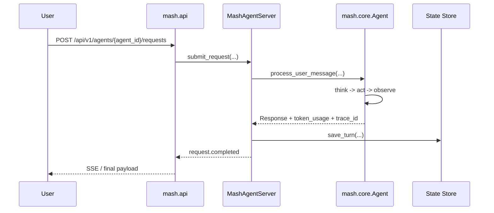
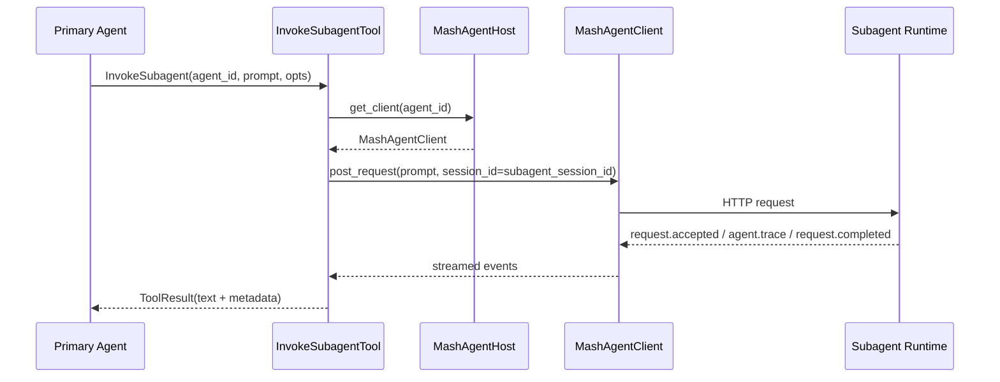

# mashpy

This repository is the development workspace for Mash.

It contains three code surfaces:

- `mashpy`
  The unified distribution.
- `mash.api`
  The self-hosted API server in `src/mash/api`.
- `mash`
  The bundled CLI in `src/mash/cli`.


## Repo layout

```text
src/mash/                  SDK, host API, and CLI
examples/                  Canonical example app and example container
tests/                     Unified test suite
Dockerfile                 Base image for Mash host deployments
```

## Mental model

The architecture is:

- app developers use `mashpy` to define one or more `AgentSpec`s
- an app exposes `build_host() -> MashAgentHost`
- `mash.api` loads that host and serves HTTP
- `mash.api` also serves the built-in telemetry UI at `/telemetry`
- `mash` talks to a running Mash API deployment
- deployments are expected to run in a container

Persistence is runtime-level, not app-level.

Mash stores agent state under:

- `<MASH_DATA_DIR>/<agent_id>/state.db`
- `<MASH_DATA_DIR>/<agent_id>/logs/events.jsonl`

If `MASH_DATA_DIR` is not set, the runtime falls back to `/var/lib/mash`.

## Local setup

Create the repo virtualenv, install dependencies, and activate it:

```bash
uv venv
uv sync
source .venv/bin/activate
```

## System Architecture

At a high level, `mashpy` is one distribution with three cooperating surfaces:

- `mash.core`
  The agent loop itself: config, context, provider adapters, and think/act/observe execution.
- `mash.runtime`
  Host-side orchestration: `AgentSpec`, runtime servers, host/client wiring, request streaming, session storage, and subagent delegation.
- `mash.api` and `mash.cli`
  Operator-facing surfaces built on top of the runtime. `mash.api` exposes the FastAPI host service and telemetry UI; `mash.cli` is the remote client.

The normal execution path is:

1. An app defines one or more `AgentSpec`s.
2. `MashAgentHostBuilder` composes those specs into a `MashAgentHost`.
3. `mash.api` starts the host and exposes HTTP endpoints for agent requests, sessions, history, and telemetry.
4. `mash.cli` talks to that HTTP API as a remote client.

```mermaid
flowchart LR
    A["App code (`AgentSpec`)"] --> B["`MashAgentHostBuilder`"]
    B --> C["`MashAgentHost`"]
    C --> D["`mash.api` host service"]
    D --> E["HTTP API + Telemetry UI"]
    F["`mash` CLI"] --> E
```

Persistence is runtime-level, not app-level. Each agent stores state under:

- `<MASH_DATA_DIR>/<agent_id>/state.db`
- `<MASH_DATA_DIR>/<agent_id>/logs/events.jsonl`

If `MASH_DATA_DIR` is not set, the runtime falls back to `/var/lib/mash`.

## Agent Runtime

The core execution stack is:

- [src/mash/runtime/spec.py](src/mash/runtime/spec.py)
  `AgentSpec` is the transport-agnostic contract app authors implement.
- [src/mash/runtime/host.py](src/mash/runtime/host.py)
  `MashAgentHost` and `MashAgentHostBuilder` register the primary agent and subagents, start one runtime per agent, and wire host-managed delegation.
- [src/mash/runtime/server.py](src/mash/runtime/server.py)
  `MashAgentServer` owns per-agent execution state, request buffering, session persistence, event logging, and the HTTP request worker.
- [src/mash/core/agent.py](src/mash/core/agent.py)
  `Agent.run()` executes the think/act/observe loop and emits trace + token metadata.
- [src/mash/runtime/client.py](src/mash/runtime/client.py)
  `MashAgentClient` is the runtime-side HTTP client used by the host and by subagent delegation.



Important runtime properties:

- Each `MashAgentServer` is single-flight per server: requests are queued and executed by one worker thread.
- Request lifecycle is streamed over SSE using stable event names:
  `request.accepted`, `request.started`, `agent.trace`, `request.completed`, `request.error`.
- Token accounting is session-scoped inside each runtime. `session_total_tokens` is computed from saved turn metadata and persisted with each turn.
- Runtime logs are written to JSONL and also fanned out as live events for telemetry and remote clients.

## Working on the SDK

The main SDK surface is:

- `AgentSpec` in [src/mash/runtime/spec.py](src/mash/runtime/spec.py)
- `MashAgentHostBuilder` in [src/mash/runtime/host.py](src/mash/runtime/host.py)
- `MashAgentServer` in [src/mash/runtime/server.py](src/mash/runtime/server.py)

The intended app shape is:

```python
from mash.core.config import AgentConfig
from mash.core.llm import AnthropicProvider
from mash.runtime import AgentSpec, MashAgentHostBuilder
from mash.skills.registry import SkillRegistry
from mash.tools.registry import ToolRegistry


class PrimaryAgent(AgentSpec):
    def get_agent_id(self) -> str:
        return "primary"

    def build_tools(self) -> ToolRegistry:
        return ToolRegistry()

    def build_skills(self) -> SkillRegistry:
        return SkillRegistry()

    def build_llm(self):
        return AnthropicProvider(app_id="primary", api_key="...")

    def build_agent_config(self) -> AgentConfig:
        return AgentConfig(app_id="primary", system_prompt="You are helpful.")


def build_host():
    return MashAgentHostBuilder().primary(PrimaryAgent()).build()
```

Storage path configuration does not belong in `AgentSpec`. Set `MASH_DATA_DIR` in the process environment.

## Subagent Invocation Flow

Subagent delegation is host-managed, not a special local shortcut.

1. The host registers the primary agent and subagents in [src/mash/runtime/host.py](src/mash/runtime/host.py).
2. On startup, the host injects subagent routing guidance into the primary system prompt and registers `InvokeSubagent`.
3. `InvokeSubagentTool` in [src/mash/tools/subagent.py](src/mash/tools/subagent.py) resolves the target subagent client and submits a normal streamed request.
4. The subagent request runs through that subagent’s own `MashAgentServer`, persistence layer, and session namespace.
5. Streamed request events are forwarded back to the primary runtime as `subagent.*` trace events for observability.



Relevant implementation details:

- Subagent session ids are deterministic via [src/mash/runtime/session.py](src/mash/runtime/session.py) using:
  `primary_app_id + primary_session_id + subagent_id`.
- The subagent keeps its own session history and token totals.
- The primary agent only owns its own turns and token usage; subagent execution is correlated, but not merged into the primary session’s token total.

## Core Modules

When working on `mashpy`, these are the main files to orient around:

- [src/mash/core/agent.py](src/mash/core/agent.py)
  Core think/act/observe loop, tool execution, token aggregation, and trace emission.
- [src/mash/runtime/server.py](src/mash/runtime/server.py)
  Session persistence, request queueing, SSE event buffering, and runtime event fan-out.
- [src/mash/runtime/host.py](src/mash/runtime/host.py)
  Multi-agent composition and subagent tool wiring.
- [src/mash/api/app.py](src/mash/api/app.py)
  FastAPI composition for the public host API, telemetry endpoints, and auth.
- [src/mash/cli/main.py](src/mash/cli/main.py)
  Unified `mash` CLI entrypoint for remote operations and `mash host serve`.
- [src/mash/cli/shell.py](src/mash/cli/shell.py)
  Remote REPL path, including streamed request handling and chain rendering.

Common contributor questions:

- If you are changing request or event shapes, update runtime tests, API tests, and CLI streaming behavior together.
- If you are changing token accounting or persistence, validate both `tests/mash/runtime/test_engine.py` and `tests/mash/runtime/test_host_integration.py`.
- If you are changing telemetry behavior, remember there are two layers:
  the API routes in `mash.api`, and the bundled frontend assets under `src/mash/api/web`.

## Running the canonical example

The repo has one canonical example app in [examples/example_app.py](examples/example_app.py).

Set `MASH_DATA_DIR` in `examples/.env` before starting the app. Example:

```bash
echo 'MASH_DATA_DIR=.mash' >> examples/.env
```

Start the example host from the activated repo environment:

```bash
python -m examples.example_app \
  --workspace-root /Users/sid/Projects/mashpy \
  --host 127.0.0.1 \
  --port 8000 \
  --api-key secret
```

Connect with the bundled CLI:

```bash
mash connect --api-base-url http://127.0.0.1:8000 --api-key secret
mash status
mash agents
mash repl --agent primary
```

Open the built-in telemetry UI:

- [http://127.0.0.1:8000/telemetry](http://127.0.0.1:8000/telemetry)

The example app:

- defines one primary agent
- defines one research subagent
- exposes `build_host()`
- uses the same `MASH_DATA_DIR` storage contract as any real app
- auto-loads env from repo `.env` and `examples/.env`

## Running the host API directly

You can start the API server either from Python or through `mash host serve`.

From Python:

```python
from mash.api import MashHostConfig, run_host

from my_app import build_host

run_host(build_host(), config=MashHostConfig(bind_host="0.0.0.0", bind_port=8000))
```

From the CLI:

```bash
MASH_HOST_APP=my_app:build_host \
MASH_API_HOST=0.0.0.0 \
MASH_API_PORT=8000 \
MASH_DATA_DIR=/var/lib/mash \
mash host serve
```

For containerized deployments, the env-driven startup path is the intended one.

## Docker workflow

The root [Dockerfile](Dockerfile) is the base image for Mash host deployments.

Build it:

```bash
docker build -t mashpy/mash-host-base:latest .
```

The example app image is defined in [examples/Dockerfile](examples/Dockerfile).

Build and run it:

```bash
docker build -t mashpy/example-app:latest -f examples/Dockerfile .
docker run \
  -p 8000:8000 \
  -e ANTHROPIC_API_KEY=... \
  -e MASH_API_KEY=secret \
  -e MASH_DATA_DIR=/var/lib/mash \
  -v $(pwd)/data:/var/lib/mash \
  mashpy/example-app:latest
```

The container contract is:

- `MASH_HOST_APP` points at `module:build_host`
- `MASH_DATA_DIR` points at the persistent state root
- port `8000` is exposed by default
- operators mount persistent storage at `/var/lib/mash`

## Tests

Focused runtime and API tests:

```bash
PYTHONPATH=src \
pytest -q \
  tests/mash/runtime/test_engine.py \
  tests/mash/runtime/test_host_integration.py \
  tests/mash/api/test_host_server.py
```

CLI-focused tests:

```bash
PYTHONPATH=src \
pytest -q \
  tests/mash/cli/test_main.py \
  tests/mash/cli/test_shell.py
```

When changing cross-surface behavior, set `PYTHONPATH=src` so tests resolve the unified workspace sources instead of stale installed copies.
