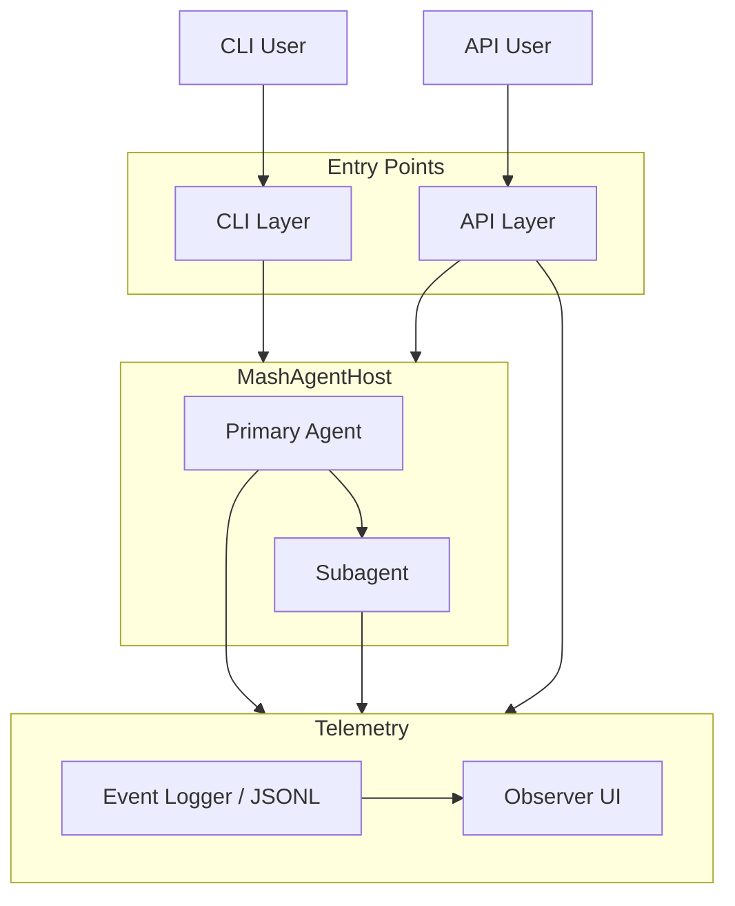
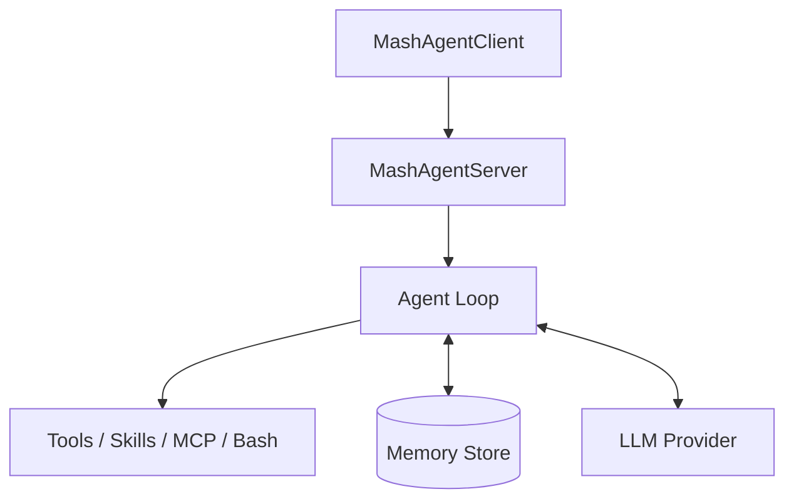
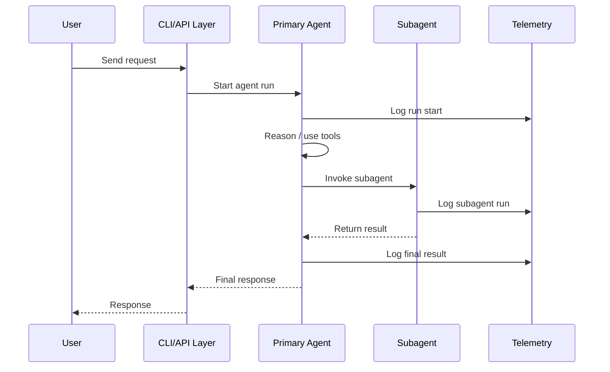

# mashpy

Platform for building CLI-native agent applications.

MashPy is delivered as four offerings that work together: the `mash` framework runtime, `mash-cli` for interactive shell UX, `mash-api` for HTTP/OpenAPI serving, and `mash-telemetry-web` for optional observer UI assets.

## Install

```bash
pip install mashpy
```

Or with `uv`:

```bash
uv add mashpy
```

Install CLI package:

```bash
pip install mash-cli
# or
pip install "mashpy[cli]"
# or
uv add mash-cli
# or
uv add "mashpy[cli]"
```

Optional telemetry observer UI package:

```bash
pip install "mashpy[telemetry-web]"
# or
uv add "mashpy[telemetry-web]"
```

Optional API server package:

```bash
pip install mash-api
# or
pip install "mashpy[api]"
# or
uv add mash-api
# or
uv add "mashpy[api]"
```

Validate the CLI installation:

```bash
mash --version
```

The `mashpy` package is framework-only. The `mash` command is provided by `mash-cli`.
`mash.telemetry` entrypoint has been removed; use `mash-api` for HTTP APIs.

## What MashPy Does

MashPy provides four offerings:

1. `mash` (from `mashpy`)
   - Framework/runtime for agents: orchestration, memory, tools, skills, MCP, and logging.
2. `mash-cli`
   - Interactive shell package (`CLIAppShell`, slash commands, REPL) and the `mash` terminal command.
3. `mash-api`
   - FastAPI/OpenAPI package for serving runtime interaction and observability HTTP endpoints.
4. `mash-telemetry-web`
   - Optional static web UI assets that can be used by API observers.

In interactive usage with `mash-cli`, each input line follows one of two paths:

1. Slash command path:
   - local commands (`/help`, `/exit`, `/clear`) run entirely in `mash-cli`.
   - runtime commands (`/session`, `/prefs`, `/app_data`, `/history`, `/compact`) call `MashAgentClient` control APIs.
2. Agent path (normal message): `mash-cli` sends the message to `MashAgentClient`, then `MashAgentServer` builds context, runs the agent loop, executes tools, and persists/logs the turn.

This lets you combine deterministic CLI controls with model-driven tool execution in one interface.
`mash-cli` (`CLIAppShell`) owns user interaction. `mashpy` (`MashAgentServer`) owns agent execution.

## System Architecture

High-level view of how CLI and API users enter the system, how the primary agent can invoke subagents, and how telemetry is captured.



**Agent Runtime**

Shared runtime structure used by both the primary agent and any subagent.



**Subagent Invocation Flow**

Runtime sequence showing how the primary agent delegates work to a subagent and incorporates the result.



## Core Modules

This section covers `mash` framework modules only.

### Core (`mash.core`)

Agent configuration and think/act loop primitives (`Agent`, provider interfaces, context/response types).

### Runtime (`mash.runtime`)

Host/client/server orchestration for app execution (`MashAgentHost`, `MashAgentClient`, `MashAgentServer`, app definitions).

### Memory Store

`SQLiteStore` persists conversation turns, signals, preferences, and app data. This gives both commands and tools durable state across turns and sessions.

### Agent Loop

The agent runs a bounded think/act/observe loop (`max_steps`) for non-command messages. It builds context from prompt + recent history, calls tools when needed, and writes final response metadata (including token usage).

### Skills

Skills are discoverable instructions stored in local `SKILL.md` files and registered via `SkillRegistry`. When `skills_enabled=True`, Mash auto-injects a `Skill` tool so the model can load skill content at runtime.

### Runtime Tools

`MashAgentServer` auto-registers runtime tools for memory access (enabled by default):

- `search_conversations` - Search conversation history at session or app scope.
- `get_full_turn_message` - Fetch full user and assistant messages for one or more turns.
- `get_preferences` - read stored user preferences.
- `set_preferences` - update stored user preferences.
- `list_app_data` - list stored app-scoped key/value entries.
- `set_app_data` - persist app-scoped key/value data.

### BashTool

`BashTool` is an opt-in execution tool for shell commands in a persistent bash session. Register it explicitly in your app when you want repository inspection or CLI automation from the agent.

- `bash` - execute shell commands with timeout controls and output truncation safeguards.

### Remote MCP Tools

`MCPManager` manages remote MCP server connections, optional tool allowlists, and tool invocation. Remote MCP tools are adapted into normal Mash tools so the agent can call them like local tools.

### Logging Backend (`mash.logging`)

`EventLogger` writes structured JSONL events for commands, LLM calls, agent steps, MCP activity, and memory-search stages.


## How to Write a New App

Use one `MashRuntimeDefinition` as the source of truth, then compose it into either a CLI app (`mash-cli`) or an API app (`mash-api`).

### Quickstart (CLI + API + Telemetry Web)

1. Build one `MashRuntimeDefinition` (example below in this section).
2. Run it as a CLI app:
```bash
uv run --extra cli python -m examples.simple_app
```
3. Run it as an API app:
```bash
uv run --extra api python -m examples.api_app --port 8000
```
4. Start telemetry web against that API:
```bash
cd src/mash/telemetry/web
npm run dev
```
5. Open:
- API docs: `http://127.0.0.1:8000/docs`
- Telemetry UI: `http://127.0.0.1:5173`

Minimal `api_app.py` shape:

```python
from pathlib import Path

from mash_api import MashAPIConfig, run_app

from .app_definition import MyAppDefinition

run_app(
    MyAppDefinition(Path(".").resolve()),
    config=MashAPIConfig(bind_host="127.0.0.1", bind_port=8000),
)
```

### 1) Implement `MashRuntimeDefinition`

Required methods:

- `get_app_id()`
- `build_store()`
- `build_tools()`
- `build_skills()`
- `build_llm()`
- `build_agent_config()`
- `get_log_destination()`

Optional hooks:

- `build_mcp_servers()`
- `enable_runtime_tools()`
- `on_startup(runtime)` / `on_shutdown(runtime)`

Minimal shape:

```python
from pathlib import Path

from mash.core.config import AgentConfig
from mash.core.llm import AnthropicProvider, LLMProvider
from mash.memory.store import MemoryStore, SQLiteStore
from mash.runtime import MashRuntimeDefinition
from mash.skills.registry import SkillRegistry
from mash.tools.registry import ToolRegistry


class MyAppDefinition(MashRuntimeDefinition):
    def __init__(self, root: Path) -> None:
        self.root = root

    def get_app_id(self) -> str:
        return "my-app"

    def build_store(self) -> MemoryStore:
        return SQLiteStore(self.root / ".mash" / "my-app.db")

    def build_tools(self) -> ToolRegistry:
        return ToolRegistry()

    def build_skills(self) -> SkillRegistry:
        return SkillRegistry()

    def build_llm(self) -> LLMProvider:
        return AnthropicProvider(app_id="my-app", api_key="...")

    def build_agent_config(self) -> AgentConfig:
        return AgentConfig(app_id="my-app", system_prompt="You are helpful.")

    def get_log_destination(self) -> Path:
        return self.root / ".mash" / "logs" / "my-app.jsonl"
```

### 2) CLI app design (`mash-cli`)

Current pattern:

1. Parse args (`--root`, app-specific flags).
2. Build your definition.
3. Create shell with `CLIAppShell.from_definition(...)`.
4. Optionally register custom slash commands.
5. `shell.run()` and always `shell.shutdown()` in `finally`.

```python
from mash_cli import CLIAppShell, Command

definition = MyAppDefinition(root)
shell = CLIAppShell.from_definition(definition)
shell.register_command(
    Command(name="workspace", help="Show workspace", handler=lambda ctx, _a: ctx.renderer.info(str(root)))
)
try:
    shell.run()
finally:
    shell.shutdown()
```

For host-managed subagents, pass `subagents=[SubagentRegistration(...)]` to `CLIAppShell.from_definition(...)`.

Reference examples:

- `examples/simple_app.py`
- `examples/command_app.py`
- `examples/subagent_app.py`

Run:

```bash
uv run --extra cli python -m examples.simple_app
uv run --extra cli python -m examples.command_app
uv run --extra cli python -m examples.subagent_app
```

### 3) API app design (`mash-api`)

Current pattern:

1. Reuse the same runtime definition.
2. Call `run_app(definition, config=MashAPIConfig(...))`.
3. Set `observability_memory_db_path` (or CLI `--memory-db`) if you want `/api/v1/telemetry/memory/search`.

```python
from mash_api import MashAPIConfig, run_app

run_app(
    MyAppDefinition(root),
    config=MashAPIConfig(
        bind_host="127.0.0.1",
        bind_port=8000,
        api_key=None,
    ),
)
```

Reference example:

- `examples/api_app.py`

Run:

```bash
uv run --extra api python -m examples.api_app --port 8000
```

OpenAPI/docs:

- `http://127.0.0.1:8000/docs`
- `http://127.0.0.1:8000/openapi.json`

### 4) Telemetry web with API app

Start API first, then web UI:

```bash
uv run --extra api python -m examples.api_app --port 8000
cd src/mash/telemetry/web
npm run dev
```

Open `http://127.0.0.1:5173`.
The Vite proxy forwards `/api/*` to `http://127.0.0.1:8000`.

If model responses should work end-to-end, set `ANTHROPIC_API_KEY` before running.
