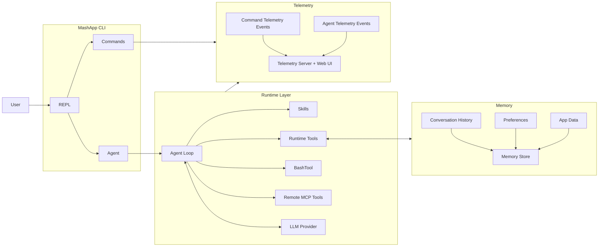

# mashpy

Platform for building CLI-native agent applications.

MashPy gives you reusable pieces for interactive agent CLIs: a REPL, slash commands, memory, an LLM think/act loop, skills, runtime tools, `BashTool`, MCP integration, and telemetry.

## Install

```bash
pip install mashpy
```

Or with `uv`:

```bash
uv add mashpy
```

Validate the installation:

```bash
mash --version
```

The PyPI package is framework-only and ships the `mash` library plus a thin `mash` CLI for install validation.

## What MashPy Does

Each line typed in a Mash app follows one of two paths:

1. Slash command path (`/help`, `/session`, `/prefs`, `/app_data`, etc.): command handlers run immediately in the CLI.
2. Agent path (normal message): Mash builds context, runs the agent loop, executes tools, and persists/logs the turn.

This lets you combine deterministic CLI controls with model-driven tool execution in one interface.

## High-Level Flow



How to read this diagram:

1. `REPL` receives user input and routes slash commands to `Commands`.
2. Non-command messages go through `Agent` into the `Agent Loop`.
3. The `Agent Loop` can call local `Runtime Tools`, `BashTool`, `Remote MCP Tools` and `Skills`.
4. State is persisted in the `Memory Store`. This includes Conversation history, User preferences and App data
5. Command, agent, and MCP events are written as JSONL and visualized in telemetry.

## Core Modules

### REPL

The REPL handles interactive input, command auto-completion, and history persistence. It is the entrypoint UX for every Mash app session.

### Commands

Slash commands provide deterministic control without involving the model. `MashApp` registers these built-ins out of the box:

- `/help` (`/h`, `/?`) - list available slash commands.
- `/exit` (`/quit`, `/q`) - exit the application.
- `/clear` (`/cls`) - clear terminal output.
- `/session` - show app name, session id, model, max steps, and session token total.
- `/prefs` - view preferences, or `set`/`clear` persistent preferences.
- `/app_data` - `list`, `get`, `set`, or `delete` app-scoped JSON data.
- `/history [limit]` - print saved conversation turns (optionally capped).
- `/compact` - summarize conversation into a checkpoint turn.

### Memory Store

`SQLiteStore` persists conversation turns, signals, preferences, and app data. This gives both commands and tools durable state across turns and sessions.

### Agent Loop

The agent runs a bounded think/act/observe loop (`max_steps`) for non-command messages. It builds context from prompt + recent history, calls tools when needed, and writes final response metadata (including token usage).

### Skills

Skills are discoverable instructions stored in local `SKILL.md` files and registered via `SkillRegistry`. When `skills_enabled=True`, Mash auto-injects a `Skill` tool so the model can load skill content at runtime.

### Runtime Tools

`MashApp` auto-registers runtime tools for memory access (enabled by default):

- `search_conversations` - Search conversation history at session or app scope.
- `get_full_turn_message` - Fetch full user and assistant messages for one or more turns.
- `get_preferences` - read stored user preferences.
- `set_preferences` - update stored user preferences.
- `list_app_data` - list stored app-scoped key/value entries.
- `set_app_data` - persist app-scoped key/value data.

### BashTool

`BashTool` is an opt-in execution tool for shell commands in a persistent bash session. Register it explicitly in your app when you want repository inspection or CLI automation from the agent.

- `bash` - execute shell commands with timeout controls and output truncation safeguards.

### Remote MCP Tools

`MCPManager` manages remote MCP server connections, optional tool allowlists, and tool invocation. Remote MCP tools are adapted into normal Mash tools so the agent can call them like local tools.

### Telemetry

`EventLogger` writes structured JSONL events for commands, LLM calls, agent steps, MCP activity, and memory-search stages. The telemetry server exposes:

- `/api/logs` for snapshots
- `/api/stream` for live SSE tailing
- `/api/search` for memory search (requires starting the server with `--memory-db`)
    - `q` - query DSL string (for example `@user:billing issue` or `@agent:retry logic`)
    - `app_id` - required app scope for memory search
    - `session_id` - optional session scope filter
    - `limit` - optional result limit (max 50)

Start the telemetry API server directly with:

```bash
python -m mash.telemetry --log /path/to/events.jsonl
```

Enable memory search in telemetry (`/api/search`) by also passing your memory DB:

```bash
python -m mash.telemetry \
  --log /path/to/events.jsonl \
  --memory-db /path/to/memory.db
```

Telemetry API endpoints (default `--host 127.0.0.1 --port 8765`):

- Logs snapshot: `http://127.0.0.1:8765/api/logs`
- Live stream (SSE): `http://127.0.0.1:8765/api/stream`
- Search (requires `--memory-db`): `http://127.0.0.1:8765/api/search`

For local API + web UI development together, use:

```bash
make telemetry-dev \
  TELEMETRY_LOG=/path/to/events.jsonl \
  TELEMETRY_MEMORY_DB=/path/to/memory.db
```

Default dev UI endpoint:

- Web UI: `http://127.0.0.1:5173`

## How to Write a New App

Build apps by subclassing `AbstractMashApp` and implementing its required hooks:

- `get_app_id()`
- `build_store()`
- `build_tools()`
- `build_skills()`
- `build_llm()`
- `build_agent_config()`
- `get_log_destination()`

Optional hooks:

- `register_commands()` for custom slash commands
- `build_mcp_servers()` for startup MCP connections
```python
from mash.mcp import MCPServerConfig

def build_mcp_servers(self) -> list[MCPServerConfig]:
    return [
        MCPServerConfig(
            name="github",
            url="https://api.githubcopilot.com/mcp/",
            description="GitHub MCP tools",
            headers={"Authorization": "Bearer <token>"},
            allowed_tools=["list_issues", "issue_read"],
        )
    ]
```
Mash connects to each configured server at startup, fetches tool definitions, and registers them as callable tools in the agent runtime.

- `enable_runtime_tools()` to disable built-in memory/runtime tools
- `on_startup()` / `on_shutdown()` for app lifecycle hooks

### 1) Simple app

```python
import sys
from pathlib import Path

from mash.cli.app import AbstractMashApp
from mash.cli.commands import Command
from mash.core.config import AgentConfig
from mash.core.llm import AnthropicProvider, LLMProvider
from mash.memory.store import MemoryStore, SQLiteStore
from mash.skills.registry import SkillRegistry
from mash.tools.bash import BashTool
from mash.tools.registry import ToolRegistry

APP_ID = "hello-mash"

class HelloMashApp(AbstractMashApp):
    def __init__(self) -> None:
        self._root = Path(".").resolve()
        super().__init__()

    def get_app_id(self) -> str:
        return APP_ID

    def build_store(self) -> MemoryStore:
        return SQLiteStore(self._root / ".mash" / "hello-mash.db")

    def build_tools(self) -> ToolRegistry:
        tools = ToolRegistry()
        tools.register(BashTool(working_dir=str(self._root)))
        return tools

    def build_skills(self) -> SkillRegistry:
        return SkillRegistry()

    def build_llm(self) -> LLMProvider:
        return AnthropicProvider(app_id=APP_ID)

    def build_agent_config(self) -> AgentConfig:
        return AgentConfig(
            app_id=APP_ID,
            system_prompt="You are a concise CLI assistant.",
            skills_enabled=False,
        )

    def get_log_destination(self) -> Path:
        return self._root / ".mash" / "logs" / "hello-mash.jsonl"

    def register_commands(self) -> None:
        super().register_commands()
        self.register_command(
            Command(
                name="ping",
                help="Check app responsiveness",
                handler=lambda ctx, _args: ctx.renderer.info("pong"),
            )
        )


def main() -> int:
    app = HelloMashApp()
    try:
        app.run()
        return 0
    except KeyboardInterrupt:
        return 0
    finally:
        app.cleanup()


if __name__ == "__main__":
    sys.exit(main())
```

Run it:

```bash
python my_app.py
```

### 2) App with skills enabled

Skill requirements:

1. `location` must point to a folder containing `SKILL.md`.
2. Set `skills_enabled=True` in `AgentConfig`.
3. Register at least one skill in `SkillRegistry`.

```python
import sys
from pathlib import Path

from mash.cli.app import AbstractMashApp
from mash.core.config import AgentConfig
from mash.core.llm import AnthropicProvider, LLMProvider
from mash.memory.store import MemoryStore, SQLiteStore
from mash.skills.base import Skill
from mash.skills.registry import SkillRegistry
from mash.tools.registry import ToolRegistry

APP_ID = "hello-skills"


class HelloSkillsApp(AbstractMashApp):
    def __init__(self) -> None:
        self._root = Path(".").resolve()
        super().__init__()

    def get_app_id(self) -> str:
        return APP_ID

    def build_store(self) -> MemoryStore:
        return SQLiteStore(self._root / ".mash" / "hello-skills.db")

    def build_tools(self) -> ToolRegistry:
        return ToolRegistry()

    def build_skills(self) -> SkillRegistry:
        skills = SkillRegistry()
        skills.register(
            Skill(
                type="custom",
                name="repo-audit",
                description="Checklist for auditing a repository",
                location=str((self._root / "skills" / "repo-audit").resolve()),
            )
        )
        return skills

    def build_llm(self) -> LLMProvider:
        return AnthropicProvider(app_id=APP_ID)

    def build_agent_config(self) -> AgentConfig:
        return AgentConfig(
            app_id=APP_ID,
            system_prompt="You are a CLI agent that can load skills when needed.",
            skills_enabled=True,
        )

    def get_log_destination(self) -> Path:
        return self._root / ".mash" / "logs" / "hello-skills.jsonl"


def main() -> int:
    app = HelloSkillsApp()
    try:
        app.run()
        return 0
    except KeyboardInterrupt:
        return 0
    finally:
        app.cleanup()


if __name__ == "__main__":
    sys.exit(main())
```


