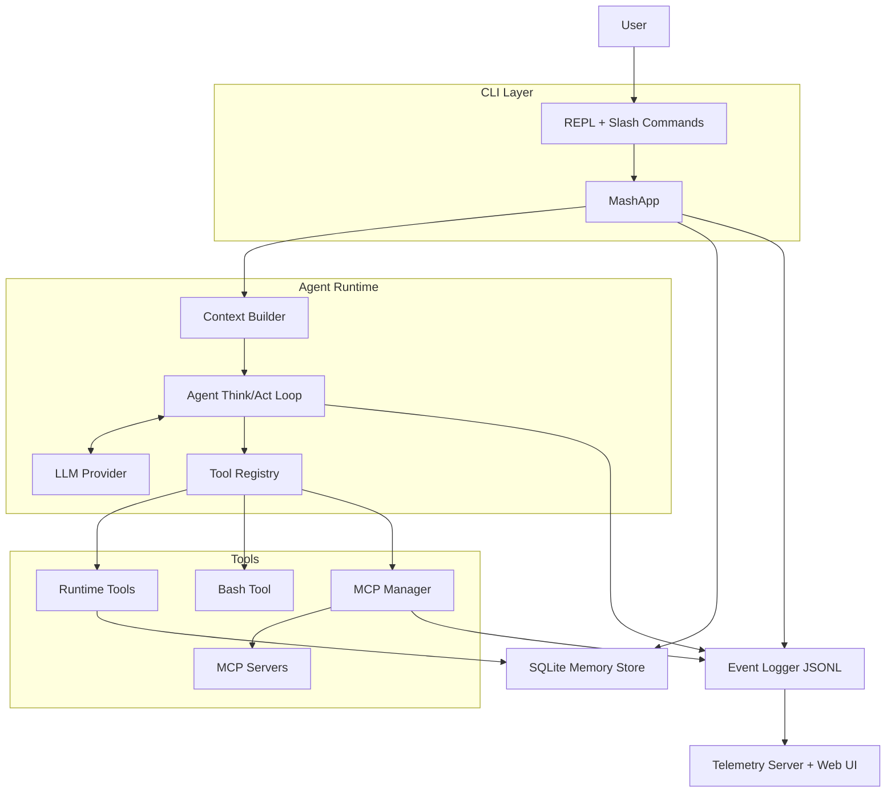

# mashpy

MashPy is a Python framework for building CLI-native agent applications.

It gives you a reusable runtime for:
- LLM-driven think/act loops
- local and remote tools (including MCP)
- persistent memory (conversation + preferences + app data)
- interactive REPL UX with slash commands
- structured JSONL tracing for debugging and telemetry

## What MashPy Does

A Mash app runs this loop on every user message:
1. Build context (system prompt + selected conversation history).
2. Ask the model what to do next.
3. Execute tool calls if requested.
4. Feed tool results back into context.
5. Repeat until the model finishes.
6. Persist the turn with trace metadata and token usage.

This makes it practical to build domain-specific agent CLIs without rewriting orchestration each time.

## High-Level Flow



## Core Capabilities

- Agent runtime with configurable max steps, model, token limits, and temperature.
- Anthropic provider integration with tool-use support and prompt-caching controls.
- Optional tool search integration for large tool catalogs.
- Built-in runtime memory tools (auto-registered by `MashApp`):
  - `get_conversation`
  - `get_preferences`
  - `set_preferences`
  - `list_app_data`
  - `set_app_data`
- MCP connectivity for remote tools, with server/tool whitelisting support.
- Conversation compaction (summary checkpoints) to manage long sessions.
- Structured event logging (`JSONL`) for agent, command, MCP, and LLM events.
- Optional skills loading via `SkillRegistry` + `Skill` tool.

## Quick Start

### 1) Install

```bash
uv pip install -e .
```

(Equivalent: `pip install -e .`)

### 2) Set Environment

Create `.env` in your project root:

```bash
ANTHROPIC_API_KEY=your_key_here
ANTHROPIC_MODEL=claude-haiku-4-5-20251001
```

### 3) Build a Minimal App

```python
from pathlib import Path

from mash.cli.app import MashApp
from mash.core.agent import Agent
from mash.core.config import AgentConfig
from mash.core.llm import AnthropicProvider
from mash.memory.store import SQLiteStore
from mash.skills.registry import SkillRegistry
from mash.tools.bash import BashTool
from mash.tools.registry import ToolRegistry

APP_ID = "my-agent"


class MyAgentApp(MashApp):
    def __init__(self) -> None:
        store = SQLiteStore(Path(".mash/my-agent.db"))

        tools = ToolRegistry()
        tools.register(BashTool(working_dir="."))

        skills = SkillRegistry()  # Register custom skills if needed

        llm = AnthropicProvider(app_id=APP_ID)
        config = AgentConfig(
            app_id=APP_ID,
            system_prompt="You are a practical CLI coding assistant.",
            tool_search_enabled=False,
            skills_enabled=False,
        )
        agent = Agent(llm=llm, tools=tools, skills=skills, config=config)

        super().__init__(
            app_name="My Agent",
            agent=agent,
            store=store,
            cached_files=[],
            log_destination=Path.home() / ".mash" / "logs" / "my-agent.jsonl",
            mcp_servers=[],
        )


if __name__ == "__main__":
    MyAgentApp().run()
```

### 4) Run

```bash
python my_app.py
```

Built-in slash commands include:
- `/help`
- `/exit`
- `/clear`
- `/session`
- `/prefs`
- `/app_data`
- `/history`
- `/compact`

## Add MCP Tools

To attach remote MCP tools at app startup, pass `mcp_servers` to `MashApp`:

```python
mcp_servers=[
    {
        "name": "github",
        "url": "https://api.githubcopilot.com/mcp/",
        "description": "GitHub MCP tools",
        "headers": {"Authorization": "Bearer <token>"},
        "allowed_tools": ["list_issues", "issue_read"],
    }
]
```

Mash will connect, pull tool definitions, and register them as callable tools for the agent.

## Reference CLI Scripts

This repository currently exposes:
- `codebase-agent`
- `pocket-agent`

Example:

```bash
uv run codebase-agent --repo /path/to/repo --gh https://github.com/org/repo
```

## Telemetry

Mash writes JSONL traces to your configured log destination. You can inspect traces live with the telemetry server + web UI.

```bash
# terminal 1
make telemetry-server TELEMETRY_LOG=~/.mash/logs/my-agent.jsonl

# terminal 2
make telemetry-web
```

Default endpoints:
- API/SSE: `http://127.0.0.1:8765`
- Web UI: `http://127.0.0.1:5173`

## Notes for App Authors

- If you enable `skills_enabled=True`, register skills in `SkillRegistry`.
- If you enable `tool_search_enabled=True`, the runtime adds tool-search metadata/betas for the LLM.
- For long sessions, set `compaction_token_threshold` and `compaction_turn_limit` in `AgentConfig`.
- Keep tool outputs small to avoid token blowups, especially for shell tools.
