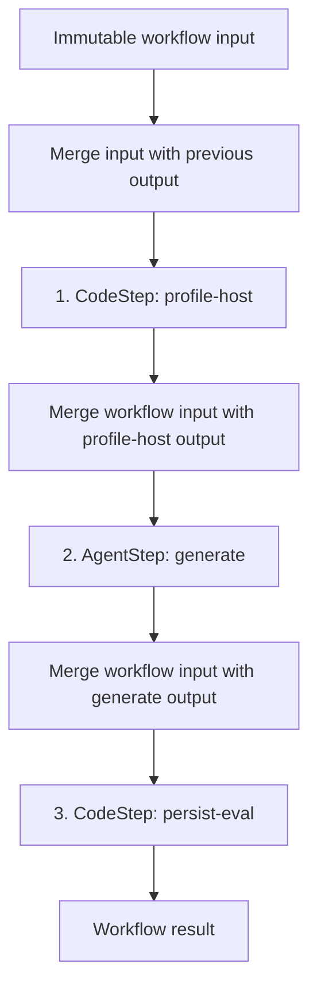

# Workflows Admin UI

Status: implementation in progress

Progress: implementation completed through Phase 5 on 2026-07-10. Manual host
and browser verification remains.

Related:

- [Workflows design](./workflows.md)
- [Workflows as Step Pipelines](../posts/workflows-as-step-pipelines.md)
- `src/mash/workflows/spec.py`
- `src/mash/workflows/service.py`
- `src/mash/workflows/store.py`
- `src/mash/api/routes/workflow.py`
- `src/mash/api/web-admin/src/routes/Workflows.jsx`

## Summary

The Workflows tab should become the place to understand a workflow definition,
start a run, follow its ordered steps, inspect the data crossing each step
boundary, and recover a failed run. It should no longer be a catalog of old
task chains that links to agent sessions.

The new experience has three levels:

1. **Workflow catalog** — registered definitions, their pipeline shape, and
   latest run.
2. **Workflow detail** — immutable definition, input contract, ordered
   `CodeStep`/`AgentStep` pipeline, and run history.
3. **Run detail** — live run status, per-step progress, inputs, outputs, errors,
   attempts, audit events, and recovery actions.

Workflow definitions remain authored in Python and registered at build time.
The admin UI is an execution and inspection surface, not a workflow builder.

This is a clean cutover. The implementation removes the old `tasks` rendering,
the telemetry activity rollup, and the link from workflow cards to Logs. It does
not retain aliases or fallback rendering for the removed response shape.

## Why the current UI no longer fits

The current `Workflows.jsx` assumes each definition has `workflow.tasks`, calls
them a "Task chain," displays only `task_id -> agent_id`, and sends the user to
workflow-filtered sessions in Logs. It also uses `GET /telemetry/workflows` for
run count, last-run time, and token totals.

That model conflicts with the workflow runtime in several important ways:

- A pipeline now contains `steps`, and a step can be code or an agent.
- Code steps have no agent session and no token usage.
- The workflow store, not telemetry or agent memory, owns run history.
- A run has immutable workflow input, a final result, and persisted snapshots at
  every step boundary.
- A failed pipeline can resume under the same `run_id`; a fresh run gets a new
  `run_id`. Those actions are materially different and need different labels.
- A queued run may exist in DBOS before its `workflow_runs` row and step rows are
  written, so the UI must handle a definition-known but step-records-not-yet-
  available state.

The backend already exposes list, submit, run detail, resume, step audit, and
SSE endpoints. The main gaps are a definition-detail contract rich enough for
the UI, workflow input/session fields on run detail, and frontend routes that
use the workflow store instead of telemetry.

## User jobs

The design optimizes for five questions:

1. **What will this workflow do?** Show the ordered pipeline, step kinds,
   targeted agents, skills, timeouts, and typed boundaries before it is run.
2. **What input does it need?** Turn the workflow input schema into a usable
   form while retaining a raw JSON path for advanced inputs.
3. **Where is this run now?** Show workflow and step status together, including
   the queued window before store rows exist.
4. **What data moved through the pipeline?** Make each persisted input/output
   snapshot inspectable and copyable.
5. **What should I do after failure?** Explain and separately offer `Resume`
   (same run, completed work replayed) and `Run again` (new run from step one).

## Product principles

### The workflow store is authoritative

Run lists, status, timing, result, step snapshots, attempts, and step lifecycle
events come from `workflow_runs`, `workflow_steps`, and
`workflow_step_events`. The Workflows UI must not reconstruct a run from
sessions or telemetry.

Logs still has a useful but narrower role: it provides the agent-loop trace for
an `AgentStep`. A code step is fully inspectable without visiting Logs.

### Show the pipeline, not an implementation graph

Step pipelines are straight lines, so use a compact vertical sequence rather
than a free-form DAG canvas. A vertical pipeline is easier to scan, fits the
existing admin layout, works at narrow widths, and makes failure location
obvious.

The UI should make the actual threading rule explicit: before each step, the
immediately previous step's output overlays the immutable `workflow_input`.
Outputs from every earlier step do not accumulate independently.

### Use domain language exactly

- Definition: **workflow**
- Invocation: **run**
- Unit of work: **step**
- Step kinds: **Code** and **Agent**
- Terminal value: **result**
- Recovery of the same run: **Resume**
- Re-execution from step one: **Run again**

Do not use "task," "task chain," or "view sessions" in the new workflow
surface.

### Progressive disclosure

The pipeline and step statuses should be visible immediately. JSON schemas,
snapshots, raw metadata, ids, and lifecycle events belong in disclosures or a
step drawer. This keeps ordinary monitoring readable without hiding the data
needed for debugging.

## Information architecture

Add the following routes under the existing Workflows navigation item:

| Route | Purpose |
| --- | --- |
| `/workflows` | Registered workflow catalog |
| `/workflows/:workflowId` | Definition, input contract, pipeline, and recent runs |
| `/workflows/:workflowId/runs` | Filterable, paginated run history |
| `/workflows/:workflowId/runs/:runId` | Live or historical run detail |

These are pages rather than drawers so a workflow or run can be bookmarked,
shared, and restored after refresh. Drawers are reserved for starting a run and
inspecting one step.

## 1. Workflow catalog

### Page header

- Title: **Workflows**
- Description: **Durable step pipelines registered in this deployment.**
- Search by workflow id or display name.
- Optional client-side type filter: All, Code only, Agent only, Mixed.
- Exclude custom strategy definitions from the catalog.

The catalog retains cards because definitions are usually few and the ordered
step preview is more legible on a card than in a table.

### Workflow card

Each card shows:

- display name, falling back to `workflow_id`;
- `workflow_id` when a separate display name exists;
- metadata description when present;
- the count and mix of Code/Agent steps;
- an ordered preview of up to four steps, with kind badge and step id;
- an overflow label such as `+ 3 more` for longer pipelines;
- latest workflow-store run status and relative/absolute start time, or
  **Never run**;
- CTA: **Open workflow**.

Do not show token totals. They are undefined for code steps and belong to agent
traces, not the workflow definition.

Example:

```text
+----------------------------------------------------+
| Generate synthetic evals              Mixed · 3    |
| gen-synthetic-evals                                |
|                                                    |
| 1  CODE   profile-host                             |
| 2  AGENT  generate                 masher          |
| 3  CODE   persist-eval                              |
|                                                    |
| Latest: COMPLETED · Jul 9, 2:14 PM   Open workflow |
+----------------------------------------------------+
```

### Empty and partial states

- No definitions: **No workflows are registered in this deployment.**
- Definition exists but the store has no run: **Never run**.
- Latest-run lookup is unavailable: keep the definition usable and show
  **Run history unavailable** without replacing the whole page with an error.

## 2. Workflow detail

The detail header contains a breadcrumb back to Workflows, display name,
`workflow_id`, mode badge, description, and a primary **Run workflow** action
for step pipelines.

### Definition summary

Show a small summary row:

- Pipeline or custom strategy
- Number of steps
- Code/Agent mix
- Input model title, or **Untyped JSON object**
- Source/kind metadata when present

Arbitrary metadata is available in a **Raw metadata** disclosure. Only the
well-known `display_name` and `description` keys receive custom presentation.

### Input contract

Render the root workflow input schema before the pipeline:

- property name and type;
- required marker;
- description, enum values, default, and numeric/string constraints where
  present;
- Pydantic model title.

This contract describes immutable `workflow_input`, not the first step's
computed input.

### Pipeline

Render one vertical card per registered step in ordinal order. A connector
between cards says **Previous output overlays workflow input**; show the full
explanation once, not between every pair on a long pipeline.

Each step card shows:

- ordinal and `step_id`;
- Code or Agent badge;
- input and output Pydantic model titles;
- field definitions for both contracts: name, type, required marker,
  description, and default;
- `agent_id` for an Agent step, linked to `/agents` when that agent is visible;
- optional `skill_name`, linked to `/skills/:skillName`;
- optional timeout;

A Code step never exposes the Python callable or pretends that it can be edited
in the browser. An Agent step with `input: None` is labelled **Pass-through
input** rather than **No input**.

The eval agent uses the ordinary visible agent registration path. Every pool registers
the `eval-agent` agent and the `masher-trace-digest`,
`masher-online-eval-curation`, `gen-synthetic-evals`, and `score-evals`
workflows as host defaults. Hosts defined at build time or later through the
control API inherit those defaults, so an Agent step that targets `eval-agent`
always has a corresponding inspectable entry in Agents.



### Recent runs

Below the definition, show the five newest store-backed runs with columns:

- Status
- Started
- Duration
- Run ID
- Dedup key
- Error summary

Rows link to run detail. A **View all runs** action opens the full run-history
route. Result payloads are not included in this table because they can be large
and are available on run detail.

### Custom strategies

`WorkflowStrategy` remains the escape hatch for non-linear orchestration, but
the current service deliberately does not write strategy runs or steps to the
workflow store. The UI must not draw a fake linear pipeline or imply that run
history is complete.

Strategy definitions are excluded from the Workflows catalog. Retain their
product-specific execution surfaces, such as score-eval execution in Evals,
without presenting them as inspectable step pipelines.

Giving strategies full generic run management is a workflow-runtime change, not
an admin-only task. It can be designed separately if strategies later adopt the
workflow store contract.

## 3. Start-run drawer

Clicking **Run workflow** opens a right-side drawer while preserving the
definition behind it.

### Input form

The drawer has **Form** and **JSON** modes backed by the same object:

- Form mode handles the common JSON Schema object fields: string, multiline
  string, number/integer, boolean, enum, and arrays of scalar values.
- Nested objects, arrays of objects, schema composition, or unsupported schema
  features render as a JSON field for that property.
- JSON mode accepts the complete input object and is always available.
- Required fields and simple constraints are validated before submission.
- Submission validates the object against the workflow's `input_model` before
  the run is enqueued. Server errors are authoritative and are shown next to the
  relevant input when they can be mapped.

If a workflow has no `input_model`, default to JSON mode with `{}` and explain
that the definition does not publish a typed input contract.

An **Advanced** disclosure contains an optional dedup key. Its help text says:
**While a run with this key is active, another run with the same key is
rejected.** Do not expose `session_id` in the generic admin form; the runtime can
create the run session and product-specific callers can continue to provide a
session over the API.

### Submission outcomes

- Success: close the drawer and navigate to the new run detail URL.
- Duplicate (`409 WORKFLOW_DUPLICATE_RUN`): show **A run with this dedup key is
  already active** and link to the returned `run_id`.
- Validation error: retain the entered input.
- Other error: retain the entered input and offer Retry.

## 4. Run history

The all-runs page uses the existing workflow-store filters:

- status: All, Queued, Running, Completed, Failed, Cancelled;
- start and end time;
- newest/oldest sort;
- page size and offset pagination.

Keep filters in the URL query string so filtered history is shareable. A row
opens run detail. Status is always shown as text plus color; color is not the
only signal.

The page does not offer bulk actions. Resume is a run-level decision that needs
the failed-step context.

## 5. Run detail

### Header and run summary

The header shows:

- breadcrumb: Workflows / workflow / run;
- status badge;
- copyable run id;
- created, started, finished, and duration;
- dedup key when present;
- **Resume** and **Run again** actions when applicable.

The summary body shows immutable **Workflow input** and, for a completed run,
**Result** as copyable JSON. A failed run shows its workflow-level error above
the pipeline. Raw ids and timestamps remain available but visually secondary.

### Live step rail

Use the definition to render every expected step immediately. This matters
during the queued window when `get_run` falls back to DBOS status and returns no
stored step rows yet. Until records arrive, steps display as Pending.

Overlay persisted step records by `step_id` as they appear. Each row/card shows:

- status and ordinal;
- kind and step id;
- start time and duration;
- attempt count when greater than one;
- agent id from the definition for Agent steps;
- a one-line error when failed.

Clicking a step opens a detail drawer.

### Step detail drawer

The drawer contains:

- status, kind, ordinal, attempt, timing;
- input snapshot;
- output snapshot when available;
- full error when failed;
- lifecycle events ordered by `at`, then `seq`;
- for Agent steps, copyable `agent_request_id` and **Open agent trace**.

`Open agent trace` deep-links to Logs with workflow, session, and trace/request
parameters. Logs should consume those parameters and open the matching trace.
The workflow snapshot remains the primary record; Logs is a deeper view into the
agent loop only.

### Live updates

For queued and running runs:

1. Load `GET /workflow/{workflow_id}/runs/{run_id}`.
2. Connect to the existing SSE events endpoint through an `api.js` helper.
3. Deduplicate replayed lifecycle events by
   `(step_id, attempt, event_type, seq)`.
4. Re-fetch run detail after lifecycle transitions so persisted snapshots and
   status stay authoritative.
5. Close the stream on a terminal workflow event.
6. If SSE disconnects, show **Reconnecting** and fall back to bounded polling;
   do not turn a transient stream failure into a failed workflow status.

The current pipeline SSE stream contains step lifecycle events and a terminal
workflow event. It does not provide the token-level AgentStep trace, which is
why the step drawer links to Logs.

### Failure actions

For a failed step-pipeline run, show both actions with explicit descriptions:

- **Resume run** — same `run_id`; completed steps replay from memoized outputs
  and execution continues from the failed step. Require a confirmation.
- **Run again** — new `run_id`; prefill the start-run drawer with the prior
  `workflow_input`, and execute from step one.

After Resume succeeds, remain on the same URL, reset transient stream state,
and reconnect. Never label Resume as Retry: a retry commonly implies a new
attempt or new run, while the runtime contract is specifically a durable resume
of the same run.

There is no cancel endpoint in the current workflow API, so the UI must not show
a non-functional Cancel action.

## Status language and visual treatment

| Domain | Status | Label | Tone |
| --- | --- | --- | --- |
| Run | `queued` | Queued | slate |
| Run/step | `running` | Running | indigo, with subtle motion |
| Run/step | `completed` | Completed | emerald |
| Run/step | `failed` | Failed | rose |
| Run | `cancelled` | Cancelled | slate/rose |
| Step | `pending` | Pending | slate |
| Unknown | any other value | Preserve normalized value | amber |

Retry is represented by `attempt > 1` and `step.retried` events, not a separate
step status. The storage contract has both fields, but the current engine fixes
`_ATTEMPT = 1` and does not emit `step.retried`. Until recovery attempts are
wired through the runtime, the UI must omit retry history rather than infer it
from reconnects or repeated reads.

## Required API contract changes

The current API is close but not sufficient for this UI. The clean contract
should be:

### Definition list

`GET /api/v1/workflow` returns catalog summaries, including an optional latest
pipeline run. This avoids one request per workflow card.

```json
{
  "workflows": [
    {
      "workflow_id": "gen-synthetic-evals",
      "display_name": "Generate synthetic evals",
      "description": "",
      "mode": "pipeline",
      "step_count": 3,
      "step_kinds": { "code": 2, "agent": 1 },
      "step_preview": [
        { "ordinal": 0, "step_id": "profile-host", "kind": "code" },
        { "ordinal": 1, "step_id": "generate", "kind": "agent", "agent_id": "eval-agent" },
        { "ordinal": 2, "step_id": "persist-eval", "kind": "code" }
      ],
      "history_available": true,
      "latest_run": {
        "run_id": "mw:...",
        "status": "completed",
        "created_at": 1783631640.0,
        "started_at": 1783631641.0,
        "finished_at": 1783631654.0
      }
    }
  ]
}
```

For a strategy, `mode` is `strategy` and `latest_run` is `null` because the
workflow store is not authoritative for it.

### Definition detail

Add `GET /api/v1/workflow/{workflow_id}`. Serialize every Pydantic model with
`model_json_schema()` and use one name, `input_schema`/`output_schema`, for both
Pydantic and author-supplied JSON Schema.

```json
{
  "workflow_id": "gen-synthetic-evals",
  "mode": "pipeline",
  "metadata": {},
  "input_schema": { "type": "object", "properties": {} },
  "steps": [
    {
      "ordinal": 0,
      "step_id": "profile-host",
      "kind": "code",
      "input_schema": {},
      "output_schema": {},
      "timeout_s": null
    },
    {
      "ordinal": 1,
      "step_id": "generate",
      "kind": "agent",
      "agent_id": "eval-agent",
      "skill_name": "gen-synthetic-evals",
      "input_schema": {},
      "output_schema": {},
      "timeout_s": null
    }
  ]
}
```

For AgentStep pass-through input, `input_schema` is `null`. For a strategy,
return `strategy` and an empty `steps` list without inventing a schema or shape.

This replaces the current partial serializer, which omits Pydantic schemas,
timeouts, the workflow input model, and CodeStep boundaries, and exposes
`structured_output` only when the author originally supplied a dict.

### Run submission

Keep `POST /workflow/{workflow_id}/run`, but validate `body.input` against the
registered workflow's `input_model` before enqueueing a pipeline. Return a
structured `422` for invalid input. The engine still validates every computed
step boundary during execution; this preflight only prevents a known-invalid
workflow input from becoming a failed run asynchronously.

### Run list

Keep `GET /workflow/{workflow_id}/runs` and its current filters, but return
summary rows plus pagination metadata. Do not include the final result in every
list row.

```json
{
  "workflow_id": "gen-synthetic-evals",
  "runs": [],
  "limit": 50,
  "offset": 0,
  "has_more": false
}
```

### Run detail

Extend `GET /workflow/{workflow_id}/runs/{run_id}` with the store fields the UI
needs:

- `workflow_input`
- `result` (replace public `output`; do not return both)
- `session_id`
- existing run timing, error, dedup key, and ordered steps

The step projection already contains the required status, snapshots, attempt,
agent request id, and timing fields.

Normalize the terminal SSE payload to use `result` for both pipelines and
strategies. Today pipeline events use `result` while strategy events use
`output`.

### Existing mutations and audit endpoints

Retain and expose through `api.js`:

- `POST /workflow/{workflow_id}/run`
- `POST /workflow/{workflow_id}/runs/{run_id}/resume`
- `GET /workflow/{workflow_id}/runs/{run_id}/step-events`
- `GET /workflow/{workflow_id}/runs/{run_id}/events`

No compatibility aliases are needed.

## Frontend component design

Suggested route files:

- `routes/Workflows.jsx` — catalog only
- `routes/WorkflowDetail.jsx`
- `routes/WorkflowRuns.jsx`
- `routes/WorkflowRunDetail.jsx`

Suggested reusable components:

- `components/workflows/WorkflowCard.jsx`
- `components/workflows/Pipeline.jsx`
- `components/workflows/StepCard.jsx`
- `components/workflows/RunTable.jsx`
- `components/workflows/RunWorkflowDrawer.jsx`
- `components/workflows/StepDetailDrawer.jsx`
- `components/workflows/StatusBadge.jsx`
- `components/workflows/SchemaFields.jsx`

Suggested pure helpers:

- `lib/workflowSchema.js` — JSON Schema field projection, defaults, and basic
  client validation
- additions to `lib/format.js` for epoch-second duration formatting
- additions to `lib/api.js` for definition, run list, resume, step events, and
  SSE subscription

Keep all transport access in `lib/api.js`, as required by the admin package.
Do not call `fetch` or construct EventSource URLs in route components.

## Implementation plan

### Phase 1: establish the public projection

1. Add a detailed workflow serializer in `WorkflowService` that projects mode,
   workflow input schema, ordinal, kind, step schemas, agent, skill, and timeout.
2. Add a service method and route for one workflow definition.
3. Add synchronous workflow-input validation to run submission when an
   `input_model` is declared.
4. Add workflow-store support for latest run per registered pipeline so the
   catalog does not make N run-list requests.
5. Add `workflow_input` and `session_id` to `WorkflowRun`; rename its public
   terminal value from `output` to `result` throughout workflow routes and
   clients.
6. Add pagination metadata to the run list and normalize SSE terminal payloads.
7. Update service and API tests before changing the SPA.

### Phase 2: replace the catalog and add definition detail

1. Replace the existing task/session-based `Workflows.jsx` with the workflow catalog.
2. Remove the `workflowActivity()` dependency from the Workflows route. Keep the
   telemetry endpoint only if another consumer still needs it.
3. Add definition and run routes to `App.jsx`; the existing Workflows nav item
   remains correct.
4. Build the vertical pipeline and Pydantic field presentation components.
5. Filter custom strategy definitions out of the catalog.

### Phase 3: run submission and history

1. Add the schema-to-form helper with raw JSON fallback.
2. Build the start-run drawer, including dedup-key behavior and duplicate-run
   linking.
3. Add the recent-runs section and full filterable history page.
4. Persist history filters in URL search parameters.
5. Navigate directly to run detail after successful submission.

### Phase 4: live run inspection and recovery

1. Build run detail from definition plus stored run projection; synthesize
   Pending steps from the definition during the queued/store-lag window.
2. Add the step detail drawer and store-backed lifecycle event view.
3. Add SSE subscription, replay deduplication, authoritative re-fetches, and
   polling fallback.
4. Add Resume and Run again with their distinct confirmations and behavior.
5. Add Logs deep-link support for workflow/session/trace and wire AgentStep
   request ids to it.
6. Render attempt/retried information only when supplied by the runtime; do not
   synthesize it from SSE reconnects. Surfacing DBOS recovery attempt numbers is
   a separate runtime fix if accurate retry audit is required in this release.

### Phase 5: remove legacy language and verify the cutover

1. Remove all `tasks`, `task_id`, `Task chain`, `View sessions`, and workflow
   token-rollup assumptions from the Workflows UI.
2. Update `src/mash/api/web-admin/README.md` with the new routes and endpoint
   map.
3. Update any CLI/admin consumers for the `result` field rename; add no
   compatibility alias.
4. Build the SPA and test it against a host with all-code, all-agent, mixed,
   failed/resumed, never-run, and strategy definitions.

## Verification and acceptance criteria

### Backend

- Service tests cover Pydantic and dict schemas, pass-through AgentStep input,
  timeouts, metadata, and strategy serialization.
- API tests cover the new definition-detail route and the clean response names.
- Invalid typed workflow input returns `422` without enqueueing a run.
- Run detail returns immutable workflow input and ordered step snapshots.
- Latest-run summary never derives from telemetry.
- Resume remains rejected for strategies and unknown runs.

### Frontend

- `npm run build` succeeds and emits the admin bundle.
- Catalog cards correctly distinguish all-code, all-agent, and mixed pipelines;
  strategy definitions do not appear.
- Direct navigation and browser refresh work on every new route.
- A schema-backed run can be submitted without hand-authoring JSON; unsupported
  schema shapes remain runnable through JSON mode.
- A duplicate dedup key links to the active run.
- A newly queued run renders all definition steps as Pending before store rows
  appear.
- Step transitions update without a full page refresh, and an SSE disconnect is
  shown as a connection issue rather than a workflow failure.
- Completed runs show their result; failed runs show the failed step and both
  recovery choices.
- Resume stays on the same run id. Run again creates a new run id and starts
  from step one.
- Code steps are fully inspectable without telemetry. Agent steps can open their
  deeper trace in Logs.
- Status remains understandable without color, all interactive rows/cards are
  keyboard accessible, drawers close with Escape, and the vertical pipeline
  works at the narrowest supported admin width.

## Explicit non-goals

- Creating or editing workflow definitions in the browser
- Reordering, adding, or removing steps at runtime
- Manually rerunning an individual step
- Scheduling, cron, or webhook management
- A DAG editor or visualization for `WorkflowStrategy`
- Workflow cancellation until the runtime exposes a real cancel operation
- Recreating code-step history from generic telemetry
- Preserving the removed `tasks` or `output` API/UI shape

## Open runtime boundary

The only intentional limitation in this design is custom strategy observability.
Step pipelines have a complete definition/run/step store and therefore receive
the full admin experience. Strategies currently provide no listable
workflow-store history or step audit, so they are omitted from the Workflows
catalog instead of receiving a partial experience that looks complete.

If generic strategy administration becomes a requirement, the runtime should
first define a strategy-level persistence contract for run creation, status,
result, and optional child-operation audit. The same catalog and run-detail
pages can then consume that contract without changing the step-pipeline UX.
