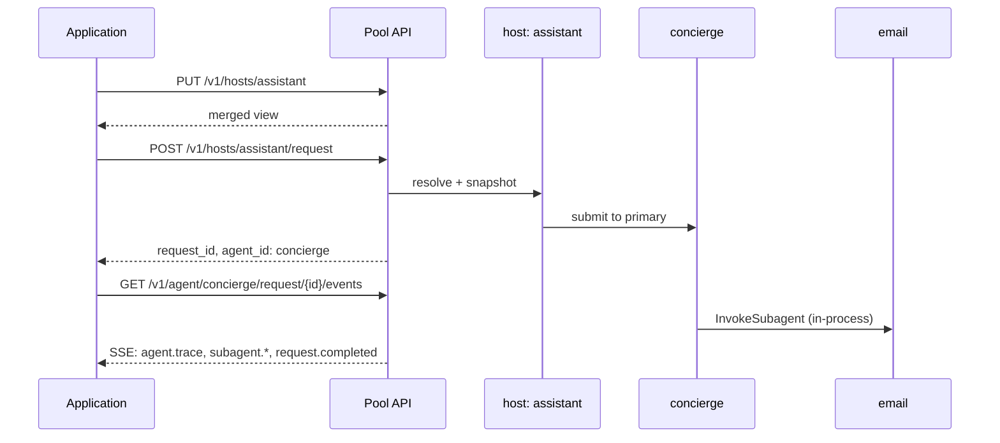

# Building Dynamic Hosts over the API

A Mash deployment is a pool of agents; which agents work together on a
request is decided by a host, and hosts are plain data. This guide covers
the API-only version of that flow: an application that inspects the pool,
composes a host over HTTP, routes requests through it, and streams the
results. No Mash CLI involved, and the application can be written in any
language, since the whole surface is HTTP + SSE.

The running example is a personal assistant backend. The pool ships three
agents: `concierge`, `email`, and `calendar`. The application decides per
task which team to assemble.

## The pool

The server side is the only Python in this guide, and it's deployed once:

```python
# assistant/spec.py
from mash.runtime import AgentMetadata, HostBuilder

def build_pool():
    return (
        HostBuilder()
        .agent(ConciergeAgent(), metadata=AgentMetadata(...))
        .agent(EmailAgent(),     metadata=AgentMetadata(...))
        .agent(CalendarAgent(),  metadata=AgentMetadata(...))
        .build()
    )
```

```bash
mash host serve --host-app assistant.spec:build_pool --port 8000
```

No `.host(...)` call. The pool starts with three live runtimes and zero
compositions. (For the full `AgentSpec` walkthrough, see
[Building an Agent CLI](building-agent-clis.md).)

All requests below go to `http://127.0.0.1:8000/api/v1`. If the deployment
sets `MASH_API_KEY`, add `Authorization: Bearer <key>` to each one.

## Inspect the pool

```bash
curl http://127.0.0.1:8000/api/v1/agent
```

```json
{
  "data": {
    "agents": [
      {"agent_id": "concierge", "metadata": {"display_name": "Concierge", ...}},
      {"agent_id": "email",     "metadata": {"display_name": "Email", ...}},
      {"agent_id": "calendar",  "metadata": {"display_name": "Calendar", ...}}
    ],
    "hosts": []
  }
}
```

The `metadata` on each agent is its self-description from registration:
display name, description, capabilities, and usage guidance. When an agent
serves as a subagent, this metadata becomes the routing directory the
primary's model reads to decide when to delegate, so it's also what an
application should show a user who is assembling a team.

## Define a host

A host names a primary, a set of subagents, and optionally workflows, all
by agent id:

```bash
curl -X PUT http://127.0.0.1:8000/api/v1/hosts/assistant \
  -H "Content-Type: application/json" \
  -d '{"primary": "concierge", "subagents": ["email", "calendar"]}'
```

The response is the merged view, members joined with their pool metadata:

```json
{
  "data": {
    "host_id": "assistant",
    "primary":   {"agent_id": "concierge", "metadata": {...}},
    "subagents": [
      {"agent_id": "email",    "metadata": {...}},
      {"agent_id": "calendar", "metadata": {...}}
    ],
    "workflows": []
  }
}
```

Validation happens here, synchronously. A primary or subagent id that isn't
a pooled agent, or a workflow id that isn't registered, returns
`400 INVALID_HOST` with the offending id in the message.

`PUT` is define-or-replace, so re-sending the same body is a no-op and
sending a different body swaps the composition for future requests. There
is no `DELETE`; a host you stop using costs nothing.

`GET /v1/hosts` lists the definitions, `GET /v1/hosts/{host_id}` returns
the merged view for one (`404 HOST_NOT_FOUND` for unknown ids).

## Route a request through it

```bash
curl -X POST http://127.0.0.1:8000/api/v1/hosts/assistant/request \
  -H "Content-Type: application/json" \
  -d '{"message": "triage my inbox and block focus time", "session_id": "s-1"}'
```

```json
{
  "data": {
    "request_id": "5f0c2b1e-...",
    "agent_id": "concierge",
    "session_id": "s-1"
  }
}
```

Submission is the moment composition takes effect. The server resolves the
host, routes to its primary, and snapshots `{host_id, primary, subagents}`
onto the request. For every turn of that request, the primary's system
prompt carries a directory of exactly those subagents and its
`InvokeSubagent` tool accepts exactly those ids.

`session_id` is yours to choose. Conversation history lives with the
primary agent, keyed by agent and session, so sending a later message to
the same host and session continues the conversation. The body also accepts
an optional `structured_output` JSON schema, same as the bare-agent submit.

The response names the primary in `agent_id` because everything after
submit happens on the standard per-agent routes.

## Stream the lifecycle

```bash
curl -N http://127.0.0.1:8000/api/v1/agent/concierge/request/5f0c2b1e-.../events
```

This is the same SSE stream every Mash request has, host-routed or not:

| Event | Meaning |
|---|---|
| `request.started` | the durable workflow began executing |
| `agent.trace` | a step happened: a think, a tool call, a subagent delegation |
| `request.interaction.create` | the agent paused for human input (see below) |
| `request.interaction.ack` | the input was received |
| `request.completed` | terminal; `data.response.text` holds the answer |
| `request.error` | terminal; `data.error` holds the failure |

While the concierge delegates, the child requests run in the subagents' own
sessions, and their lifecycle is mirrored into this stream as
`subagent.request.*` and `subagent.agent.trace` events, so one SSE
connection shows the whole team working.

If a tool on the primary requires approval, the stream emits
`request.interaction.create` with an `interaction_id` and the request
parks durably until the application answers:

```bash
curl -X POST http://127.0.0.1:8000/api/v1/agent/concierge/request/5f0c2b1e-.../interaction \
  -H "Content-Type: application/json" \
  -d '{"interaction_id": "itr_ab12cd34ef56", "response": "approve"}'
```



## What the snapshot means for your application

Three properties fall out of the snapshot, and they shape how an
application should use hosts:

**Redefinition is safe.** Re-`PUT`ting a host while requests are in flight
changes nothing for them; each request replays from the composition it was
submitted with, including across a crash and recovery. Only new
submissions see the new definition.

**Compositions are cheap.** A host is a few strings on the server. An
application can define a host per task ("compose `email` + `calendar`
under `concierge` for this command"), use it for a handful of requests,
and never clean it up.

**Hosts are in-memory.** A deployment restart keeps the pool (it's code)
and drops API-defined hosts. The pattern is to re-`PUT` your hosts on
application startup, which is free because the call is idempotent. If the
deployment runs multiple replicas behind a load balancer, a `PUT` lands on
one replica, so startup re-definition should hit each replica or the hosts
should move into `build_pool()`. The
[deploy guide](how-to-deploy.md) covers this in the scaling section.

## Observe by composition

Every runtime event written during a host-routed request carries the
`host_id` from its snapshot, and the telemetry API filters on it:

```bash
curl "http://127.0.0.1:8000/api/v1/telemetry/events?agent_id=concierge&host_id=assistant&limit=100"
```

Events from bare-agent requests carry `host_id: null`, so the same query
distinguishes the concierge's work inside the `assistant` composition from
anything it did standalone or under a different host.

## The same flow from Python

For Python applications, `MashHostClient` wraps every call above:

```python
from mash.cli import MashHostClient

client = MashHostClient("http://127.0.0.1:8000", api_key="...")

client.list_agents()
client.define_host("assistant", primary="concierge",
                   subagents=["email", "calendar"])
accepted = client.submit_host_request("assistant",
                                      message="triage my inbox",
                                      session_id="s-1")
for event in client.stream_request(accepted["agent_id"], accepted["request_id"]):
    if event["event"] == "request.completed":
        print(event["data"]["response"]["text"])
        break

client.close()
```

The full route reference lives in the
[API README](https://github.com/imsid/mashpy/blob/main/src/mash/api/README.md),
and [The Host API and CLI](host-api-and-cli.md) covers the rest of the HTTP
surface this builds on.
