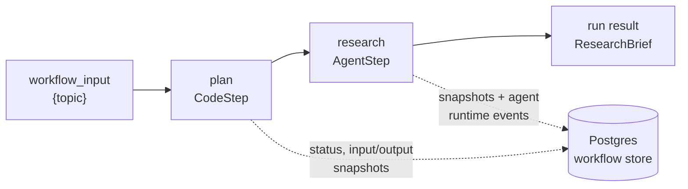

# Code as the Source of Truth

A research-brief automation takes a topic, decides which questions are worth
answering, researches them, and returns a summary with sources. Deciding the
questions is deterministic: a function over the topic. The research needs a
model. In Mash the whole automation is a workflow, an ordered pipeline of typed
steps, and the pipeline is code. A step is deterministic Python or one run of a
harnessed agent. The pipeline is something you can read, diff, test, and
replay, and the agent is a step with a schema on both edges.

## The pipeline in code

Every step declares a pydantic input and output. The planning step is a plain
function:

```python
from pydantic import BaseModel

from mash import CodeStep, StepContext, WorkflowSpec


class ResearchRequest(BaseModel):
    topic: str


class ResearchPlan(BaseModel):
    topic: str
    questions: list[str]


def plan_research(request: ResearchRequest, _context: StepContext) -> ResearchPlan:
    return ResearchPlan(
        topic=request.topic,
        questions=[
            f"What are the key facts about {request.topic}?",
            f"What should a reader understand about {request.topic}?",
        ],
    )


RESEARCH_BRIEF = WorkflowSpec(
    workflow_id="research-brief",
    input_model=ResearchRequest,
    steps=[
        CodeStep(
            step_id="plan",
            run=plan_research,
            input=ResearchRequest,
            output=ResearchPlan,
        ),
    ],
)
```

This one-step pipeline is already a deployable automation. A pool built from it
alone serves workflow runs with no agents registered:

```python
from mash import HostBuilder


def build_pool():
    return HostBuilder().workflow(RESEARCH_BRIEF).build()
```

Everything about the automation is ordinary code. A unit test calls
`plan_research` with a `ResearchRequest` and asserts on the plan. A reviewer
reads the `steps` list and sees the control flow in one place, in order. A
change to the pipeline is a diff, and the diff says exactly what changed.

## An agent as a step

The research itself becomes an `AgentStep`: one run of a registered agent's
loop, with the same typed edges as any other step.

```python
from mash import AgentStep


class ResearchBrief(BaseModel):
    summary: str
    sources: list[str]


RESEARCH_BRIEF = WorkflowSpec(
    workflow_id="research-brief",
    input_model=ResearchRequest,
    steps=[
        CodeStep(
            step_id="plan",
            run=plan_research,
            input=ResearchRequest,
            output=ResearchPlan,
        ),
        AgentStep(
            step_id="research",
            agent_id="research",
            input=ResearchPlan,
            output=ResearchBrief,
        ),
    ],
)
```

The agent receives the `ResearchPlan` as JSON and must return structured output
matching `ResearchBrief`. The schema rides the request, the runtime validates
the payload, and the validated result is the run result. Inside the step the
model reasons, calls tools, and may pause for a human. None of that changes the
pipeline. The step's contract is `ResearchPlan` in, `ResearchBrief` out, and
everything the loop did is recorded as runtime events under the step.

Control flow stays in code. The `steps` list decides what runs and in what
order; the model reasons inside its step and never owns the pipeline.
Nondeterminism is contained inside typed steps with schema-checked boundaries,
and `WorkflowSpec` checks every edge when the pool is built, so a step that
expects a field no earlier step provides fails before anything deploys.

## Deploying it

The pool is the unit of deploy: agents and workflows registered together.

```python
from mash import AgentMetadata, HostBuilder


def build_pool():
    return (
        HostBuilder()
        .agent(
            ResearchAgent(),
            metadata=AgentMetadata(
                display_name="Research",
                description="Handles research-heavy questions in depth.",
                capabilities=["research", "analysis"],
                usage_guidance="Use for questions that need digging.",
            ),
        )
        .workflow(RESEARCH_BRIEF)
        .build()
    )
```

```bash
mash host serve --host-app my_app.host:build_pool --port 8000
mash connect --api-base-url http://127.0.0.1:8000
mash workflows
```

`POST /api/v1/workflow/research-brief/run` starts a run and returns a
`run_id`. Every step executes durably: step bodies and store writes are
memoized, a failed run resumes from the failed step under the same `run_id`,
and completed steps replay from their stored outputs instead of running again.
Both step kinds write to the same store: the run, each step's input and output
snapshots, and the agent step's full event stream land in Postgres tables you
can query.



When a run misbehaves, the audit trail shows which step ran, what it received,
and what it produced. The fix is a code change, and the next diff carries it.

*The step-pipeline mechanics, output threading, resume, and the audit trail in
detail: [Workflows as Step Pipelines](workflows-as-step-pipelines.md).*
