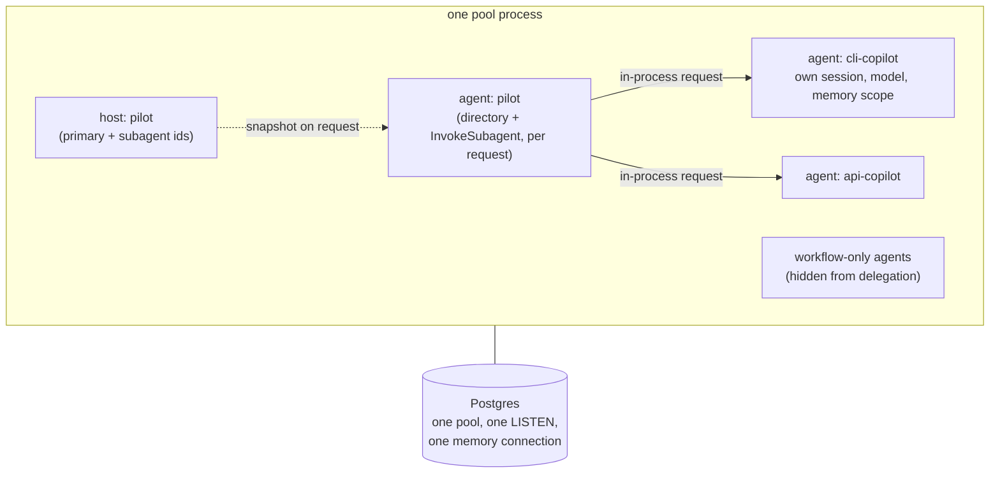

# Composing Agents Under One Host

A Mash deployment is a flat pool of agents plus the hosts composed over them:

```python
pool = (
    HostBuilder()
    .agent(PilotSpec(), metadata=AgentMetadata(...))
    .agent(
        CliCopilot(),
        metadata=AgentMetadata(
            display_name="CLI Copilot",
            description="Answers questions about the mash CLI.",
            capabilities=["cli commands", "repl usage"],
            usage_guidance="Use for CLI-specific questions.",
        ),
    )
    .agent(ApiCopilot(), metadata=AgentMetadata(...))
    .host(Host(host_id="pilot", primary="pilot", subagents=("cli-copilot", "api-copilot")))
    .build()
)
```

Each spec becomes a full `AgentRuntime` with its own model, tools, config, and memory scope, everything this series has covered, multiplied inside one process. Note what's missing: roles. No agent is registered as a primary or a subagent. The pool is the unit of deploy; a `Host` is the unit of composition, and roles only exist inside one.

## Hosts are data

A `Host` names a primary, a set of subagents, and optionally workflows — all by agent id. It's an immutable value, defined in code at build time like above, or on a running pool over the control API:

```bash
curl -X PUT http://127.0.0.1:8000/api/v1/hosts/cli-help \
  -d '{"primary": "cli-copilot", "subagents": []}'
```

Submitting to a host (`POST /v1/hosts/{host_id}/request`) routes to its primary and snapshots `{host_id, primary, subagents}` onto the request. The snapshot rides inside the durable workflow's inputs, so a crashed request recovers with the composition it started with, even if someone re-`PUT` the host mid-flight. Redefining a host only affects new requests.

Because roles live in the host and not on the agent, the same agent can be the primary of one host and a subagent in another, concurrently. And because hosts are a few strings, they're cheap to create: a client application can compose a host per task, route a few requests through it, and forget it.

## The metadata is the routing layer

`AgentMetadata` is required at registration; `register_agent` rejects an agent without it. The metadata is how delegation decisions get made: when a request carries a host snapshot, the per-turn agent build augments the primary's system prompt with a directory of that host's subagents, built from those display names, descriptions, capabilities, and usage guidance, and the primary's own model reads that directory to decide when a question belongs to a specialist.

Delegation quality is therefore a prompt-engineering surface. Vague `usage_guidance` produces vague routing.

The directory is per-request, not baked into the runtime. A bare request to the same agent (`POST /v1/agent/{agent_id}/request`) gets no directory and no delegation tool — the agent answers alone.

## Delegation is a tool call

Alongside the directory, the per-turn build installs one tool on the primary:

```python
# src/mash/tools/subagent.py
class InvokeSubagentTool:
    name = "InvokeSubagent"
    parameters = {
        "type": "object",
        "properties": {
            "agent_id": {"type": "string", ...},
            "prompt":   {"type": "string", ...},
            "opts":     {"type": "object", ...},  # e.g. {"timeout_ms": 30000}
        },
        "required": ["agent_id", "prompt"],
    }
```

Invoking it submits a normal Mash request to the subagent's runtime through an in-process client. The client resolver is gated on the snapshot: an agent id outside the host's subagent list is refused, even if it exists in the pool. The child request goes down the same `submit_request` path and durable workflow as any external request, and the subagent's response streams back to become the tool result the primary observes on its next think.

Two details keep this delegation well-behaved:

**Sessions stay separate.** The child request runs in the subagent's own session, derived deterministically from the primary's (`derive_subagent_session_id`). The specialist accumulates its own [memory](memory-and-compaction.md) across delegations, and the primary's conversation stays its own.

**Traces stay connected.** While the child executes, its lifecycle events are mirrored into the parent's trace as `subagent.request.*` and `subagent.agent.trace` events. A client streaming the primary's request watches the delegation happen live, and trace analysis can stitch child traces into the parent's timing breakdown.



`InvokeSubagent` has one durability nuance: it runs at workflow scope rather than inside a step checkpoint, because the child request is its own DBOS workflow and DBOS won't start workflows from step context. The result payload and events are the same as any tool; only the checkpoint boundary differs.

## The second registration kind

Besides pooled agents, deployments can carry **workflow-only agents**, specs registered through `HostBuilder.workflow(...)` (or `register_workflow_agent`) that exist to execute workflow tasks. They're full runtimes, but they're hidden from public agent listings and can't be named in a host: the primary can't invoke them and clients can't address them. They surface in the next post.

Masher is a built-in example: the workflow-only specialist that runs Mash's trace-digest and eval-curation workflows against another agent's event logs. It's registered into every pool by default; pass `enable_masher(False)` to the builder to leave it out.

## Shared infrastructure

The pool owns the stores, as [the two-stores post](two-stores.md) covered: every agent using the default `build_memory_store()` shares one pool, one LISTEN connection, and one memory connection, regardless of agent count.

Sharing stops at infrastructure. Memory reads and writes are scoped by `app_id`, and runtime events carry their `agent_id`, so two agents in one pool stay as isolated as two agents in separate processes. One consequence worth knowing: memory is keyed by agent id, not by host, so an agent keeps its memory whether it's serving one host or three. If you need isolated instances of the same spec, register it twice under different ids.

Delegation covers work that arrives as conversation. Scheduled, repeatable pipelines that need state between runs get their own layer, built from the same parts, and that's the next post.

*Next: [Workflows and Task State](workflows-and-task-state.md).*
