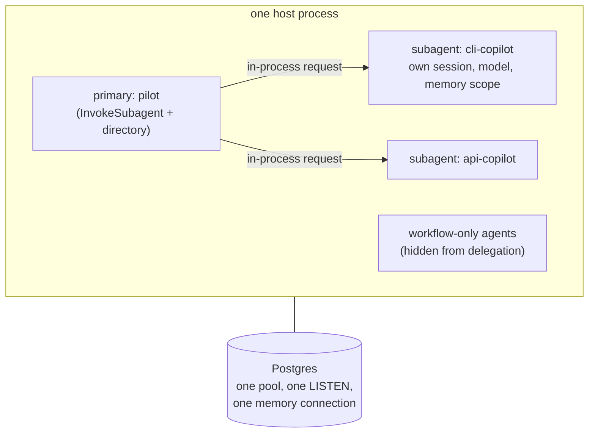

# Composing Agents Under One Host

A Mash host is one primary agent plus optional specialists, composed in a few lines — and delegation is a tool call.

```python
host = (
    HostBuilder()
    .primary(PilotSpec())
    .subagent(
        CliCopilot(),
        metadata=SubAgentMetadata(
            display_name="CLI Copilot",
            description="Answers questions about the mash CLI.",
            capabilities=["cli commands", "repl usage"],
            usage_guidance="Use for CLI-specific questions.",
        ),
    )
    .subagent(ApiCopilot(), metadata=SubAgentMetadata(...))
    .build()
)
```

Each spec becomes a full `AgentRuntime` — its own model, tools, config, and memory scope, everything this series has covered, multiplied by N inside one process. The composition layer adds three things on top: a directory, a tool, and shared plumbing.

## The metadata is the routing layer

`SubAgentMetadata` is required — `build()` rejects a subagent without it — because the metadata *is* how delegation decisions get made. The host augments the primary agent's system prompt with a directory of its subagents, built from those display names, descriptions, capabilities, and usage guidance, and the primary's own model reads that directory to decide when a question belongs to a specialist.

Which means delegation quality is a prompt-engineering surface, in the best sense: vague `usage_guidance` produces vague routing, and tightening the metadata tightens the behavior.

## Delegation is a tool call

Alongside the directory, the host auto-installs one tool on the primary:

```python
# src/mash/tools/subagent.py
class InvokeSubagentTool:
    name = "InvokeSubagent"
    parameters = {
        "type": "object",
        "properties": {
            "agent_id": {"type": "string", ...},
            "prompt":   {"type": "string", ...},
            "opts":     {"type": "object", ...},  # e.g. {"timeout_ms": 30000}
        },
        "required": ["agent_id", "prompt"],
    }
```

Invoking it submits a *normal Mash request* to the subagent's runtime through an in-process client — the same `submit_request` path, the same durable workflow, the same event log treatment as any external request. The subagent's response streams back and becomes the tool result the primary observes on its next think.

Two details keep this delegation well-behaved:

**Sessions stay separate.** The child request runs in the subagent's own session, derived deterministically from the primary's (`derive_subagent_session_id`). The specialist accumulates its own [memory](memory-and-compaction.md) across delegations, and the primary's conversation stays its own.

**Traces stay connected.** While the child executes, its lifecycle events are mirrored into the parent's trace as `subagent.request.*` and `subagent.agent.trace` events. A client streaming the primary's request watches the delegation happen live, and trace analysis can stitch child traces into the parent's timing breakdown. Separate sessions, one observable story.



There's one durability nuance: `InvokeSubagent` runs at workflow scope rather than inside a step checkpoint, because the child request is its own DBOS workflow and DBOS won't start workflows from step context. The result payload and events are the same as any tool; only the checkpoint boundary differs.

## The third registration kind

Besides `primary` and `subagent`, hosts can carry **workflow-only agents** — specs registered through `HostBuilder.workflow(...)` (or `register_workflow_agent`) that exist to execute workflow tasks. They're full runtimes, but they're hidden from public agent listings and from the delegation directory: the primary can't invoke them and clients can't address them. They surface in the next post.

`enable_masher()` registers a built-in example: Masher, the workflow-only specialist that runs Mash's trace-digest and eval-curation workflows against another agent's event logs.

## What sharing actually shares

The host owns the stores, as [the two-stores post](two-stores.md) covered: every agent using the default `build_memory_store()` shares one pool, one LISTEN connection, one memory connection, regardless of agent count.

Sharing stops at infrastructure. Memory reads and writes are scoped by `app_id`, runtime events carry their `agent_id`, and sessions stay within their agent. Two agents in one host are as isolated as two agents in separate processes.

A primary delegating to a specialist covers work that arrives as conversation. The other shape of work — scheduled, repeatable, multi-step pipelines that need state between runs — gets its own layer, built from the same parts.

*Next: [Workflows and Task State](workflows-and-task-state.md).*
