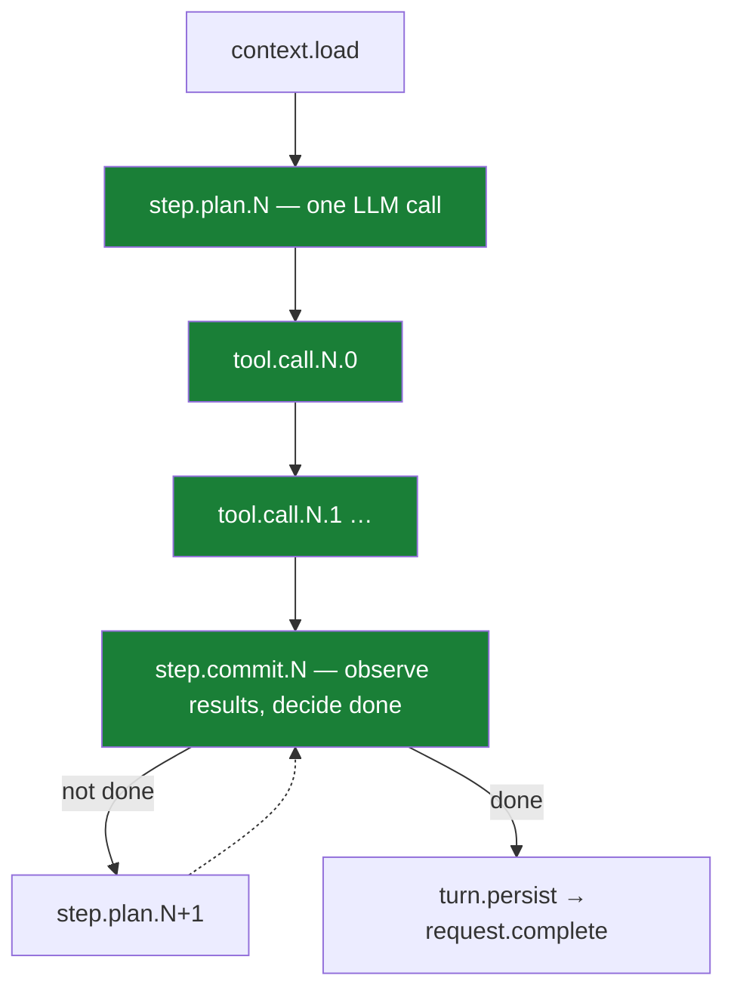

# The Agent Loop, Durably

Start a request that takes a dozen steps. Halfway through, `kill -9` the host process. Start it again.

The request finishes from where it left off: completed tool calls stay completed, the loop resumes at its last checkpoint, and the client streaming events watches it happen. This post is about the design that makes that sentence true.

## The loop itself is simple

At the core of every Mash agent is the think–act–observe loop in `mash/core/agent.py`. Stripped of logging, it reads like the textbook version:

```python
# src/mash/core/agent.py — Agent.run() (trimmed)
for step in range(self.config.max_steps):
    plan = await self.plan_step(context)      # think: one LLM call → an Action
    results = await self.act(plan.action)     # act: execute the planned tool calls
    commit = self.commit_step(                # observe: fold results into context,
        context, plan.action, results,        # decide whether we're done
        step_index=step,
    )
    context = commit.context
    if commit.done:
        break
```

`Agent.run()` is real and used — it's the in-memory execution path. But the hosted runtime **never calls it**. That's the interesting decision.

## Why the engine doesn't call `run()`

The hosted runtime executes each request as a [DBOS](https://docs.dbos.dev) workflow — a function whose progress is checkpointed to Postgres so it can resume after a crash. DBOS resumes a workflow by replaying it from the last completed step.

Now suppose the workflow had one step: `Agent.run()`. A crash at step 9 of 12 means the last completed checkpoint is *the start of the request*. Recovery replays the whole turn: every LLM call paid for again, and — much worse — every tool call executed again. The agent already appended to a changelog, sent a message, deployed a service. Replay does it twice.

So the unit of durability can't be the loop. It has to be the loop's *phases*. The agent exposes exactly those seams — `plan_step`, `execute_step_tool_call`, `commit_step` — and the workflow wraps each one in its own checkpoint:

```python
# src/mash/runtime/engine/workflow.py — execute_request_workflow (trimmed)
while True:
    loop_index = int(workflow_state.get("loop_index") or 0)

    workflow_state = await retry_transient(
        lambda: DBOS.run_step_async(
            {"name": f"step.plan.{loop_index}"},
            plan_request_step, ...,
        )
    )

    for call_index, tool_call in enumerate(tool_calls):
        existing_results = list(workflow_state.get("result_payloads") or [])
        if call_index < len(existing_results):
            continue                      # already ran before the crash — skip
        workflow_state = await _run_tool_call_for_workflow(
            ..., loop_index=loop_index, call_index=call_index, tool_call=...,
        )

    workflow_state = await DBOS.run_step_async(
        {"name": f"step.commit.{loop_index}"},
        commit_request_step, ...,
    )

    if bool(workflow_state.get("done")):
        # persist the final turn, complete the request
        return
```

Every checkpoint has a stable name — `step.plan.3`, `tool.call.3.1`, `step.commit.3` — and each tool call is its own checkpoint. That `continue` in the middle is the whole crash story in two lines: completed tool results live in `result_payloads`, so on resume, tool calls that already finished are skipped by index, and execution proceeds from the first one that didn't.



Every green box is a durable checkpoint. A crash between any two of them resumes at the boundary — the most you can lose is the one step that was in flight, and a *plan* step in flight is the safe kind to lose: re-planning is idempotent in a way that re-deploying is not.

## What travels between checkpoints

DBOS replays the workflow function, so anything the loop needs must flow through the step return values. The workflow carries one state dict between checkpoints:

| Field | What it holds |
|---|---|
| `context` | the serialized model context, updated after every plan and commit |
| `loop_index` | which step of the loop we're on |
| `action` | the currently planned action (tool calls to run) |
| `result_payloads` | completed tool results for the current step — the resume cursor |
| `aggregate_usage`, `tool_usage` | token accounting across the run |
| `done` | whether `commit_step` declared the run terminal |

All of this is execution state. Nothing here is written as a conversation turn until the run completes — partial progress lives in workflow state and the event log only. (That boundary is the subject of the next post.)

## Three layers of failure handling

Crash recovery is one of three failure layers, and they cover different things:

| Failure | Handled by | You do |
|---|---|---|
| Transient error — rate limit, timeout, network blip | `retry_transient()`: in-process retry with exponential backoff and jitter, 3 attempts | nothing |
| Retries exhausted, or terminal error — bad API key, context overflow | workflow emits `request.error` with `error_code` and `retryable` | inspect; call `POST .../resume` if it's worth retrying |
| Process crash — OOM, `kill -9`, hardware | DBOS finds the orphaned workflow on next startup and replays from the last checkpoint | nothing |

The first layer hugs the two hot paths — LLM planning and tool execution — and decides what's transient by pattern-matching the error:

```python
# src/mash/runtime/errors.py (trimmed)
_RETRYABLE_PATTERNS = (
    (("rate_limit", "429", "too many requests"), "rate_limit_exceeded"),
    (("timeout", "timed out", "deadline exceeded"), "timeout"),
    (("connection", "network", "dns", "socket"), "network_error"),
    ...
)
_TERMINAL_PATTERNS = (
    (("authentication", "unauthorized", "401", ...), "auth_error"),
    (("context_length_exceeded",), "context_length_exceeded"),
    ...
)
```

Unknown errors default to retryable — the worst case of retrying is failing again, while the worst case of not retrying is abandoning recoverable work.

The third layer has a subtlety worth knowing for operations: a crashed process emits no `request.error`, because nothing was alive to emit it. The event stream just goes quiet. That's what `GET .../request/{id}/status` is for — it queries the DBOS workflow state directly, and `pending` means "will be auto-recovered on startup," while `failed` means "needs a resume call."

## The shape of the trade

The design has a real cost: a serialization boundary. Context must round-trip through workflow state on every step, and the loop had to be expressed as three primitives instead of one method. In exchange it buys exactly one thing, and it's the thing that matters for agents in production: **tool calls execute at most once per request**, across retries, restarts, and crashes. For an agent whose tools write to the world — files, deploys, messages — at-most-once execution is what makes it safe to run unattended.

One loose end: workflow state holds the in-flight request, while finished turns and the event log each live in a store of their own, with rules of their own.

*Next: [Two Stores, On Purpose](two-stores.md) — why the runtime keeps the event log and conversation memory in separate stores with separate rules.*
