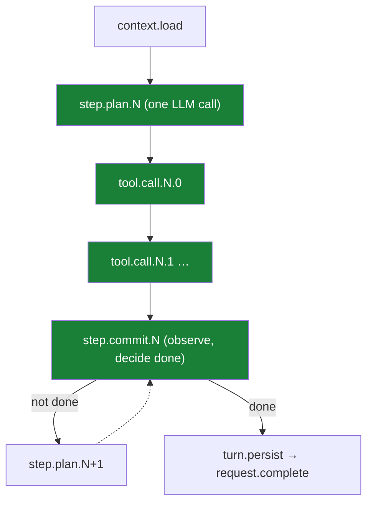

# The Durable Agent Loop

The agent loop in Mash is a think/act/observe cycle. Almost everything the agent does flows through tool calls — skills, subagents, remote tools, memory — and the loop runs the same way regardless of which of those is happening.

A trace spans one user message through the full loop run to the final response, written as one row in `memory_turns` on completion. Within a trace, each iteration of the loop is a turn — one think/act/observe cycle.

The runtime wraps each request in a [DBOS](https://docs.dbos.dev) workflow. The LLM call and the commit are each a checkpoint; each tool call gets its own checkpoint. If the host process crashes mid-run, the workflow resumes from the last completed checkpoint.

## The loop

In the **think** phase, the model receives the current context and returns an action — either a set of tool calls to execute, or a final response signalling the run is complete. In the **act** phase, if the action has tool calls they execute; if not, act returns nothing. In the **observe** phase, results fold back into context. The loop continues as long as the model returns tool calls, or until `max_steps` is reached.

The loop in `mash/core/agent.py` maps directly to those phases:

```python
# src/mash/core/agent.py: Agent.run() (trimmed)
for step in range(self.config.max_steps):
    plan = await self.plan_step(context)      # think: one LLM call → an Action
    results = await self.act(plan.action)     # act: execute tool calls, or [] if none
    commit = self.commit_step(                # observe: fold results into context,
        context, plan.action, results,        # decide whether we're done
        step_index=step,
    )
    context = commit.context
    if commit.done:
        break
```

## Tool calls as the uniform interface

The LLM emits tool calls during `plan_step`. The `act` phase executes them. What those calls do covers a wide range:

- **Skills** — a `Skill` meta-tool fetches the relevant markdown instruction bundle and surfaces it back to the LLM as a tool result
- **Subagent invocation** — `InvokeSubagent` sends a request to another agent in the pool and streams back its output
- **Web search and fetch** — `web_search` and `web_fetch` are registered tools when a web search provider is configured
- **Remote MCP tools** — tools registered from MCP servers (GitHub, databases, custom servers) are called the same way as local tools
- **Memory** — `memory_search` and `memory_store` read and write to the agent's memory store

From the loop's perspective, these are all tool calls. The routing happens inside `act`.

## Checkpoint-level durability

Because DBOS replays a workflow from its last completed checkpoint on crash recovery, the granularity of checkpoints determines the cost of recovery. If the whole loop were one checkpoint, a crash mid-run would replay from the start: every LLM call billed again, every tool call executed again. For agents that write to external systems, that matters.

The runtime maps each loop iteration to three checkpoints. The LLM call runs as `step.plan.N`. Each tool call runs as its own `tool.call.N.M` checkpoint (parallel-safe calls may be batched into a single `tool.batch.N.M`). The commit runs as `step.commit.N`. In code:

```python
# src/mash/runtime/engine/workflow.py: execute_request_workflow (trimmed)
while True:
    loop_index = int(workflow_state.get("loop_index") or 0)

    workflow_state = await retry_transient(
        lambda: DBOS.run_step_async(
            {"name": f"step.plan.{loop_index}"},
            plan_request_step, ...,
        )
    )

    for call_index, tool_call in enumerate(tool_calls):
        existing_results = list(workflow_state.get("result_payloads") or [])
        if call_index < len(existing_results):
            continue                      # already ran before the crash; skip
        workflow_state = await _run_tool_call_for_workflow(
            ..., loop_index=loop_index, call_index=call_index, tool_call=...,
        )

    workflow_state = await DBOS.run_step_async(
        {"name": f"step.commit.{loop_index}"},
        commit_request_step, ...,
    )

    if bool(workflow_state.get("done")):
        return
```

On resume, the `continue` in the tool call loop skips any calls whose results are already in `result_payloads`. Execution picks up at the first tool call that did not complete.



Each green box is a checkpoint. A crash between any two of them resumes at the boundary. Re-running `step.plan.N` costs one extra LLM call with no side effects. Re-running a tool call that already completed is prevented by the index check.

DBOS replays the workflow function on resume, so the loop carries all execution state in one dict passed between checkpoints:

| Field | What it holds |
|---|---|
| `context` | the serialized model context, updated after every plan and commit |
| `loop_index` | which turn of the loop we're on |
| `action` | the planned action for the current turn (tool calls to run) |
| `result_payloads` | completed tool results for the current turn; the resume cursor |
| `aggregate_usage`, `tool_usage` | token accounting across the run |
| `done` | whether `commit_step` declared the run terminal |

Nothing here is written to `memory_turns` until the trace completes. Partial progress lives in workflow state and the event log until then.

## Event sourcing

Every plan, tool call, and commit emits structured events to the `runtime_event_log` table alongside the workflow state. Those events are how the streaming API works: a client polling `GET .../request/{id}/events` is reading from that log. They are also how the runtime provides observability into a run.

The events are the same regardless of which LLM provider runs the think step. All providers — Anthropic, OpenAI, Gemini, and OSS models via `OSSCompatibleProvider` — implement the same `send(LLMRequest) -> LLMResponse` interface. The loop works only with `LLMResponse`, so `agent.think.complete` carries the same fields whether Claude or a self-hosted Qwen model produced the plan. Swapping providers is a change to `build_llm()`; the events, the tooling, and the loop are unaffected.

You can query the log after the fact to see exactly what happened in a session:

```sql
select seq, event_type, loop_index, payload
from runtime_event_log
where session_id = 'd8ec0a00-20df-48dc-a90b-9aa1b8393f8b'
order by seq;
```

The event log and workflow state are separate stores. Workflow state holds what the runtime needs to continue execution; the event log holds the record of what happened. The completed trace is written to a third store. That split is covered in the next post.

## Failure handling

Three layers cover different failure modes:

| Failure | Handled by | You do |
|---|---|---|
| Transient error (rate limit, timeout, network blip) | `retry_transient()`: in-process retry with exponential backoff and jitter, 3 attempts | nothing |
| Retries exhausted, or terminal error (bad API key, context overflow) | workflow emits `request.error` with `error_code` and `retryable` | inspect; call `POST .../resume` if worth retrying |
| Process crash (OOM, `kill -9`, hardware) | DBOS finds the orphaned workflow on next startup and replays from the last checkpoint | nothing |

The first layer wraps LLM planning and tool execution and classifies errors by pattern:

```python
# src/mash/runtime/errors.py (trimmed)
_RETRYABLE_PATTERNS = (
    (("rate_limit", "429", "too many requests"), "rate_limit_exceeded"),
    (("timeout", "timed out", "deadline exceeded"), "timeout"),
    (("connection", "network", "dns", "socket"), "network_error"),
    ...
)
_TERMINAL_PATTERNS = (
    (("authentication", "unauthorized", "401", ...), "auth_error"),
    (("context_length_exceeded",), "context_length_exceeded"),
    ...
)
```

Unknown errors default to retryable. A crashed process emits no `request.error`, so `GET .../request/{id}/status` covers that case by querying the DBOS workflow state directly. A status of `pending` means the request will recover on next startup; `failed` means it needs a resume call.

*Next: [The Runtime Store](persistence-store.md).*
