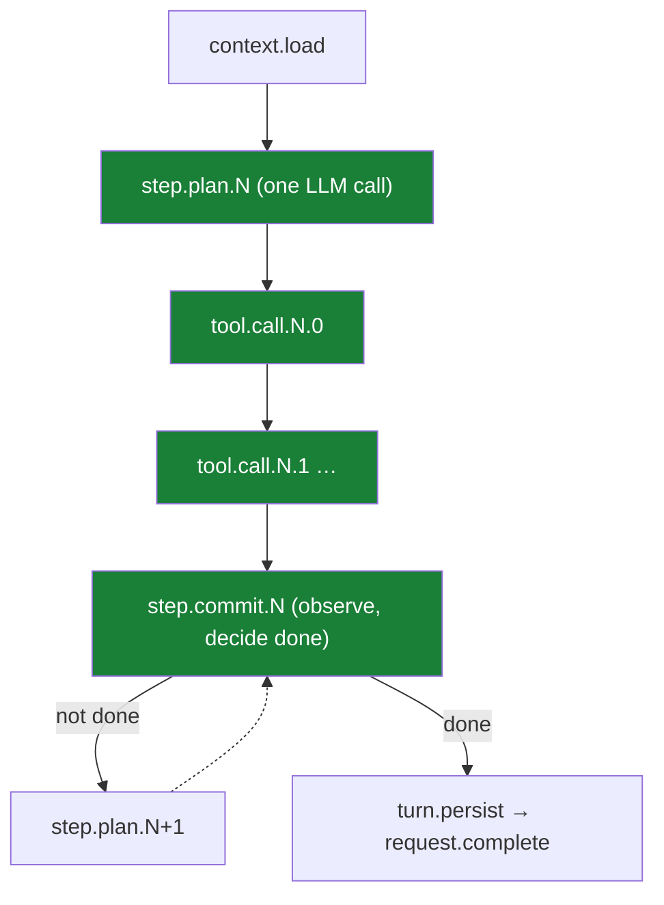

# The Durable Agent Loop

The agent loop in Mash is a think/act/observe cycle. Almost everything the agent does flows through tool calls — skills, subagents, remote tools, memory — and the loop runs the same way regardless of which of those is happening.

A trace spans one user message through the full loop run to the final response, written as one row in `memory_turns` on completion. Within a trace, each iteration of the loop is a turn — one think/act/observe cycle.

The runtime wraps each request in a [DBOS](https://docs.dbos.dev) workflow. The LLM call and the commit are each a checkpoint; each tool call gets its own checkpoint. If the host process crashes mid-run, the workflow resumes from the last completed checkpoint.

## The loop

In the **think** phase, the model receives the current context and returns an action — either a set of tool calls to execute, or a final response signalling the run is complete. In the **act** phase, if the action has tool calls they execute; if not, act returns nothing. In the **observe** phase, results fold back into context. The loop continues as long as the model returns tool calls, or until `max_steps` is reached.

The loop in `mash/core/agent.py` maps directly to those phases:

```python
# src/mash/core/agent.py: Agent.run() (trimmed)
for step in range(self.config.max_steps):
    plan = await self.plan_step(context)      # think: one LLM call → an Action
    results = await self.act(plan.action)     # act: execute tool calls, or [] if none
    commit = self.commit_step(                # observe: fold results into context,
        context, plan.action, results,        # decide whether we're done
        step_index=step,
    )
    context = commit.context
    if commit.done:
        break
```

## Tool calls as the uniform interface

The LLM emits tool calls during `plan_step`. The `act` phase executes them. What those calls do covers a wide range:

- **Skills** — a `Skill` meta-tool fetches the relevant markdown instruction bundle and surfaces it back to the LLM as a tool result
- **Subagent invocation** — `InvokeSubagent` sends a request to another agent in the pool and streams back its output
- **Web search and fetch** — `web_search` and `web_fetch` are registered tools when a web search provider is configured
- **Remote MCP tools** — tools registered from MCP servers (GitHub, databases, custom servers) are called the same way as local tools
- **Memory** — `memory_search` and `memory_store` read and write to the agent's memory store

From the loop's perspective, these are all tool calls. The routing happens inside `act`.

## Checkpoint-level durability

Because DBOS replays a workflow from its last completed checkpoint on crash recovery, the granularity of checkpoints determines the cost of recovery. If the whole loop were one checkpoint, a crash mid-run would replay from the start: every LLM call billed again, every tool call executed again. For agents that write to external systems, that matters.

The runtime maps each loop iteration to three checkpoints. The LLM call runs as `step.plan.N`. Each tool call runs as its own `tool.call.N.M` checkpoint (parallel-safe calls may be batched into a single `tool.batch.N.M`). The commit runs as `step.commit.N`. In code:

```python
# src/mash/runtime/engine/workflow.py: execute_request_workflow (trimmed)
while True:
    loop_index = int(workflow_state.get("loop_index") or 0)

    workflow_state = await retry_transient(
        lambda: DBOS.run_step_async(
            {"name": f"step.plan.{loop_index}"},
            plan_request_step, ...,
        )
    )

    for call_index, tool_call in enumerate(tool_calls):
        existing_results = list(workflow_state.get("result_payloads") or [])
        if call_index < len(existing_results):
            continue                      # already ran before the crash; skip
        workflow_state = await _run_tool_call_for_workflow(
            ..., loop_index=loop_index, call_index=call_index, tool_call=...,
        )

    workflow_state = await DBOS.run_step_async(
        {"name": f"step.commit.{loop_index}"},
        commit_request_step, ...,
    )

    if bool(workflow_state.get("done")):
        return
```

On resume, the `continue` in the tool call loop skips any calls whose results are already in `result_payloads`. Execution picks up at the first tool call that did not complete.


```mermaid
flowchart TD
    L[context.load] --> P["step.plan.N (one LLM call)"]
    P --> T0["tool.call.N.0"]
    T0 --> T1["tool.call.N.1 …"]
    T1 --> C["step.commit.N (observe, decide done)"]
    C -- "not done" --> P2["step.plan.N+1"]
    C -- "done" --> F["turn.persist → request.complete"]
    P2 -.-> C

    style P fill:#1a7f37,color:#fff
    style T0 fill:#1a7f37,color:#fff
    style T1 fill:#1a7f37,color:#fff
    style C fill:#1a7f37,color:#fff
```

Each green box is a checkpoint. A crash between any two of them resumes at the boundary. Re-running `step.plan.N` costs one extra LLM call with no side effects. Re-running a tool call that already completed is prevented by the index check.

DBOS replays the workflow function on resume, so the loop carries all execution state in one dict passed between checkpoints:

| Field | What it holds |
|---|---|
| `context` | the serialized model context, updated after every plan and commit |
| `loop_index` | which turn of the loop we're on |
| `action` | the planned action for the current turn (tool calls to run) |
| `result_payloads` | completed tool results for the current turn; the resume cursor |
| `aggregate_usage`, `tool_usage` | token accounting across the run |
| `done` | whether `commit_step` declared the run terminal |

Nothing here is written to `memory_turns` until the trace completes. Partial progress lives in workflow state and the event log until then.

## Cancel, resume, and rerun

The replay that recovers a crashed process also gives a person control over a request that is running or already finished. Three verbs sit on the API: `POST .../request/{request_id}/cancel`, `.../resume`, and `.../rerun`.

Cancel stops a running request at the next step boundary. The step in flight finishes and checkpoints first, so a tool call that already started completes and its result is recorded. A request parked on an approval or `AskUser` has that tool call terminated. A subagent invocation is a tool call like any other: a child that has already been invoked runs to completion, and cancel never cascades to it.

Resume continues a cancelled request from its last checkpoint. All of its context comes from the checkpoints, so the request picks up with the model context as it stood rather than one rebuilt from the original message. A request whose session has accrued a later turn is rejected with a 409, because resume replays the original context snapshot and allowing it would persist a turn that ignores everything after it. A request cancelled while parked on an interaction resumes by issuing a fresh `AskUser` call under a new interaction id.

DBOS declines to resume a workflow that ended in error, since its resume path updates only workflows whose status is outside `SUCCESS` and `ERROR`. A failed request starts over with rerun instead.

Rerun starts a previous request over as a new request, with a new request id, a new trace, and a `rerun_of` key stamped into the request metadata for provenance. The original message and host snapshot ride along, and `context.load` runs fresh against the session as it stands now.

One request's event log across a cancel and a resume, cancelled while the LLM call after the seventh tool call was in flight:

```
seq  event_type                     detail
78   agent.tool.call                sleep 3 && echo step-7
79   agent.tool.result
80   runtime.tool.call.completed
81   runtime.step.completed
82   runtime.llm.think.started
83   agent.think.start
84   llm.request.start
85   runtime.request.cancelled      cancelled
86   llm.request.complete
87   agent.think.complete
88   runtime.llm.think.completed
89   runtime.request.resumed        resumed
90   runtime.tool.call.started
91   agent.tool.call                sleep 3 && echo step-8
```

Seq 85 is where the cancel landed. The think step that was already running finished and checkpointed, which is why events 86 through 88 sit after the cancelled event. Resume at 89 replays the checkpoints and execution continues at the eighth tool call. No work between step-7 and step-8 ran twice.

Because terminality reads the last lifecycle event for a request, `runtime.request.resumed` returns a cancelled request to non-terminal, and a client whose stream ended reopens it. Trace and request are one to one, so the admin UI hangs these three actions off the Logs trace view and addresses the request by its trace id.

## Event sourcing

Every plan, tool call, and commit emits structured events to the `runtime_event_log` table alongside the workflow state. Those events are how the streaming API works: a client polling `GET .../request/{id}/events` is reading from that log. They are also how the runtime provides observability into a run.

The events are the same regardless of which LLM provider runs the think step. All providers — Anthropic, OpenAI, Gemini, and OSS models via `OSSCompatibleProvider` — implement the same `send(LLMRequest) -> LLMResponse` interface. The loop works only with `LLMResponse`, so `agent.think.complete` carries the same fields whether Claude or a self-hosted Qwen model produced the plan. Swapping providers is a change to `build_llm()`; the events, the tooling, and the loop are unaffected.

You can query the log after the fact to see exactly what happened in a session:

```sql
select seq, event_type, loop_index, payload
from runtime_event_log
where session_id = 'd8ec0a00-20df-48dc-a90b-9aa1b8393f8b'
order by seq;
```

The event log and workflow state are separate stores. Workflow state holds what the runtime needs to continue execution; the event log holds the record of what happened. The completed trace is written to a third store. That split is covered in the next post.

## Failure handling

Three layers cover different failure modes:

| Failure | Handled by | You do |
|---|---|---|
| Transient error (rate limit, timeout, network blip) | `retry_transient()`: in-process retry with exponential backoff and jitter, three retries after the first attempt | nothing |
| Retries exhausted, or terminal error (bad API key, context overflow) | workflow emits `request.error` with `error_code` and `retryable` | inspect; call `POST .../rerun` if worth running again |
| Process crash (OOM, `kill -9`, hardware) | DBOS finds the orphaned workflow on next startup and replays from the last checkpoint | nothing |

The first layer wraps LLM planning and tool execution and classifies errors by pattern:

```python
# src/mash/runtime/errors.py (trimmed)
_RETRYABLE_PATTERNS = (
    (("rate_limit", "429", "too many requests"), "rate_limit_exceeded"),
    (("timeout", "timed out", "deadline exceeded"), "timeout"),
    (("connection", "network", "dns", "socket"), "network_error"),
    ...
)
_TERMINAL_PATTERNS = (
    (("authentication", "unauthorized", "401", ...), "auth_error"),
    (("context_length_exceeded",), "context_length_exceeded"),
    ...
)
```

Unknown errors default to retryable. A crashed process emits no `request.error`, so `GET .../request/{id}/status` covers that case by querying the DBOS workflow state directly. A status of `pending` means the request will recover on next startup; `failed` means it will not recover on its own, and rerun is how it starts over.

*Next: [The Runtime Store](persistence-store.md).*
