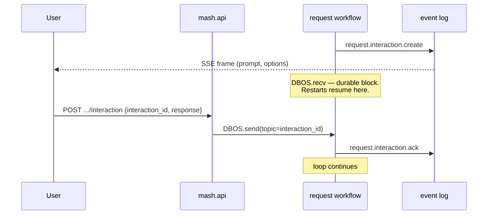

# Human-in-the-Loop

An agent plans to call a deploy tool that needs consent, then has a follow-up question about which environment to target. The user who can answer is in a meeting for the next three hours, and somewhere in that window the host gets redeployed.

In Mash both pauses are durable. The request resumes after the restart, still waiting, and when the user answers, execution continues from exactly where it paused — whether that takes seconds or days. This post covers the two ways an agent pauses for a person, and the single mechanism underneath both.

## The tool contract, and one flag

The contract between a Mash agent and its tools is four attributes and a method:

```python
# src/mash/tools/base.py
class Tool(Protocol):
    name: str
    description: str
    parameters: Dict[str, Any]   # JSON schema
    requires_approval: bool

    async def execute(self, args: Dict[str, Any]) -> ToolResult: ...
```

`requires_approval` is the human-in-the-loop entry point. A tool that deploys services or sends messages gets gated behind user consent with one line:

```python
class DeployTool:
    name = "deploy_service"
    requires_approval = True
    ...
```

After each plan step, the workflow checks the planned tool calls against `registry.tools_requiring_approval(names)`. If any match, the action carries an approval interaction and the engine pauses — durably — before the tool phase. The user answers `approve`, `deny`, or `skip`.

On a denial, the workflow synthesizes an error result for each pending call and hands it back to the model like any other tool outcome — and the request keeps going:

```python
# src/mash/runtime/engine/workflow.py (trimmed)
denied_result = {
    "tool_call_id": tool_call.id,
    "tool_name": tool_call.name,
    "result": {
        "content": f"Tool execution denied by user ({response})",
        "is_error": True,
        "metadata": {"denied": True},
    },
}
```

The agent observes the denial in its next think phase and can explain, adjust, or propose something else. Consent becomes one more data point in the loop.

## AskUser never executes

The second doorway is agent-initiated: `AskUser`, a built-in tool the agent calls when it needs information to continue. Its `execute()` method is, in the hosted runtime, dead code — the workflow recognizes the call by name and routes around it:

```python
# src/mash/runtime/engine/workflow.py (trimmed)
if str(tool_call.get("name") or "") == "AskUser":
    return await _handle_ask_user_interaction(...)
```

The interception exists for durability. The tool's purpose is to wait for a human, and a plain `await` inside `execute()` would hold that wait in process memory — one restart and the question evaporates. So the workflow translates the call into a durable interaction instead, and when the answer arrives, hands the agent an ordinary `ToolResult` whose content is the user's response. From the model's point of view, `AskUser` is a tool that works. From the runtime's point of view, it's a protocol feature wearing a tool costume. (Outside a hosted runtime, calling it returns an error result saying exactly that.)

## Three shapes of pause

Every interaction — runtime-initiated or agent-initiated — is one of three types, each with a defined answer shape and timeout default:

| Type | Created by | Response shape | On timeout |
|---|---|---|---|
| `approval` | a planned tool call with `requires_approval` | `"approve"` / `"deny"` / `"skip"` | `"deny"` |
| `info` | `AskUser(question=...)` with no options | free-form string | `""` |
| `choice` | `AskUser(question=..., options=[...])` | selected option(s) | `[]` |

The timeout defaults are conservative on purpose: an unanswered approval is a denial. `AskUser` waits up to an hour by default before giving up.

## The pause machinery

The whole flow is visible in `execute_request_workflow`. The workflow emits an event, then blocks on DBOS's durable messaging:

```python
# src/mash/runtime/engine/workflow.py (trimmed)
interaction_id = f"itr_{uuid.uuid4().hex[:12]}"

await DBOS.run_step_async(
    {"name": f"interaction.create.{loop_index}"},
    emit_interaction_create, ...,
)

response = await DBOS.recv_async(interaction_id, timeout_seconds=timeout_seconds)

timed_out = response is None
if timed_out:
    response = "deny" if interaction_type == "approval" else ...

await DBOS.run_step_async(
    {"name": f"interaction.ack.{loop_index}"},
    emit_interaction_ack, ...,
)
```

`DBOS.recv_async` is the durable block — a checkpoint in the workflow that says "I am waiting for a message on this topic." The process can die and restart any number of times while the workflow sits there; on recovery, DBOS replays to the `recv` and resumes waiting. The pause belongs to the workflow's durable state, so whichever process recovers the workflow continues the wait.

On the wire, the client sees the pause as a pair of frames in the event stream from [the request lifecycle post](request-lifecycle.md):

```text
event: request.interaction.create   ← interaction_id, type, prompt, options, timeout
... (seconds or days) ...
event: request.interaction.ack      ← interaction_id, the response
```

And because the stream is a replay of persisted events, a client that connects *while* the request is paused still sees the `create` frame and can render the pending question.

## Delivering the answer

The response travels back through the same API surface the request came in on:

```bash
curl -X POST http://127.0.0.1:8000/api/v1/agent/pilot/request/7c9e…/interaction \
  -H "Authorization: Bearer $MASH_API_KEY" \
  -H "Content-Type: application/json" \
  -d '{"interaction_id": "itr_a1b2c3d4e5f6", "response": "approve"}'
```

Under the hood that call becomes `DBOS.send(workflow_id, response, topic=interaction_id)` — a message addressed to the waiting workflow, keyed by the interaction id. The `recv` wakes, the `ack` event is appended, and the loop continues into the tool phase.



## What the agent gets back

For an approval, the answer steers the tool phase: `approve` lets execution proceed; `deny` or `skip` produces the synthesized error results above, and the model reasons about the refusal on its next think.

For `AskUser`, the answer *is* the tool result:

```json
{
  "content": "staging",
  "is_error": false,
  "metadata": {"interaction_id": "itr_a1b2c3d4e5f6", "timed_out": false}
}
```

The `timed_out` flag matters more than it looks. A timed-out `info` interaction hands the agent an empty string — indistinguishable from a user who pressed enter, except for that flag. Agents that ask questions should check it and degrade deliberately: fall back to a default, re-ask, or finish with a clear statement of what they couldn't confirm. The system prompt is the right place to set that expectation.

## One mechanism, two doorways

Approval gating and `AskUser` look like different features, and in the runtime they're the same one. Both produce a `request.interaction.create` / `request.interaction.ack` pair in the log. Both block on `DBOS.recv` keyed by interaction id. Both deliver answers via the same `POST .../interaction` endpoint. The only difference is who initiates: approval is the *runtime* pausing before a flagged tool, AskUser is the *agent* choosing to pause itself.

That convergence is what keeps the operational story simple. A client that can render a prompt and POST a response handles every human-in-the-loop case Mash has, and new interaction-shaped features can reuse the same pair of events.

Everything here ran on tools registered in `build_tools()` — objects living in the host process. The tool surface also extends past the process: servers that publish tools over the Model Context Protocol, discovered and registered at startup right next to the local ones.

*Next: [Remote Tools over MCP](remote-tools-mcp.md).*
