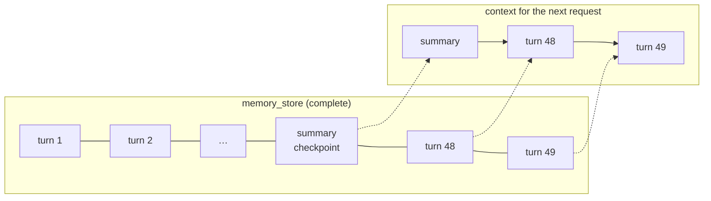

# Memory That Doesn't Grow Forever

A session that runs for weeks accumulates hundreds of turns. The model's context window and your token budget stay fixed. Mash's memory layer is the set of rules for deciding what the next request actually sees — and it's built from three pieces: a small history window, summary checkpoints, and per-turn signals.

## What context loading actually loads

The `context.load` step from [the durable loop post](durable-agent-loop.md) asks the memory store for recent turns — `conversation_history_turns` in `AgentConfig`, default `3` — and looks for one special turn on the way:

```python
# src/mash/runtime/context.py — build_context_with_history (trimmed)
for idx, turn in enumerate(turns):
    if turn.get("metadata", {}).get("type") == "summary_checkpoint":
        summary_index = idx
if summary_index is not None:
    tail_turns = turns[summary_index + 1:]
    turns_to_include = [turns[summary_index]] + tail_turns
```

A **summary checkpoint** is a turn whose content is a generated summary of everything before it. When one exists, context becomes *summary + turns after the summary* — the full early history is still in the store, but it stops being loaded. The session's effective context is always bounded: one summary plus a short tail.



## Compaction: who writes the checkpoint

Checkpoints come from **compaction** — the runtime summarizing earlier turns using the agent's own LLM. It triggers two ways.

Automatically: each turn persists a running `session_total_tokens`, and before building context the runtime compares it to the threshold:

```python
# src/mash/runtime/context.py — build_context_payload (trimmed)
if self.agent.config.compaction_token_threshold > 0:
    if session_total_tokens >= self.agent.config.compaction_token_threshold:
        summary_text, summary_turn_id = await self.compact_session(...)
```

Manually: `POST /api/v1/agent/{agent_id}/sessions/{session_id}/compact` does the same on demand, with an optional token-counter reset — useful when you know a session just finished a phase and the detail won't matter again.

The knobs live in `AgentConfig` and default to off:

| Field | Default | Meaning |
|---|---|---|
| `compaction_token_threshold` | `0` (disabled) | session token count that triggers compaction |
| `compaction_turn_limit` | `50` | how many turns one compaction pass summarizes |
| `compaction_temperature` | `0.0` | sampling for the summary call |

The temperature default is the tell for what compaction is *for*: summaries are records, generated at temperature zero. The summarization prompt aims to preserve decisions, constraints, and user preferences — the things a future turn might silently depend on — and discard the conversational scaffolding around them. Compaction is lossy by design; [the two-stores post](two-stores.md) covered why memory is allowed to be lossy while the event log is not. When the loss matters, the original turns are still in the store, and there's a path back to them.

## Signals: the queryable residue

Every persisted turn carries **signals** — small structured values collected when the run completes: token counts, tool activity, and whatever the runtime's signal collectors compute. They're stored per turn, alongside the message text:

```text
GET /api/v1/agent/pilot/sessions/s1/signals

definitions: { "tokens.total": {...}, "tools.invocations": {...}, ... }
turns: [ { "turn_id": "…", "created_at": …, "signals": {"tokens.total": 8412, ...} } ]
```

Signal *values* are persisted rows; signal *definitions* are runtime-owned metadata returned alongside them — so readers always interpret values against the exact signal set the runtime computes. Signals are how you ask operational questions across sessions ("which sessions burned the most tokens," "where did tool errors cluster") with a query over structured rows.

## Search: the path back

Bounded context means the agent's working memory forgets; the store keeps everything. Two runtime tools — registered automatically on hosted agents — give the agent itself a way back into its history:

- `search_conversations` runs keyword search over stored turns (Postgres full-text on the message columns) and returns ranked previews with turn ids.
- `get_full_turn_message` expands a hit into the complete turn text.

The two-step shape is deliberate, and it's the same economics as [skills](skills-on-demand.md): previews are cheap to put in front of the model, full turns are expensive, so the model sees previews first and pays for full text only on the turns it chooses. A user can ask "what did we decide about the schema migration last month?" and the agent can answer from a session whose early turns were compacted away fifty turns ago.

## The shape of the whole layer

Working memory is small and curated: a summary plus recent turns. Long-term memory is complete and searchable: every turn, every signal, forever. Compaction is the one-way valve between them, and search is the bridge back. Each piece is per-agent — `app_id` scopes every read and write, so an agent's memory is its own.

That per-agent scoping is about to matter, because a Mash host usually runs more than one agent — a primary and its specialists, each with its own memory, its own model, its own tools, composed and supervised in one process.

*Next: [Composing Agents Under One Host](composing-agents.md).*
