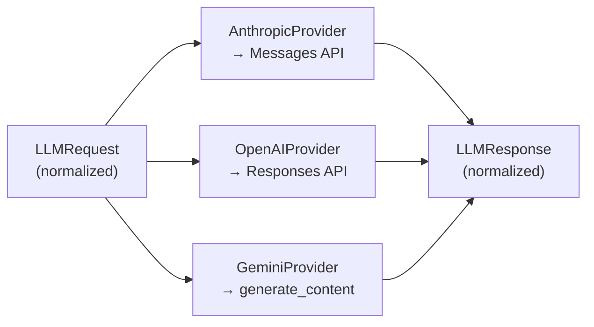

# One LLM Contract for Three Providers

Each agent in a Mash host picks its own model in `build_llm()`, so a cheap model can handle triage while the primary runs on a capable one, even across vendors in the same process. The runtime supports this by keeping provider SDKs behind the adapter layer: everything above it speaks exactly two types, `LLMRequest` in and `LLMResponse` out.

```python
# src/mash/core/llm/types.py: what the runtime sends
LLMRequest(
    model: str,
    system: SystemPrompt,
    messages: list[LLMMessage],
    tools: list[LLMToolDefinition],
    max_tokens: int,
    temperature: float = 1.0,
    use_prompt_caching: bool = True,
    streaming: bool = False,
    provider_options: dict[str, Any] = {},
)
```

The response side mirrors it: `text`, parsed `tool_calls`, normalized `content_blocks`, a normalized `stop_reason`, and `LLMTokenUsage` with cache read/write counts. The raw SDK response is preserved in `provider_response` for debugging. This post covers what the adapters do to honor that contract, since the three providers disagree on most of the details.

## Three wire formats, one translation layer



The differences the adapters absorb:

| | Anthropic | OpenAI | Gemini |
|---|---|---|---|
| API | Messages | Responses | `generate_content` |
| Prompt caching | `cache_control` breakpoints on system/tool blocks | `prompt_cache_key` + retention | server-side `CachedContent` with TTL |
| Streaming | yes | yes | not yet |
| Structured output | `output_config` json_schema | `text.format` json_schema | `response_mime_type` + `response_schema` |
| Quirks | beta flags via `provider_options` | temperature omitted for `gpt-5*` | schema types coerced to `"OBJECT"` uppercase |

Prompt caching is where the gap is widest. The developer-facing surface is one boolean, `prompt_caching_enabled` in `AgentConfig`, on by default, which flows into the request as `use_prompt_caching`. What happens next differs completely per vendor. The Anthropic adapter annotates system and tool blocks with cache breakpoints. The OpenAI adapter attaches a cache key with configurable retention. The Gemini adapter creates an actual server-side cache resource holding the system instruction and tool definitions, references it on subsequent requests, recreates it when system or tools change, and cleans it up on `close()`; if cache creation fails, it silently falls back to uncached requests. All of it stays inside the adapter, so an agent spec that switches `AnthropicProvider` for `GeminiProvider` changes one line.

## Streaming without a second contract

`send()` stays the single generation entry point with the same return type whether or not the response streams.

When `request.streaming` is set and the adapter supports it, the provider streams internally. As text arrives it emits coalesced `llm.response.delta` events, the frames you saw riding the SSE stream in [the request lifecycle post](request-lifecycle.md), and then returns the fully accumulated `LLMResponse`, identical in shape to the non-streaming case. Chunks are flushed by size or interval so event volume stays at tens of events per turn rather than hundreds. `llm.request.complete` remains the source of truth for duration and token counts; deltas are a progress channel.

Adapters without streaming support (currently Gemini) ignore the hint and return the same response shape. The answer just arrives all at once.

## Structured output, per provider

The structured-output flow from the runtime ([finalize_structured_output](durable-agent-loop.md), the second LLM call after a run completes) drives providers through `provider_options["structured_output"]`, a JSON schema dict. Each adapter detects the key and translates it to its native schema-enforcement feature, listed in the table above. The instruction asking the model to produce the payload is added by the runtime; the adapters enforce shape. The result is that `structured_output=MyPydanticModel` on a request behaves the same against all three vendors.

`provider_options` itself is the escape hatch for vendor-specific settings, such as Anthropic beta flags or Gemini cache TTLs. Anything that needs to work everywhere gets promoted to a real `LLMRequest` field; the rest stays in the dict.

## What the contract buys the rest of the system

Two consequences show up elsewhere in the series.

First, the durable loop serializes context between checkpoints, which is possible because messages and content blocks are normalized types with stable shapes. `coerce_content_blocks` even normalizes legacy forms (`tool_use` → `tool_call`) so stored context from older runs keeps deserializing.

Second, observability gets provider-uniform events for free. Every adapter inherits `llm.request.start` / `llm.request.complete` / `llm.request.error` emission from `BaseLLMProvider`, with model, duration, and token fields in the same places, so the trace analysis at the end of this series sees uniform fields across vendors.

One more thing rides on every one of these requests: the `tools` list, serialized in full each time. For a host with many instruction-heavy capabilities that payload gets expensive, which is the problem skills exist to solve.

*Next: [Skills: Instructions on Demand](skills-on-demand.md).*
