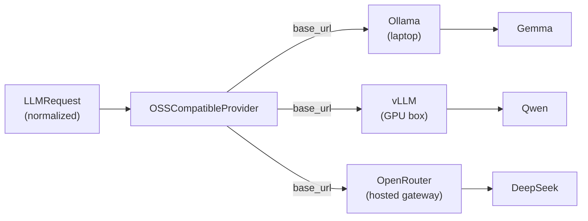

# Open-Source Models over Chat Completions

Each agent picks its model in `build_llm()`. Pointing one at an open-source model is the same one-line change as switching between frontier vendors, whether the model runs on a laptop through Ollama or behind OpenRouter:

```python
def build_llm(self):
    return GemmaProvider(app_id="assistant", base_url="http://localhost:11434/v1")
```

The agent loop, tools, skills, streaming, and observability stay exactly as they were. Everything that makes an open-source model behave inside the harness lives in one adapter, `OSSCompatibleProvider`, and the family presets over it.

## How open-source models are served

An open-source model runs behind an inference server, and the servers have converged on one API to talk to: OpenAI's Chat Completions. vLLM, Ollama, llama.cpp's `llama-server`, SGLang, and TGI all expose a Chat-Completions-compatible endpoint, and hosted gateways like Together, Groq, and OpenRouter expose the same shape. A request that works against one works against the others.

There are two ways to reach a model. You self-host the engine, running vLLM or Ollama on your own hardware so it loads the weights, or you call a hosted gateway, where someone else runs the engine and you send a request with an API key. The wire is identical either way, so the only thing that changes between them is the URL.

Mash is a client to that endpoint and never runs inference itself. The provider points an HTTP client at a `base_url` and speaks the Chat Completions wire. It's just an HTTP client for that wire, so we reuse it for the SSE streaming, retries, and typed responses, and the `base_url` aims it at whatever server is serving the model. Self-hosted engines usually need no key, so the adapter falls back to a placeholder when none is set.



## The Chat Completions adapter

`OSSCompatibleProvider` subclasses `BaseLLMProvider` like the Anthropic, OpenAI, and Gemini adapters, and speaks the same [normalized contract](one-llm-contract.md): `LLMRequest` in, `LLMResponse` out. It translates the normalized transcript into Chat Completions `messages`, sends the agent's tools as function definitions, parses `message.tool_calls` back into normalized `ToolCall` objects, and maps token usage. Streaming reassembles content deltas and fragmented tool-call deltas into the same accumulated response the non-streaming path returns.

This is a separate adapter from `OpenAIProvider`, which targets OpenAI's Responses API. Open-source servers implement Chat Completions, so the OSS adapter owns that wire.

Four presets pin a default model and a capability profile: `GemmaProvider`, `QwenProvider`, `DeepSeekProvider`, and `LlamaProvider`. The generic `OSSCompatibleProvider` takes an explicit `base_url` and `model` for any other endpoint.

## Native tool calling

The adapter supports models served with native tool calling: the server accepts a `tools=` parameter and the model returns structured `message.tool_calls`. The latest Gemma, Qwen, and DeepSeek releases do this. A request that carries tools against a provider declaring `native_tool_calling=False` raises, so a misconfigured model fails fast instead of dropping the tools and answering from guesswork.

Tool support is a property of the model and the runtime serving it, so it holds wherever the model runs. On a gateway that routes one model across several providers, that means choosing a route that supports tool use.

The model's capabilities are declared in `capabilities()`, and the adapter reads them. `structured_output` routes a JSON schema to the standard `response_format` json_schema field, which vLLM, SGLang, llama.cpp, and recent Ollama honor by constraining decoding. `reasoning_content` splits model thinking out of the visible answer, either a dedicated `reasoning_content` field or an inline `<think>` block, and keeps it in `provider_metadata`. Prompt caching is left to the server, since engines such as vLLM prefix-cache without a request annotation.

## When the backend has no tool-call parser

Native tool calling depends on the server parsing the model's output into structured `tool_calls`. Not every backend does. On a gateway that routes one model across several providers, you can land on a backend that lacks a tool-call parser, and then the model writes its tool call as plain text in the content, something like `<|tool_call>call:AskUser{...}<tool_call|>`, and returns no `tool_calls` at all. The call the agent was supposed to make never happens, the turn ends as if the model just answered, and nothing says why. It's a miserable thing to debug, and it bit a real workflow.

The adapter watches for this. When a request carries tools but the response comes back with no `tool_calls` and the text looks like a leaked call, it flags `tool_call_leak` on the response and, by default, logs a warning that names the model and says the backend likely has no tool-call parser. `on_tool_call_leak` sets how strict that is: `warn` is the default, `raise` turns it into an error, and `ignore` keeps quiet. The detection is best-effort, matching the common leak markers, and it never tries to recover the call, only to tell you the backend dropped it.

The cleaner fix is to not land on that backend in the first place. `default_provider_options` merges request options into every call without a subclass, so you can pin a gateway setting once at construction. On OpenRouter, requiring the route to honor your tool schema keeps the parser-less backends out:

```python
def build_llm(self):
    return GemmaProvider(
        app_id="assistant",
        model="google/gemma-4-27b-it",
        base_url="https://openrouter.ai/api/v1",
        api_key=os.environ["OPENROUTER_API_KEY"],
        default_provider_options={
            "extra_body": {"provider": {"require_parameters": True}},
        },
    )
```

Per-request `provider_options` still win over the defaults, and the adapter forwards these keys without reading them, so nothing about OpenRouter leaks into the base provider.

## Self-hosted and hosted

Self-hosting with Ollama means running the server and pointing a preset at it:

```bash
ollama serve
ollama pull qwen2.5
```

```python
def build_llm(self):
    return QwenProvider(app_id="assistant", base_url="http://localhost:11434/v1")
```

A hosted gateway is the same code with a different URL and a key:

```python
import os

def build_llm(self):
    return GemmaProvider(
        app_id="assistant",
        model="google/gemma-4-27b-it",
        base_url="https://openrouter.ai/api/v1",
        api_key=os.environ["OPENROUTER_API_KEY"],
    )
```

With either setup the rest of the agent is untouched: the tool the model calls, the durable loop that runs it, and the trace that records it are the same as on any frontier model.

Every request an open-source model receives carries the full `tools` list too, serialized each time, the same as the frontier adapters. For a host with many instruction-heavy capabilities that payload grows, which is the problem skills exist to solve.

*Next: [Skills: Instructions on Demand](skills-on-demand.md).*
