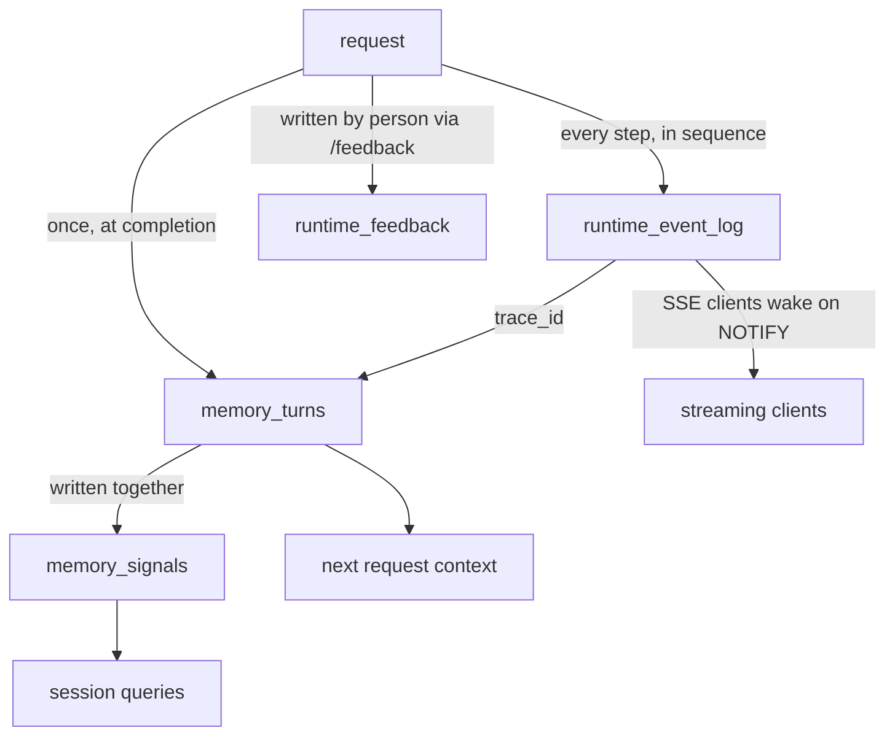

# The Runtime Store

Each `AgentRuntime` holds two store references: a `RuntimeStore` and a `MemoryStore`, both Postgres-backed. This post covers what each owns and which tables a request touches.

## RuntimeStore

The runtime store records what happened during a request, in sequence. Its protocol is at `src/mash/runtime/events/protocol.py`:

```python
append_event(...)
list_request_events(...)
list_events(...)
has_request(...)
is_request_terminal(...)
append_feedback(...)
list_feedback(...)
get_latest_trace(...)
list_recent_traces(...)
list_sessions(...)
aggregate_usage(...)
```

Two tables back it.

### runtime_event_log

Every event a request produces is appended here in sequence. A request with five agent steps writes a few dozen rows: `request.accepted`, `trace.started`, `context.loaded`, the think-and-tool-call pairs at each step, and `request.completed` at the end. The table never loses rows and is never updated in place.

Key columns:

| Column | Purpose |
|---|---|
| `event_id` | Global monotonic cursor, used for SSE pagination |
| `request_id` | Groups all events for one request |
| `trace_id` | Links these events to the memory turn |
| `seq` | Per-request sequence position |
| `event_type` | Namespaced string: `request.accepted`, `llm.response.delta`, etc. |
| `loop_index` | Which agent step emitted this event |
| `payload` | JSONB event body |

`PostgresRuntimeStore` holds a dedicated Postgres LISTEN connection subscribed to the `runtime_events` channel. Each `append_event` call fires a NOTIFY; SSE clients wake on the notification and drain new rows by cursor rather than polling.

### runtime_feedback

When someone runs `/feedback` in the REPL, the note lands here with the host, agent, session, and last request id from that shell. The operations are `append_feedback` and `list_feedback`; nothing rewrites or summarizes rows once they're in. It lives in the runtime store because it's the same shape as the event log: a timestamped record tied to a request.

App developers read feedback back over `GET /api/v1/feedback`.

## MemoryStore

The memory store records what the conversation established. It owns three tables.

**`memory_turns`** — one row per completed request. Written by `persist_completed_turn` at the end of the workflow, after the agent loop reaches a terminal state. Each row holds the user message, the final agent response, aggregate token usage, and the `trace_id`, which connects the turn back to its full event trail in `runtime_event_log`.

Workflow task turns set `replayable=False` so they're excluded when the runtime replays history into the next request's context.

**`memory_signals`** — per-turn structured values collected at completion: token counts, tool activity, whether any tools fired. Each signal is a `(trace_id, signal_name)` key/value pair. Signal queries let you scan sessions without parsing transcripts.

## Write pattern across tables



A request that fails mid-loop leaves a complete trail in `runtime_event_log` but no row in `memory_turns` or `memory_signals`. The next request in that session sees conversation history as if the failed attempt never happened.

DBOS workflow state is a separate write path — the serialized checkpoint context while a request is in flight. It lives in DBOS's own Postgres schema, scoped to one request, and is not a public surface.

## The two protocols side by side

| | `RuntimeStore` | `MemoryStore` |
|---|---|---|
| Tables | `runtime_event_log`, `runtime_feedback` | `memory_turns`, `memory_signals` |
| Unit | event | trace |
| Written | continuously, during execution | once, at request completion |
| Mutability | append-only | summarized over time (compaction) |
| Failed request leaves | full partial trail | nothing |
| Primary readers | SSE clients, trace analysis | context loading, conversation search |

*Next: [The Host API and CLI](host-api-and-cli.md).*
