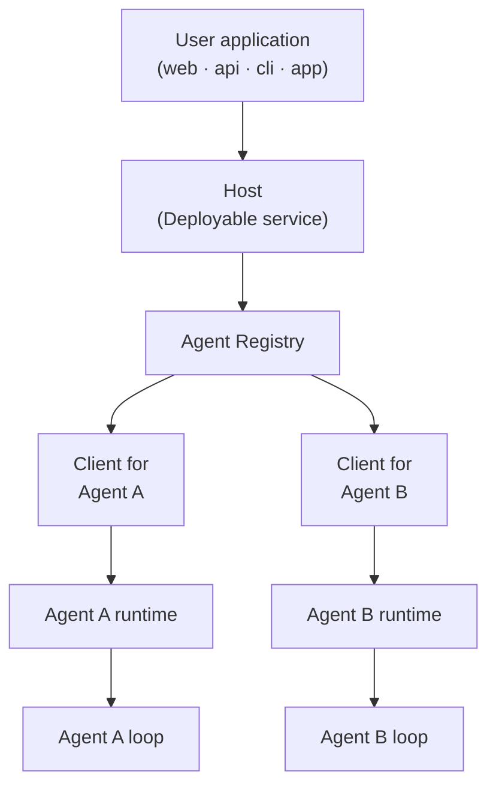

# Mash Product Brief

Building agents is on the rise as frontier and open-source models get smarter. We’re headed in a direction 
where agents will soon be commoditized similar to mobile apps, whether it's *consumer agents* 
that prepare morning briefs, triage email, monitor finances, and plan travel, or *enterprise agents* 
that automate incident triage, release readiness, onboarding, and integrations. 

However, integrating these agents into the application layer is fragmented and lacks a standard.

## Host-to-Agent Protocol (H2A)

The bridge between an application and the agents it relies on is largely built
as a bespoke gateway with ad-hoc streaming or a homegrown approval flow bolted
on. 

The [Host-to-Agent Protocol (H2A)](../rfcs/host-to-agent-protocol.md) protocol is the
contract that runs between the **application -> host -> agents**.
It standardizes how a request is submitted, how its lifecycle streams back, how an agent pauses
for human approval or input, and how it recovers from failure.

### Host

The **Host** is the operating system that agents run on. It gives
every agent a lifecycle, permissions, a stable address, and one consistent way
for a user application to reach it.

Similar to apps, agents are composable where they get added and swapped constantly. The Host
gives every agent one session model, one event contract, and one
human-in-the-loop interaction model thereby standardizing the communication between host and the agent.

The user application integrates with the host, and the agents behind it are composable.



## Mash

Mash is a Python SDK that implements the H2A protocol. You use it to build
agents, to deploy the host that governs them and the interface to interact, 
running on a consumer home server or an enterprise platform.

Mash gives you three primitives, anchored to H2A:

- **Agent development.** Durable harness to build structured agents. Each agent
  natively speaks the H2A schema for capabilities, data handling, and state,
  so it knows how to negotiate work with a host without custom integration
  code.
- **The Host.** A self-hosted runtime that hosts a collection of agents chosen
  by the user or administrator, the operating system for that set of agents. It
  sets the operational boundaries and permissions, and routes requests, manages
  state, and aggregates output across the agents behind it. The host is the unit
  of deploy and translates an incoming user instruction into H2A commands.
- **The execution surface.** A command layer exposed as a CLI and a
  structured API that talks to the host. Because the surface is CLI plus API, the application tier is
  language-agnostic: a React frontend, a Go service, a mobile app, a cron
  job, or a terminal can drive a host over plain HTTP + SSE. The agent is
  written once, in Python, behind the host; nothing that consumes it needs to
  share its stack.


```
                  ┌─────────────────────────────────────────┐
                  │          Durable Request                │
                  │                                         │
                  │   ┌─ context ─── memory ──┐             │
                  │   │                       │             │
request ────────► │   │     Agent Loop        │ ──► signals │
(cli/api)         │   │ think → act → observe │      │      │
                  │   │                       │      ▼      │
                  │   └─ tools ───── skills ──┘  structured │
workflow ───────► │        ▲                      output    │
(schedule/trigger)│        │ user interaction               │
                  │        ▼ (approval / ask-user)          │
                  │                                         │
                  │       resumable · replayable            │
                  └─────────────────────────────────────────┘
```

## Where to go next

- [**Mash Under the Hood**](mash-under-the-hood.md): what Mash provides, one
  host over many agents, the durable harness, observability, and the
  self-hosted interfaces
- [**H2A Protocol RFC**](../rfcs/host-to-agent-protocol.md): the full
  protocol specification
- [**Building an agent CLI**](building-agent-clis.md): custom CLI development with dynamic host composition
