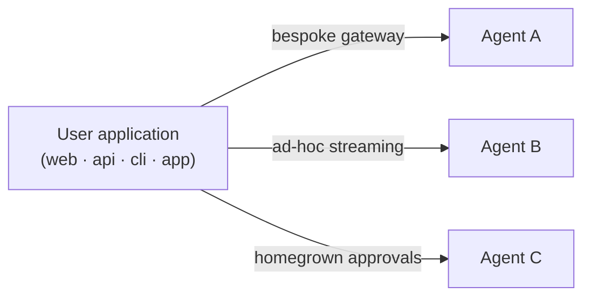
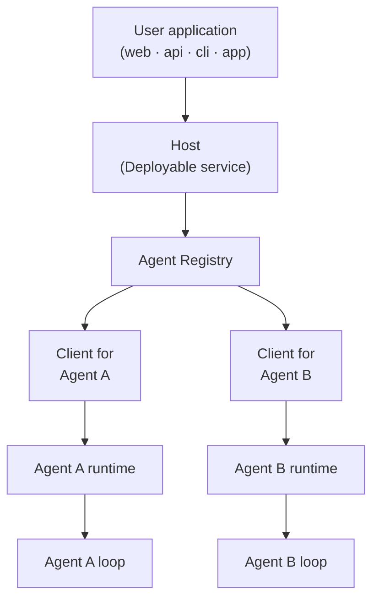

# Mash Product Brief

Building agents is on the rise as frontier and open-source models get smarter. Agents will soon be commoditized similar to mobile apps, whether it's *consumer agents* that prepare morning briefs, triage email, monitor finances, and plan travel, or *enterprise agents* that automate incident triage, release readiness, onboarding, and integrations. However, integrating these agents into the application layer is fragmented and lacks a standard.

Every application wires itself to each agent on its own: a bespoke gateway
for one, hand-rolled streaming for the next, a homegrown approval flow bolted on
for a third. Every app-to-agent pair becomes its own integration.



## Host-to-Agent Protocol (H2A)

The [Host-to-Agent Protocol (H2A)](../rfcs/host-to-agent-protocol.md) protocol is the
contract that runs between the **application -> host -> agents**.
It standardizes how a request is submitted, how its lifecycle streams back, how an agent pauses
for human approval or input, and how it recovers from failure across the full lifecycle.

### Host

The **Host** is the OS that agents run on. It gives
every agent a lifecycle, permissions, a stable address, and one consistent way
for a user application to reach it.

Similar to apps in a mobile OS, agents are composable where they get added and swapped inside a Host. The Host
gives every agent one session model, one event contract, and one
human-in-the-loop interaction model thereby standardizing the communication between host and the agent.

The user application integrates with the host, and the agents behind it are composable.



## Mash

Mash is a Python SDK that implements the H2A protocol. You use it to build
agents, to deploy the Host that governs them and the interface to interact whether 
running on a consumer home server or an enterprise platform.

Mash gives you three primitives, anchored to H2A:

- **Agent development.** Durable harness to build structured agents. Each agent
  natively speaks the H2A schema for capabilities, data handling, and state,
  so it knows how to negotiate work with a host without custom integration
  code.
- **The Host.** A self-hosted runtime that hosts a collection of agents chosen
  by the user or administrator, the operating system for that set of agents. It
  sets the operational boundaries and permissions, and routes requests, manages
  state, and aggregates output across the agents behind it. The host is the unit
  of deploy and translates an incoming user instruction into H2A commands.
- **The execution surface.** A command layer exposed as a CLI and a
  structured API that talks to the host. Because the surface is CLI plus API, the application tier is
  language-agnostic: a React frontend, a Go service, a mobile app, a cron
  job, or a terminal can drive a host over plain HTTP + SSE. The agent is
  written once, in Python, behind the host; nothing that consumes it needs to
  share its stack.


```
                  ┌─────────────────────────────────────────┐
                  │          Durable Request                │
                  │                                         │
                  │   ┌─ context ─── memory ──┐             │
                  │   │                       │             │
request ────────► │   │     Agent Loop        │ ──► signals │
(cli/api)         │   │ think → act → observe │      │      │
                  │   │                       │      ▼      │
                  │   └─ tools ───── skills ──┘  structured │
workflow ───────► │        ▲                      output    │
(schedule/trigger)│        │ user interaction               │
                  │        ▼ (approval / ask-user)          │
                  │                                         │
                  │       resumable · replayable            │
                  └─────────────────────────────────────────┘
```

## One harness across frontier and open-source models

Open-source models like Gemma, Qwen, and DeepSeek now sit near the top of public
benchmarks for reasoning, coding, and tool use, within range of the frontier
models on many tasks. Running them is cheap: a hosted gateway charges a fraction
of frontier API pricing, and self-hosting on your own hardware removes per-token
cost entirely.

Mash runs these models on the same durable harness as the frontier providers. An
agent that uses Anthropic, OpenAI, or Gemini moves seamlessly to an open-source model served
by vLLM, Ollama, or OpenRouter. The tool
loop, human-in-the-loop pauses, workflows, observability, and durability stay the
same across every model.

Because each agent in a host picks its own model, one deployment can mix them. A
high-volume triage or extraction agent runs on a local open-source model while
the agent that handles the hard reasoning runs on a frontier model, in the same
process, behind the same host. You match the model to the task and the budget,
and the harness underneath is identical.

## Evals

The host is the unit of deploy, and it is also the unit of evaluation. A user
request lands on the composition: the primary agent, the delegation choices it
makes, the tools and subagents behind it. Mash evals run against the host
rather than any single agent, so what gets measured is the path the
application actually takes and the response the user actually receives.

Synthetic evals ship in the SDK and runtime. A built-in workflow reads the
host's declared capabilities and the developer's guidance, then generates a
dataset of test scenarios and a weighted scoring rubric before the first user
ever sends a message. Each scoring run is an experiment: it snapshots the live
composition and agent specs, runs every dataset row through the host, and
records the results.

Every experiment measures two kinds of signal. Deterministic quantitative
metrics come from each row's runtime events: latency, tokens, steps, tool
calls, per-subagent breakdowns. Qualitative criteria are non-deterministic and
scored by Masher, the built-in LLM judge, against the rubric: task completion,
subagent coordination, response quality, each with a rationale. Comparing two
experiments answers three questions in one view: what changed in the agent
specs, how quality moved per criterion and per row, and what the change costs
in tokens and latency. See [Synthetic evals](synthetic-evals.md) for the full
design.

## Where to go next
- [**Getting started**](../index.md): install, define agents, and run your first host
- [**Mash Under the Hood**](mash-under-the-hood.md): what Mash provides, one
  host over many agents, the durable harness, observability, and the
  self-hosted interfaces
- [**Synthetic Evals**](synthetic-evals.md): generated datasets and rubrics,
  experiments over the live host, read-time comparison
- [**H2A Protocol RFC**](../rfcs/host-to-agent-protocol.md): the full
  protocol specification
- [**Building an agent CLI**](building-agent-clis.md): custom CLI development with dynamic host composition
