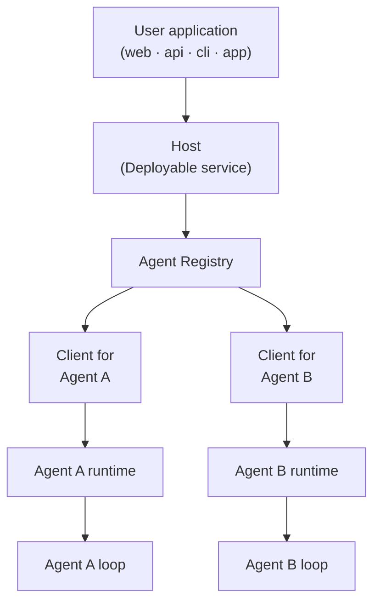

# Mash Product Brief

Building functional AI agents has become highly accessible due to rise in specialized developer harnesses and access to frontier models, turning individual agents into a commodity. However, integrating these agents into a cohesive application layer remains fragmented.

Once this bridge is established, agents will proliferate much like mobile apps did following the introduction of the app store. On a consumer level, individuals will run collections of agents to automate daily life: preparing a morning brief before waking, triaging email, monitoring finances for anomalies, or planning travel. Enterprises are on a parallel trajectory, deploying agent clusters to automate internal workflows like incident triage and release readiness, as well as customer facing operations like onboarding and integrations assistants.

## Host-to-Agent Protocol (H2A)

The bridge between agents and how a user application or an enterprise
platform (the app store of this analogy) talks to agents is largely built
as a bespoke endpoint with ad-hoc streaming or a homegrown approval flow bolted on. The
[Host-to-Agent Protocol (H2A)](../rfcs/host-to-agent-protocol.md) standardizes
that interaction model: how a request is submitted, how its lifecycle streams
back, how an agent pauses for human approval or input, and how it recovers
from failure.

### Host

When agents are commodities, they are composable and get added and swapped constantly. The
interaction pattern has to be centralized somewhere stable, and the **Host**
is that place. The host gives every agent behind it a stable address, one
session model, one event contract, and one human-in-the-loop interaction
model. The host becomes the unit of deploy and your application integrates
with the host; the agents behind the host can change freely.



## Mash

Mash is a complete Python SDK that implements the H2A protocol. It provides the toolchain to build, deploy and host structured AI agents 
within an application layer, whether running on a consumer home server or an enterprise platform.

Mash gives you three primitives, anchored to H2A:

- **Agent development.** Durable harness to build structured agents. Each agent
  natively speaks the H2A schema for capabilities, data handling, and state,
  so it knows how to negotiate work with a host without custom integration
  code.
- **The host.** A self-hosted runtime that composes a collection of agents
  chosen by the user or administrator. It sets the operational boundaries and
  permissions, and routes requests, manages state, and aggregates output
  across the agents behind it. The host is the unit of deploy and 
  translates an incoming user instruction into H2A commands.
- **The execution surface.** A command layer exposed as a CLI and a
  structured API that talks to the host. Because the surface is CLI plus API, the application tier is
  language-agnostic: a React frontend, a Go service, a mobile app, a cron
  job, or a terminal can drive a host over plain HTTP + SSE. The agent is
  written once, in Python, behind the host; nothing that consumes it needs to
  share its stack.


## How it runs

Setting up and running a host takes three steps. In composition, a user picks
agents from their library and assembles a host for a specific domain or
workflow. In configuration, the host sets permissions and the data-sharing
rules between the runtime and the agents it contains, using H2A to manage
them. In execution, an upstream application calls the host through the CLI or
API, and the host handles routing, state, and output aggregation across the
agents over its H2A lines.

Running everything through one protocol gives you a few things:

- **Custom command surfaces.** Because execution runs through the CLI and API
  interfaces, you can layer your own commands and endpoints on top of the SDK
  primitives without rebuilding the runtime.
- **Composability without glue.** The SDK governs both agent logic and the
  runtime, so handing data and execution between agents inside one host works
  without custom wiring.
- **One deploy target, many environments.** The same host and the same agent
  code run on a local home server or distributed cloud infrastructure.

```
                  ┌─────────────────────────────────────────┐
                  │          Durable Request                │
                  │                                         │
                  │   ┌─ context ─── memory ──┐             │
                  │   │                       │             │
request ────────► │   │     Agent Loop        │ ──► signals │
(cli/api)         │   │ think → act → observe │      │      │
                  │   │                       │      ▼      │
                  │   └─ tools ───── skills ──┘  structured │
workflow ───────► │        ▲                      output    │
(schedule/trigger)│        │ user interaction               │
                  │        ▼ (approval / ask-user)          │
                  │                                         │
                  │       resumable · replayable            │
                  └─────────────────────────────────────────┘
```

## Where to go next

- [**Mash Under the Hood**](mash-under-the-hood.md): what Mash provides, one
  host over many agents, the durable harness, observability, and the
  self-hosted interfaces
- [**H2A Protocol RFC**](../rfcs/host-to-agent-protocol.md): the full
  protocol specification
- [**Building an agent CLI**](building-agent-clis.md): custom CLI development with dynamic host composition
