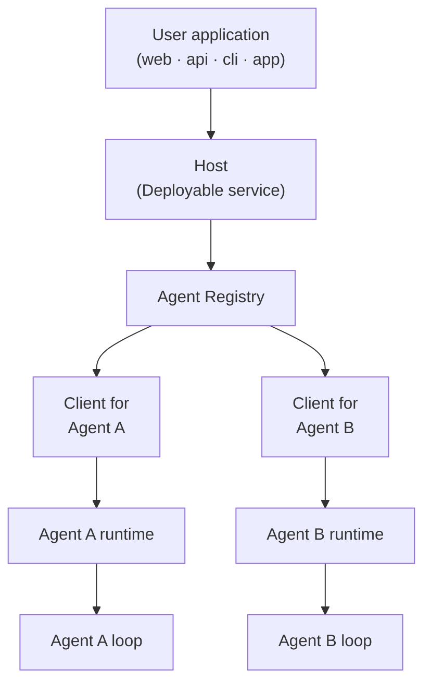

# Mash Product Brief

Most of the focus in building agents today goes into the harness: the loop, the
context engineering, the tool plumbing. As models get smarter, agents will proliferate 
the way apps did once the app store gave them a standard place to live. 
Every person will run a collection of agents inside a single app that automates their life: 
one that prepares a morning brief before you're up, one that triages email, 
one that watches finances and flags the odd charge, one that plans travel. 
Enterprises are on the same path, automating internal workflows like incident triage 
and release readiness, and external ones like an onboarding assistant or a reporting analyst.

## Host-to-Agent Protocol (H2A)

The part that's still missing is how a user application or an enterprise
platform (the app store of this analogy) talks to agents. Today that's largely built
as a bespoke endpoint with ad-hoc streaming or a homegrown approval flow bolted on. The
[Host-to-Agent Protocol (H2A)](../rfcs/host-to-agent-protocol.md) standardizes
that interaction model: how a request is submitted, how its lifecycle streams
back, how an agent pauses for human approval or input, and how it recovers
from failure.

When agents are commodities, they get added and swapped constantly. The
interaction pattern has to be standardized somewhere stable, and the **Host**
is that place. The host gives every agent behind it a stable address, one
session model, one event contract, and one human-in-the-loop interaction
model. The host becomes the unit of deploy and your application integrates
with the host; the agents behind the host can change freely.



## Mash

Mash is a Python SDK and self-hosted runtime that implements H2A. A user
application embeds a host through a CLI or an API, and because the protocol
is plain HTTP + SSE, the application can be anything: a React frontend, a Go
service, a mobile app, a cron job, a terminal. The agent is written once, in
Python, behind the host; nothing that consumes it needs to share its stack.

Everything underneath the seam (the durable harness, observability, the
self-hosted interfaces) is the commodity layer Mash ships so you never build
it yourself.

```
                  ┌─────────────────────────────────────────┐
                  │          Durable Request                │
                  │                                         │
                  │   ┌─ context ─── memory ──┐             │
                  │   │                       │             │
request ────────► │   │     Agent Loop        │ ──► signals │
(cli/api)         │   │ think → act → observe │      │      │
                  │   │                       │      ▼      │
                  │   └─ tools ───── skills ──┘  structured │
workflow ───────► │        ▲                      output    │
(schedule/trigger)│        │ user interaction               │
                  │        ▼ (approval / ask-user)          │
                  │                                         │
                  │       resumable · replayable            │
                  └─────────────────────────────────────────┘
```

## Where to go next

- [**Mash Under the Hood**](mash-under-the-hood.md): what Mash provides, one
  host over many agents, the durable harness, observability, and the
  self-hosted interfaces
- [**H2A Protocol RFC**](../rfcs/host-to-agent-protocol.md): the full
  protocol specification
