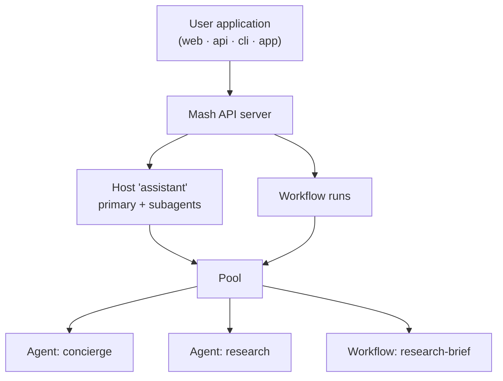

# Mash Product Brief

Mash is a self-hosted, durable runtime for code-authored automations. An
automation is a workflow: an ordered pipeline of typed steps, where a step is
deterministic Python or one run of a harnessed agent. Control flow stays in
code. Agents and workflows deploy together behind one API, on your own
Postgres.

You author two things. A workflow is the pipeline itself, the shape of the
automation as code. An agent is an LLM loop running inside a harness that gives
it tools, skills, memory, and a durable request lifecycle. An agent serves user
requests directly, runs as a step inside a workflow, or both.

## Workflows

A workflow is an ordered pipeline of typed steps. Each step declares a pydantic
input and output, each step's output threads into the next step's input, and
the last step's output is the run result. A `CodeStep` is a deterministic
Python function. An `AgentStep` is one run of an agent's loop with a schema on
both edges: typed input in, structured output out, validated against the
step's declared schema.

The pipeline is code you can read, diff, test, and replay. Dynamic work such as
fan-out over rows or branching happens inside a step body; the model reasons
inside its step and never owns the pipeline. Runs are durable. Each step body
executes as a memoized durable step, a failed run resumes from the failed step
under the same run id, and a per-step audit trail in Postgres records every
step's status, inputs, outputs, and attempts.

## The agent harness

Each agent is an `AgentSpec`: a Python contract that names the agent, picks its
LLM, and declares its system prompt, tools, and skills. The loop runs inside a
durable request: think, act, observe, with tools executing in the runtime,
skills loaded on demand, memory management, and structured output. Every
request is recorded as replayable runtime events, so retries, restarts, and
long-running work recover mid-loop instead of starting over. An agent can pause
mid-request for a human approval or a question, and the pause survives a host
restart.

The [Host-to-Agent Protocol (H2A)](../rfcs/host-to-agent-protocol.md) is the
contract underneath: it standardizes how a request is submitted, how its
lifecycle streams back, how an agent pauses for a human, and how a request
recovers from failure. Every agent behind a Mash deployment speaks it, so the
application integrates once.

```
                  ┌─────────────────────────────────────────┐
                  │          Durable Request                │
                  │                                         │
                  │   ┌─ context ─── memory ──┐             │
                  │   │                       │             │
request ────────► │   │     Agent Loop        │ ──► signals │
(cli/api)         │   │ think → act → observe │      │      │
                  │   │                       │      ▼      │
                  │   └─ tools ───── skills ──┘  structured │
workflow step ──► │        ▲                      output    │
(api/cli)         │        │ user interaction               │
                  │        ▼ (approval / ask-user)          │
                  │                                         │
                  │       resumable · replayable            │
                  └─────────────────────────────────────────┘
```

A request from a user and a step in a workflow ride the same durable loop.

## The pool and hosts

The pool is the unit of deploy. `HostBuilder` composes agents and workflows
into a `Pool`, and the API server runs it. Agents in the pool are role-less; a
pool with only workflows is a valid deploy that serves workflow runs alone.

A host is a composition over the pool: a `host_id`, a primary agent, and a set
of subagents and workflows. Submitting a request to a host wires the primary
with delegation to that host's subagents, for that request only. Hosts are
defined in code at build time or dynamically over the API, so the same pool
serves different compositions without a redeploy.


```mermaid
flowchart TD
    U["User application<br/>(web · api · cli · app)"] --> API["Mash API server"]
    API --> HO["Host 'assistant'<br/>primary + subagents"]
    API --> WF["Workflow runs"]
    HO --> P["Pool"]
    WF --> P
    P --> A1["Agent: concierge"]
    P --> A2["Agent: research"]
    P --> W1["Workflow: research-brief"]
```

## The execution surface

The runtime exposes a structured HTTP API with SSE streaming, a CLI, and an
interactive REPL. The application tier is language-agnostic: a React frontend,
a Go service, a mobile app, a cron job, or a terminal drives a deployment over
plain HTTP. The agent is written once, in Python, behind the API; nothing that
consumes it needs to share its stack.

## One harness across frontier and open-source models

Open-source models like Gemma, Qwen, and DeepSeek now sit near the top of
public benchmarks for reasoning, coding, and tool use, within range of the
frontier models on many tasks. Running them is cheap: a hosted gateway charges
a fraction of frontier API pricing, and self-hosting on your own hardware
removes per-token cost entirely.

Mash runs these models on the same durable harness as the frontier providers.
An agent that uses Anthropic, OpenAI, or Gemini moves to an open-source model
served by vLLM, Ollama, or OpenRouter by swapping one provider line. The tool
loop, human-in-the-loop pauses, workflows, observability, and durability stay
the same across every model.

Because each agent picks its own model, one deployment can mix them. A
high-volume triage or extraction agent runs on a local open-source model while
the agent that handles the hard reasoning runs on a frontier model, in the same
process, behind the same API. You match the model to the task and the budget,
and the harness underneath is identical.

## Evals

The host is also the unit of evaluation. A user request lands on the
composition: the primary agent, the delegation choices it makes, the tools and
subagents behind it. Mash evals run against the host rather than any single
agent, so what gets measured is the path the application actually takes and
the response the user actually receives.

Synthetic evals ship in the SDK and runtime. A built-in workflow reads the
host's declared capabilities and the developer's guidance, then generates a
dataset of test scenarios and a weighted scoring rubric before the first user
ever sends a message. Each scoring run is an experiment: it snapshots the live
composition and agent specs, runs every dataset row through the host, and
records the results.

Every experiment measures two kinds of signal. Deterministic quantitative
metrics come from each row's runtime events: latency, tokens, steps, tool
calls, per-subagent breakdowns. Qualitative criteria are non-deterministic and
scored by the built-in eval agent against the rubric: task completion,
subagent coordination, response quality, each with a rationale. Comparing two
experiments answers three questions in one view: what changed in the agent
specs, how quality moved per criterion and per row, and what the change costs
in tokens and latency. See [Synthetic evals](synthetic-evals.md) for the full
design.

## Where to go next

- [**Code as the Source of Truth**](code-as-the-source-of-truth.md): one
  automation taken from a pure-code pipeline to an agent step to a deployment
- [**Getting started**](../index.md): install, define agents and workflows,
  and run your first host
- [**Mash Under the Hood**](mash-under-the-hood.md): what Mash provides, one
  host over many agents, the durable harness, observability, and the
  self-hosted interfaces
- [**Synthetic Evals**](synthetic-evals.md): generated datasets and rubrics,
  experiments over the live host, read-time comparison
- [**H2A Protocol RFC**](../rfcs/host-to-agent-protocol.md): the full
  protocol specification
- [**Building an agent CLI**](building-agent-clis.md): custom CLI development
  with dynamic host composition
