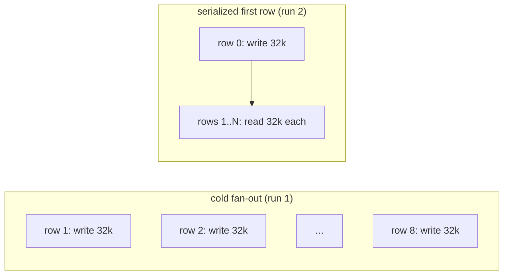

# Prompt Caching and the Token Meter

A 19-row eval run through the `score-evals` workflow took four minutes of wall clock. The Claude platform dashboard reported 1.97M input tokens for the day. Both numbers are correct, and the gap between "four minutes of work" and "two million tokens" is entirely explained by prompt caching. This post walks through the accounting, using the runtime event log from two real scoring runs.

The runtime logs one `llm.request.complete` event per LLM call, and its payload carries the provider's usage block. Summing them across the first run:

| usage field | tokens | billed at |
|---|---|---|
| `input_tokens` (uncached) | 166,860 | 1.0x |
| `cache_read_input_tokens` | 1,525,989 | 0.1x |
| `cache_creation_input_tokens` | 338,681 | 1.25x |
| `output_tokens` | 28,001 | output rate |

The dashboard's "input" number is the sum of the first three: about 2.03M raw tokens. At claude-sonnet-4-6 rates the whole run cost about $2.65, and $1.27 of that was the cache writes. The interesting parts are where the 1.5M reads come from, why the writes happened 8 times over, and what the scoring runner now does differently.

## The prefix cache

Anthropic's prompt cache is a prefix match. The cache key is derived from the exact bytes of the rendered request, in the order tools, then system prompt, then messages, up to a `cache_control` breakpoint. The cache is scoped to the organization and model. It has no notion of a session or a conversation. Two requests from two unrelated processes hit the same entry as long as the bytes match.

An entry lives for five minutes by default, and every read resets that clock. So the entry persists across sessions for as long as something in the organization keeps reading it at least once per five minutes, which a running eval does constantly. In the second run below, the prefix written at 23:16:40 was still warm when the fan-out started at 23:17:42, because the first row's own loop had been reading it the whole time.

Pilot, the primary agent under test in these runs, marks its system prompt for caching. The prompt embeds a set of repo docs, which is what makes it 32,186 tokens:

```python
def build_system_prompt(self) -> list[dict[str, Any]]:
    blocks = [
        {
            "type": "text",
            "text": build_base_prompt(...),
            "cache_control": {"type": "ephemeral"},
        }
    ]
    repo_context = build_repo_context(
        repo=str(self.workspace_root),
        cached_files=rendered_cached,   # module READMEs, briefs, one RFC
    )
    blocks.append(
        {"type": "text", "text": repo_context, "cache_control": {"type": "ephemeral"}}
    )
    return blocks
```

Every eval row starts a fresh session, so the 19 rows are fully independent conversations. Their requests still share cache entries, because each one opens with the same tool definitions and the same two system blocks. Same bytes, same key.

## Every loop re-sends the prefix

The Messages API is stateless. When the model wants to run a tool, the request ends with `stop_reason: "tool_use"`, the runtime executes the tool locally, and the next request carries the entire conversation again: tools, system prompt, every prior turn, plus the new tool result. The model reads all of it from the top. A row that takes one think step sends the 32k prefix once. A row that takes 18 sends it 18 times.

One row in the first run asked what it takes to add a new workflow-only worker. Pilot delegated to the `workflow-copilot` subagent, which ran 11 `rg`/bash loops over the repo, and then Pilot ran 6 bash loops of its own. The usage for Pilot's 6 calls, straight from the event log:

| call | `cache_read` | `input` (uncached) |
|---|---|---|
| 1 | 32,186 | 779 |
| 2 | 32,186 | 1,059 |
| 3 | 32,186 | 2,387 |
| 4 | 32,186 | 3,439 |
| 5 | 32,186 | 4,185 |
| 6 | 32,186 | 4,572 |

The `cache_read` column is flat: the stable prefix, served from cache on every iteration. The `input` column grows: the suffix past the last breakpoint, which is new bytes (the latest tool call and its output) and bills at full price. Total prompt size per call is the sum of the two columns, and the whole thing crosses the wire every loop.

This is why loop count is the multiplier behind the token meter. That single agentic row produced 267k cache reads. A row Pilot answered in one shot produced 32k. Both correct, both cheap, one eight times larger on the dashboard.

## Reads, writes, and the dashboard

The dashboard counts raw tokens, so a token served from cache counts the same as a token processed fresh. Billing does distinguish them:

- **Cache read** (`cache_read_input_tokens`): the prefix matched an existing entry. Billed at 0.1x the input rate.
- **Cache write** (`cache_creation_input_tokens`): the prefix missed, was processed at full attention, and was written into the cache. Billed at 1.25x for the default five-minute TTL.
- **Uncached input** (`input_tokens`): everything past the last matched breakpoint.

For a run like this one, reads dominate the raw count and writes dominate the bill. 1.5M reads cost $0.46. 339k writes cost $1.27. Reading the dashboard without the split is how a $2.65 run looks like a two-million-token problem.

The raw payload of the very first Pilot call of the run shows a cold cache in one line:

```json
{"model": "claude-sonnet-4-6", "input_tokens": 341, "output_tokens": 130,
 "cache_read_input_tokens": 0, "cache_creation_input_tokens": 32186}
```

Zero read and a full write. The question for the rest of the run is how many more times that write happens.

## A concurrent fan-out on a cold cache

The `score-evals` runner fans out one durable child workflow per dataset row over a DBOS queue with a concurrency of 8. Each child runs its row through the host, then judges the output. In the first run all rows were enqueued at once, and the queue started 8 of them within seconds of each other.

A cache entry only becomes readable once the request writing it has started streaming its response. Eight requests in flight with the same prefix and no finished writer means eight misses. The event log shows it directly, first call per row session:

| row session first call | `cache_write` |
|---|---|
| 17:41:40 | 32,186 |
| 17:41:46 | 32,186 |
| 17:41:46 | 32,186 |
| 17:41:47 | 32,186 |
| 17:41:48 | 93,898 |
| 17:41:50 | 32,186 |
| 17:41:56 | 32,186 |
| 17:41:57 | 32,186 |
| 17:41:59 and later (11 rows) | 0 |

Eight sessions wrote the same prefix inside an 18-second window. Every row that started after 17:41:59 found the entry warm and wrote nothing. The stampede is bounded by the queue concurrency, and it costs the prefix size times the concurrency, at the 1.25x write rate, once per run.



## Warming the cache with the first row

The fix in the scoring runner is to run the first row alone and fan out the rest once it completes. Row 0 does real work, so the one unavoidable cache write is attached to a row that was going to run anyway, and there is no throwaway warm-up request cluttering the event log. The child workflow IDs are unchanged, so the durable recovery semantics are too:

```python
scored_rows: list[dict[str, Any]] = []
handles = []
for index, row in enumerate(rows):
    child_id = f"{run_id}:row:{index}"
    with set_workflow_id(child_id):
        handle = await _STATE.queue.enqueue_async(
            _STATE.workflow, ctx.runner_id, run_id, host_id,
            host_snapshot, host.primary, row, rubric,
        )
    if index == 0:
        scored_rows.append(await handle.get_result())
    else:
        handles.append(handle)
scored_rows.extend([await handle.get_result() for handle in handles])
```

The second run, 20 rows through the same host, confirms the shape. The same first-call-per-row query that showed eight writers in run 1 now shows one:

| row session first call | `cache_write` | `cache_read` |
|---|---|---|
| 23:16:40 (row 0) | 32,186 | 0 |
| 23:17:42 | 0 | 32,186 |
| 23:17:42 | 0 | 32,186 |
| 23:17:44 | 0 | 32,186 |
| 23:17:45 | 0 | 32,186 |
| 23:17:47 | 0 | 32,186 |
| 23:17:50 and later (12 rows) | 0 | 32,186 each |

Row 0 is the only Pilot session in the run that wrote to the cache, 63,042 tokens in total, and that total is two entries rather than one. 32,186 is the tool-loop prefix from the table above: seven tool definitions plus the two system blocks. Each row's request also ends with a structured-output pass, where the runtime re-sends the same system prompt with no tools attached to coerce the final answer into JSON. Tools are part of the prefix bytes, so that request shape has its own cache key. Row 0's pass at 23:17:24 missed and wrote the second entry, 30,856 tokens: the same system blocks minus the 1,330 tokens of tool definitions. By the time the fan-out started, both entries were warm, and every later row read them. The run totals:

| | run 1 (cold fan-out) | run 2 (serialized row 0) |
|---|---|---|
| cache writes | 338,681 | 82,523 |
| cache reads | 1,525,989 | 1,951,519 |
| uncached input | 166,860 | 189,594 |
| output | 28,001 | 27,651 |
| approx. cost | $2.65 | $1.88 |

Writes fell 76%. The residual 19k of writes belongs to the copilot subagents, each writing its own much smaller prefix once. Reads went up, because the second run happened to draw more agentic rows (one took 12 Pilot calls), and each extra loop re-reads the prefix. The run did more work and cost 29% less.

The cost of serializing is one row of wall clock before the parallel phase starts, about a minute here. If row 0 happens to be a long agentic row, the whole fan-out waits on it. For an offline batch job that trade is fine, and it stays simple: no synthetic warm-up prompt to keep honest, no timeout logic.

## Checking a run

Two checks against `runtime_event_log` tell you whether a scoring run behaved:

- **Writes**: `cache_creation_input_tokens` summed per session should be nonzero for row 0 and near zero everywhere else. A cluster of equal-sized writes in the first seconds of a run means the fan-out beat the cache.
- **Reads**: flat per-call `cache_read` values with a growing `input` column is a healthy agentic loop. Reads scale with loop count and are the baseline cost of running agents on a stateless API, at a tenth of the input rate.

Both checks read straight off the `llm.request.complete` payloads, which are the same numbers the platform dashboard is summing into one figure.

## Takeaways

- Cache writes are the expensive part. They bill at 1.25x the input rate against 0.1x for reads, so a modest write count dominates the bill: in run 1 the writes were 17% of the raw tokens and 48% of the cost.
- The Claude cache is persistent across sessions. It is scoped to the organization and model, lives for five minutes by default, and every read resets the clock, so a busy workload keeps its own entries alive indefinitely.
- Fan-out workloads should lean on that persistence. Run one job to completion first, then fan out; the concurrency-sized write stampede disappears and the only write left is the one row 0 was going to pay anyway.
- Break the dashboard's input number into cache reads, cache writes, and uncached input before reasoning about cost. The 2.03M raw figure hides the split, and the $1.27 of writes only becomes visible once the three usage fields are summed separately.
