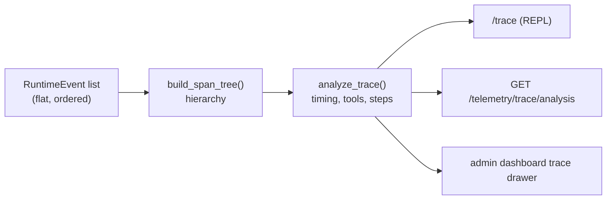

# Reading a Trace

Every post in this series ended up at the same place, events in an append-only log. This one is about reading them back out: turning the flat event stream of one request into an answer to where the time went.

The pipeline has three stages:



All three stages are pure computation over event timestamps and payloads. Run `analyze_trace` twice on the same trace and you get the same numbers, which matters when the output is what you'll use to argue about latency.

## From events to spans

`build_span_tree(events)` in `runtime/events/spans.py` folds the flat list into a hierarchy. The vocabulary is small:

```python
class SpanKind(str, Enum):
    TRACE = "trace"
    COLD_START = "cold_start"
    CONTEXT_LOAD = "context_load"
    STEP = "step"
    THINK = "think"
    TOOL_CALL = "tool_call"
    SUBAGENT_CALL = "subagent_call"
```

A typical request becomes:

```text
TRACE                                    4.81s
├── COLD_START                           120ms   accepted → trace started
├── CONTEXT_LOAD                          85ms   history + summary loaded
├── STEP 0
│   ├── THINK                            1.4s    (tokens in payload)
│   └── TOOL_CALL  bash                  640ms
├── STEP 1
│   ├── THINK                            1.1s
│   └── SUBAGENT_CALL  cli-copilot       1.2s
└── STEP 2
    └── THINK                            260ms   final response
```

Two of these kinds measure gaps. `COLD_START` is the gap between `request.accepted` and `trace.started`, the cost of the engine picking the request up, which the [lifecycle post](request-lifecycle.md) showed are two separate events for exactly this reason. Whatever time inside the trace no span claims gets reported as **idle**: gaps between steps, scheduling overhead, anything unaccounted for. A request that feels slow despite fast thinks and fast tools shows its problem in cold start or idle, which are host-side numbers.

## From spans to answers

`analyze_trace(tree)` reduces the tree to a few summaries:

- **Timing breakdown**: total duration split across cold start, context load, think, tool, subagent, and idle, each with absolute and percentage values.
- **Per-tool stats**: call count, total/avg/max/min latency, error count, sorted by total time so the most expensive tool reads first.
- **Per-step breakdown**: think vs. tool vs. overhead for each loop iteration. The shape tells you whether a request was slow because of one bad step or uniformly heavy.
- **Slowest operations**: top spans by duration.

Delegation costs flow through the tree. A `SUBAGENT_CALL` span links the child's trace, and analysis recurses into it up to three levels deep, so a slow primary request whose time went into a subagent's tool call attributes the cost to that tool. The mirrored `subagent.*` events from [the composition post](composing-agents.md) are what make the stitching possible.

## Where the analysis renders

The analysis renders in three places, all backed by the same computation.

In the REPL, `/trace` analyzes the most recent trace (or `/trace 5` for the last five): summary line, timing table with bars, tool stats, and slowest operations, right in the terminal. It fits the development loop, since you can type `/trace` the moment a reply feels slow and see the breakdown while the request is still fresh.

Over HTTP, `GET /api/v1/telemetry/trace/analysis?agent_id=…&session_id=…&trace_id=…` returns the span tree and the full analysis dict in one call, which suits dashboards, alerts, and regression checks in CI. The trace id to query for is sitting on each turn in memory, since [trace id doubles as turn id](persistence-store.md).

In the browser, the admin dashboard at `/admin` renders the trace under Logs: a request list per agent, and a drawer per trace with summary tiles, the reconstructed conversation, and a collapsible span tree with per-span durations. This is the view for browsing and reading traces, where a terminal table stops scaling.

For continuous use, Masher packages the same analysis into scheduled workflows. `masher-trace-digest` emits a full diagnostic snapshot per trace, and `masher-online-eval-curation` writes eval records with latency context. Both are all-code [step pipelines](workflows-as-step-pipelines.md) that scan the event log deterministically and deduplicate what they append, which makes them safe on a schedule.

## Wrapping up

The event log was introduced in the first post as the record of what happened, and this post read that record directly; the same events that drive SSE replay drive the latency breakdown. That closes the tour of the internals. From here, the [CLI guide](building-agent-clis.md) puts a custom shell on top of what you've built, and the [deploy guide](how-to-deploy.md) covers running it in production.
