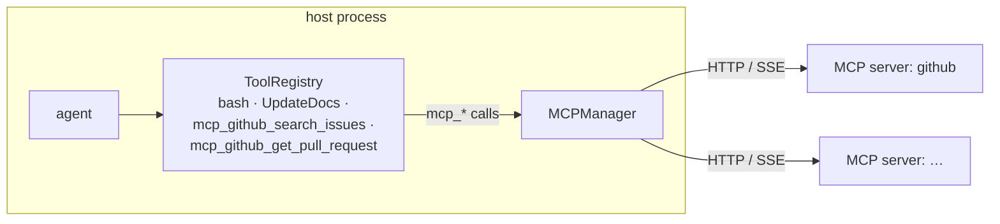

# Remote Tools over MCP

An agent's tool surface extends past the host process. `build_mcp_servers()` on the spec returns a list of [Model Context Protocol](https://modelcontextprotocol.io) server configs, and the tools those servers publish join the agent's registry next to the local ones:

```python
from mash.mcp.types import MCPServerConfig

class PilotSpec(AgentSpec):
    def build_mcp_servers(self):
        return [
            MCPServerConfig(
                name="github",
                url="http://localhost:3000/sse",
                description="GitHub issue and PR tools",
                headers={"Authorization": f"Bearer {token}"},
                allowed_tools=["search_issues", "get_pull_request"],
            ),
        ]
```

The config is the whole integration surface: a `name` that namespaces everything the server contributes, the `url`, optional `headers` for auth, and an optional `allowed_tools` filter for servers that publish more than you want to expose. Everything past this dataclass is handled by the runtime.

## Discovery at startup

When the runtime builds the agent, an `MCPManager` connects to each configured server, lists its tools, and wraps every one in an adapter that satisfies the same four-attribute `Tool` protocol from [the previous post](human-in-the-loop.md):

```python
# src/mash/runtime/factory.py (trimmed)
mcp_tools = manager.get_flattened_tools(prefix="mcp_")
for mcp_tool in mcp_tools:
    adapter = MCPToolAdapter.from_mcp_tool(
        mcp_tool=mcp_tool,
        executor=make_executor(server_name, original_name),
    )
    agent.tools.register(adapter)
```

Remote tools get namespaced names, like `mcp_github_search_issues` for a `search_issues` tool on the `github` server, with the original name and server kept in metadata for routing the call back. The prefix lets the model tell remote tools apart from local ones (and from the same tool name on two different servers), and it keeps the registry's flat namespace collision-free.



To the model, a remote tool is indistinguishable from a local one; the same `{name, description, input_schema}` triple rides on [every LLM request](one-llm-contract.md). The only difference is that `execute()` crosses the network. The adapter routes the call through the manager to the owning server, and the response text comes back as an ordinary `ToolResult`.

## Web search

Web search runs on the same machinery. A `WebSearchProvider` resolves to a single `MCPServerConfig`, and the runtime connects it through the same `MCPManager`. To enable it you must explicitly specify a provider by returning one from `build_web_search()` rather than writing a server config by hand — there's no default, so you always know who is handling your search data. Mash ships one `WebSearchProvider`, `ParallelSearchProvider`, which offers `web_search` and `web_fetch` and requires an API key.

Naming is the one place it diverges. These tools register under their plain names, `web_search` and `web_fetch`, not the `mcp_*` form. They're a named capability rather than an arbitrary remote server, so the wiring keeps the original names while reusing the connection, auth headers, `allowed_tools` filter, and call routing that every MCP server gets.

## Failure stays inside the tool result

Remote calls add failure modes like an unreachable server or expired auth, and the integration keeps all of them inside the existing tool contract. A tool call that fails returns an error `ToolResult`, the same shape a local tool produces, and the model reasons about it on the next think phase. A server that fails during startup discovery is logged and skipped, and the agent starts with the tools that did resolve.

Because an MCP call is just a tool call, the durability machinery from [the durable loop post](durable-agent-loop.md) applies unchanged: each call is its own checkpoint, completed calls are skipped on resume, and transient failures get the standard retry treatment.

## Remote context, beyond tools

Tools are the most-used MCP surface, and the client speaks the rest of the core protocol too:

- **Resources**: `read_resource(uri)` pulls remote content (documents, records, files) into the conversation; resource templates parameterize the URIs.
- **Prompts**: `get_prompt(name)` fetches server-defined prompt templates.
- **Elicitation**: a server can ask for structured input mid-call, and the client surfaces those requests for the host to answer.

The package boundary in `src/mash/mcp` keeps protocol details in one place: `types.py` for config, `client.py` for the wire protocol, and `manager.py` for server lifecycle and tool routing. Runtime and tool code consume MCP through this package, so protocol changes land in one module.

## The same observability

MCP activity emits structured events alongside everything else in the [event stream](request-lifecycle.md): `mcp.client.connect` / `connected` / `disconnect` / `error` for lifecycle, and `mcp.tool.call` / `result` / `error` for execution, each carrying `server_name`, `tool_name`, `duration_ms`, and the current `trace_id`. In [trace analysis](reading-a-trace.md), remote calls show up as tool spans under their `mcp_`-prefixed names, so a slow remote server surfaces in the per-tool stats table like any other expensive tool.

Every registered tool, local or remote, is serialized into the `tools` list on each LLM request. The contract that carries that list across three different provider APIs is the subject of the next post.

*Next: [One LLM Contract](one-llm-contract.md).*
