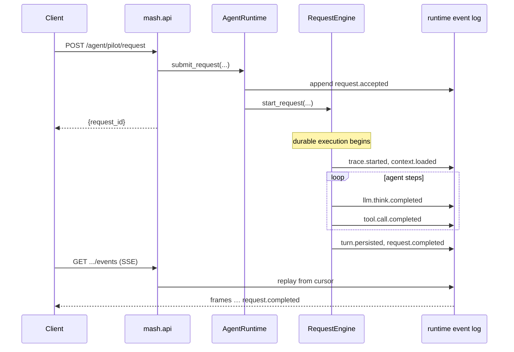

# The Life of a Mash Request

Submitting a message to a hosted agent returns a request id:

```bash
curl -X POST http://127.0.0.1:8000/api/v1/agent/pilot/request \
  -H "Authorization: Bearer $MASH_API_KEY" \
  -H "Content-Type: application/json" \
  -d '{"message": "What changed in the last five commits?", "session_id": "s1"}'
```

```json
{
  "data": {
    "request_id": "7c9e1f0a-…",
    "agent_id": "pilot",
    "session_id": "s1",
    "status": "accepted"
  }
}
```

The answer arrives as a stream of events on `GET /api/v1/agent/pilot/request/{request_id}/events`, ending in a `request.completed` frame that carries the response text. This post follows one request from submission to completion and walks through the events the runtime emits along the way.

The example above targets one agent directly. Requests routed through a
[host composition](composing-agents.md) enter at
`POST /api/v1/hosts/{host_id}/request` instead; the server resolves the
host's primary, snapshots the composition onto the request, and replies with
`{"request_id", "agent_id", "session_id"}` so you know which agent to stream
from. Everything after submission, the stream, the events, the terminal
frames, is identical for both paths.

## Submit, then stream

Mash splits the interaction into two calls so that accepting a request and watching its progress stay independent. The host accepts the request, makes it durable, and lets you attach to its progress from anywhere, across client disconnects and host restarts:

```bash
curl -N http://127.0.0.1:8000/api/v1/agent/pilot/request/7c9e1f0a-…/events \
  -H "Authorization: Bearer $MASH_API_KEY"
```

You can attach late, or detach and re-attach, and you'll see the same events either way, because the stream is a replay of persisted records.

## The path a message takes

Between those two calls, the message moves through a handful of layers, each with a narrow job:



One ordering detail: `request.accepted` is appended to the log before execution starts. The order in `submit_request` is append first, start second:

```python
# src/mash/runtime/requests.py (trimmed)
request_id = str(uuid.uuid4())
accepted_event = await append_runtime_event(self, RuntimeEvent(
    request_id=request_id,
    event_type=RuntimeEventType.REQUEST_ACCEPTED.value,
    ...
))
await self.engine.start_request(request_id=request_id, ...)
```

By the time you hold a `request_id`, the request already exists durably, even if the process dies before the first model call.

## Everything is an event

Internally, every request is an ordered stream of `RuntimeEvent` records. The full vocabulary is one enum:

```python
# src/mash/runtime/events/types.py
class RuntimeEventType(str, Enum):
    REQUEST_ACCEPTED        = "runtime.request.accepted"
    TRACE_STARTED           = "runtime.trace.started"
    CONTEXT_LOADED          = "runtime.context.loaded"
    LLM_THINK_COMPLETED     = "runtime.llm.think.completed"
    TOOL_CALL_COMPLETED     = "runtime.tool.call.completed"
    SUBAGENT_CALL_COMPLETED = "runtime.subagent.call.completed"
    TURN_PERSISTED          = "runtime.turn.persisted"
    INTERACTION_CREATE      = "runtime.interaction.create"
    INTERACTION_ACK         = "runtime.interaction.ack"
    REQUEST_COMPLETED       = "runtime.request.completed"
    REQUEST_FAILED          = "runtime.request.failed"
    # ... plus started/failed variants for steps and tool calls
```

`to_public_event` in `requests.py` maps each internal record to one of a small set of public frames before it reaches your SSE client. Lifecycle events get first-class names (`request.accepted`, `request.started`, `request.completed`, `request.error`, `request.interaction.*`), and everything that happened inside execution arrives as an `agent.trace` frame carrying the internal `event_type` in its data. Keeping two vocabularies lets the internal one grow without breaking client code, which only ever matches on the public names.

Each record also carries identity fields: `app_id`, `agent_id`, `session_id`, the `request_id`, and, for host-routed requests, the `host_id` of the composition the request ran under. Bare-agent requests leave `host_id` null, which is what lets the telemetry API filter one agent's events by the composition they served.

## Reading one request, frame by frame

Here's the stream for the commit-summary request above, against a Pilot host with a `bash` tool, annotated:

```text
event: request.accepted          ← the request exists; execution may not have started yet
event: request.started           ← a trace_id was created; durable execution began

event: agent.trace               ← event_type: runtime.context.loaded
                                   session history was loaded (and compacted, if due)
                                   into the model context

event: agent.trace               ← event_type: runtime.llm.think.started
                                   think phase began; loop_index=0

event: agent.trace               ← event_type: runtime.llm.think.completed
                                   the model decided to call bash("git log --oneline -5"),
                                   with token usage

event: agent.trace               ← event_type: runtime.tool.call.started
                                   tool execution began

event: agent.trace               ← event_type: runtime.tool.call.completed
                                   the tool ran; duration and result preview in payload

event: agent.trace               ← event_type: runtime.step.completed
                                   the full agent step (think + tool calls) is done;
                                   loop advances

event: agent.trace               ← event_type: runtime.llm.think.started
                                   second think phase began; loop_index=1

event: agent.trace               ← event_type: runtime.llm.think.completed
                                   model read the tool output, produced the final answer

event: agent.trace               ← event_type: runtime.step.completed
                                   final step done; loop exits

event: agent.trace               ← event_type: runtime.turn.persisted
                                   the completed turn was written to conversation
                                   memory; this is the only thing the next request
                                   in this session will see

event: request.completed         ← terminal; payload carries the response text
```

The stream already answers the questions you would normally add instrumentation for. Each think and tool frame carries its own duration, so if a request felt slow, you can see whether the model or the tool was responsible. The tool frames record names, arguments, and result previews, the actual sequence as it ran. And `turn.persisted` appears exactly once, at the end: the intermediate steps are visible here, but they never become conversation history. That distinction gets its own post.

If the agent streams text (`streaming_enabled`, on by default), you'll also see `agent.trace` frames with `event_type: llm.response.delta` between think start and completion. These carry coalesced text chunks you can concatenate to render the answer live. The final, authoritative text still arrives on `request.completed`; deltas are a progress channel.

Two terminal frames exist, and exactly one of them always arrives. `request.completed` carries the response. `request.error` carries an `error_code` and a `retryable` flag, which tell you whether retrying is sensible. More on that in the next post.

## Streaming is replay

Because frames are persisted before they're streamed, the SSE endpoint is really a cursor over a log. The server-side helper reads everything after your cursor, and if there's nothing new, waits for the store to signal an append:

```python
# src/mash/runtime/requests.py (trimmed)
stored_events = await self.runtime_store.list_request_events(
    request_id, after_seq=max(0, int(cursor)),
)
public_events = [to_public_event(event) for event in stored_events]
done = await self.runtime_store.is_request_terminal(request_id)
```

This is why reconnecting is uneventful: a client that drops mid-request reconnects, replays from the start (or its last cursor), and sees an identical stream. It's also why `GET .../request/{id}/status` can report a request's fate hours after the fact, since the log holds the request's whole history.

## The log and the engine

The layering above separates two jobs:

- The **event log** records the request: what happened, in what order, replayable forever.
- The **request engine** executes the request durably, with checkpoints, surviving restarts.

Neither layer absorbs the other's job. The log is what this post covered. The engine is what makes a half-finished request survive a `kill -9`, and it's the subject of the next post.

*Next: [The Durable Agent Loop](durable-agent-loop.md).*
