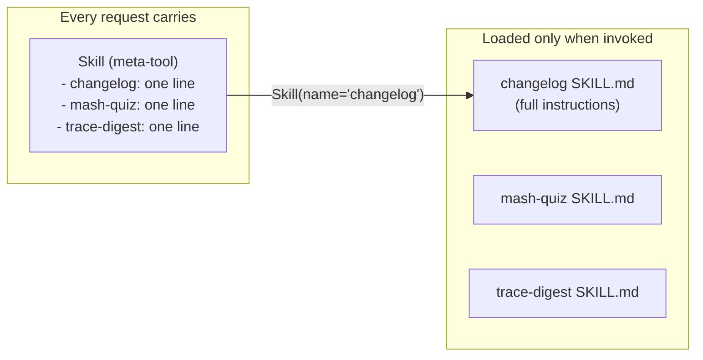

# Skills: Instructions on Demand

A skill is a named piece of markdown. When the model invokes the `Skill` tool with a skill's name, that markdown lands in the conversation as instructions to follow. That's the whole feature — and the design question it answers is one of token economics.

An agent that knows how to write changelogs, run quizzes, and produce trace digests needs detailed instructions for each. Putting them all in the system prompt means every request pays for all of them, on every turn, even though a given request uses at most one. Tool definitions also ride on [every LLM request](one-llm-contract.md), so registering each bundle as a tool carries the same cost. The instructions need to exist *somewhere* the model can reach while staying out of the per-request payload.



## One meta-tool, N skills

Mash surfaces every registered skill through a single tool named `Skill`. The tool's description lists each skill's name and one-line description; its input schema enumerates the valid names. The per-request cost of a skill is therefore one line of tool description — the full markdown is read only when the model asks for it.

The registration is automatic and gated by config:

```python
# src/mash/core/agent.py — Agent.__init__ (trimmed)
if self.config.skills_enabled and self.skills.list_skills():
    if "Skill" not in self.tools:
        self.tools.register(SkillTool(self.skills))
```

`skills_enabled` defaults to `False`; an agent with no skills never carries the meta-tool at all.

## The skill itself

`Skill` is a frozen dataclass with two flavors distinguished by where the markdown lives:

```python
# src/mash/skills/base.py
@dataclass(frozen=True)
class Skill:
    type: str                    # "custom" (filesystem) or "dynamic" (inline)
    name: str
    description: str = ""
    location: str | None = None  # directory containing SKILL.md
    content: str | None = None   # inline markdown
```

A **filesystem-backed** skill is a directory with a `SKILL.md` whose frontmatter carries `name` and `description` — nothing else is parsed:

```markdown
---
name: changelog
description: Generate a changelog entry from recent commits.
---

# Changelog

Scan the most recent commits, group them by area, and append
an entry to CHANGELOG.md following the existing format…
```

When the model invokes `Skill(name="changelog")`, the tool reads `SKILL.md` *at invocation time* and returns a JSON payload with the markdown plus its paths (`base_path`, `skill_path`), so instructions can reference files relative to the skill directory. Reading at invocation time also means editing a `SKILL.md` on disk takes effect on the next invocation.

A **dynamic** skill skips the filesystem: the markdown is supplied as `content` at registration. This is the flavor for hosts that generate instructions from another system — an app that authors workflows elsewhere and publishes them to Mash as skills.

## Registration: build time and runtime

Static skills go in `AgentSpec.build_skills()` and live with the codebase. Dynamic skills can be pushed to a *running* host:

```python
host.register_agent_skill("pilot", Skill(
    type="dynamic",
    name="workflow:experiment-readout:v1",
    description="Execute Experiment Readout workflow v1.",
    content=generated_markdown,
))
```

or over HTTP with `POST /api/v1/agent/{agent_id}/skill`. If the agent's runtime is already started, the live `SkillTool` is refreshed in place — the model's next request sees the new skill in the tool's enum. If the runtime hasn't started yet, the skill is queued and installed when it opens.

The trade attached to dynamic skills: they are live host state. A host restart forgets them, and the application that owns authoring is expected to republish on startup. Skill storage and authoring belong to the owning application; Mash owns surfacing. The versioned name in the example (`:v1`) hints at the convention that makes republishing safe.

## Where the boundary sits

The distinction worth keeping crisp: **tools act, skills instruct.** A tool invocation makes something happen in the world and returns a result. A `Skill` invocation changes only what the model knows for the rest of the request — the returned markdown is input, not effect. A skill carries only a name, a description, and markdown; approval gating, parameter schemas, and result types stay with tools. That's also why the meta-tool design works — one executor serves every skill, because "execution" is a read.

Skills will reappear in this series: dynamic workflows ship their task instructions as skills, with the workflow definition telling the task agent which one to load. That connection is two posts away. First, the skill markdown the model just loaded went *into context* — and context is built from conversation memory, which has its own discipline about what to keep and what to summarize away.

*Next: [Memory That Doesn't Grow Forever](memory-and-compaction.md) — history, compaction, and signals.*
