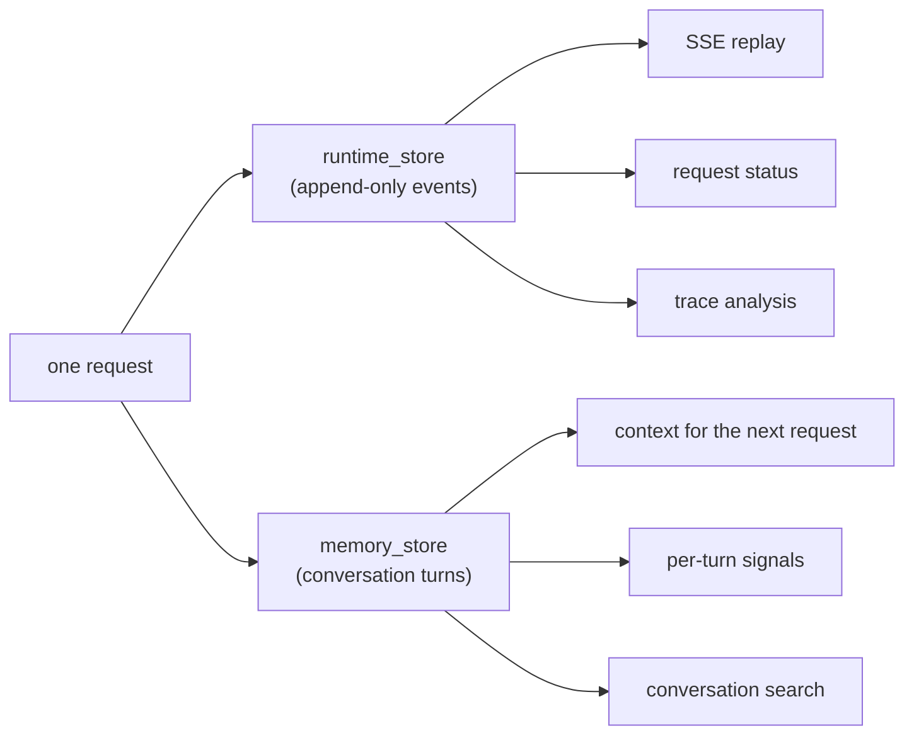

# Two Stores

Construct an `AgentRuntime` and you have to hand it two stores:

```python
runtime = AgentRuntime(
    spec=spec,
    memory_store=memory_store,
    runtime_store=runtime_store,
    ...
)
```

Both are Postgres-backed, both are owned by the same runtime, and they often live in the same database, so it's fair to ask why there are two of them. They stay separate because they serve different readers with different write patterns. Merging them would force one schema to do both jobs, and several layers in the runtime depend on each contract staying narrow. This post covers what each store owns.

## What each store owns

**`runtime_store` holds the record of what happened during a request.** It is the append-only event log from [the first post in this series](request-lifecycle.md). Every event a request produces, from `request.accepted` through its terminal state, is appended in order and kept. The interface is small:

```python
# src/mash/runtime/events/store.py: the RuntimeStore boundary
append_event(...)
list_events(...)
list_request_events(...)
has_request(...)
is_request_terminal(...)
get_latest_trace(...)
list_recent_traces(...)
```

The contract is append and read. Everything that consumes the log later, whether that's SSE replay or trace analysis, is a read over an immutable sequence, and reconstructing a request's status works the same way.

**`memory_store` holds what the conversation has established.** It owns turns, per-turn signals, compaction summaries, and the search index over past conversations. This is the store the next request reads when it loads context. When the agent remembers something you discussed last week, the memory came from here.



## One turn per request

Counting writes makes the boundary visible. A request that takes five agent steps with a few tool calls each appends a few dozen runtime events along the way: accepted, trace started, context loaded, the thinks, the tool completions, and so on. The same request writes one turn to memory, at the end.

The enforcement is structural. `persist_completed_turn` runs once in the workflow, only after the loop reaches a terminal state:

```python
# src/mash/runtime/engine/workflow.py (trimmed)
if bool(workflow_state.get("done")):
    turn_payload = await DBOS.run_step_async(
        {"name": "turn.persist"},
        persist_completed_turn, ...,
    )
    await DBOS.run_step_async(
        {"name": "request.complete"},
        complete_request, ...,
    )
    return
```

Intermediate steps are never written as turns. A request that fails on step 4 of 12 leaves a complete forensic trail in the event log but adds nothing to conversation history, so the next request in that session sees the conversation as if the failed attempt never happened. History contains what the agent actually concluded.

The turn that does get written is dense. `save_turn` persists the user message, the final response, aggregate token usage, and the trace id, which doubles as the turn id and is your path from a conversation back to its full event trail. It also persists a bag of signals: small structured values collected at the end of the run, like token counts and tool activity, that let you query sessions without parsing transcripts.

## The two contracts side by side

The contracts barely overlap:

| | `runtime_store` | `memory_store` |
|---|---|---|
| Unit | event | turn |
| Written | continuously, during execution | once, at request completion |
| Mutability | append-only | summarized over time (compaction) |
| Primary readers | SSE clients, telemetry, trace analysis | context loading, conversation search |
| Holds | what happened, in what order | what the session has established |
| Failed request leaves | full partial trail | nothing |

The mutability row carries the most weight. Replay depends on the event log never changing, so it never does. Conversation memory gets summarized: when a session's token count crosses the compaction threshold, the runtime condenses earlier turns into a checkpoint, and future context loads read the summary instead of the full history. Losing detail is acceptable there, since memory's job is to keep context useful and bounded. The log can't tolerate that kind of loss, because its job is to be the record.

A third kind of state from [the previous post](durable-agent-loop.md) belongs on this map too: DBOS workflow state, which carries the serialized context between checkpoints while a request is in flight. It's execution scaffolding, alive for the duration of one request and never a public surface, so neither store holds it.

## One pool for the whole host

The two stores share their connection infrastructure. In a multi-agent host, `AgentHost` creates one shared `PostgresRuntimeStore` and one shared `PostgresStore` and injects them into every runtime that uses the default `build_memory_store()`:

```python
# the host owns the store lifecycle
host = (
    HostBuilder()
    .primary(PilotSpec())
    .subagent(CliCopilot(), metadata=...)
    .subagent(ApiCopilot(), metadata=...)
    .build()
)
```

Pilot's host above runs three agents but holds a single connection pool, a single LISTEN connection for event wakeups, and a single memory connection. The count would be the same with one agent or ten. Runtimes never open or close their stores; the host opens the shared stores before any runtime starts and closes them after all runtimes shut down. (A spec that overrides `build_memory_store()` opts out and gets its own instance, which is useful when one agent's memory genuinely must live elsewhere.)

The design rule at the top of the runtime package says it directly: `memory_store` and `runtime_store` stay separate. Replay, compaction, trace analysis, and search each lean on one of the two contracts holding.

## Where this leads

At this point the skeleton is complete: events record a request, the engine executes it durably, and the two stores keep the record and the conversation's knowledge apart. The rest of Mash builds on those seams. The next post covers the pauses for people built into the loop, tool approval and `AskUser`.

*Next: [Human-in-the-Loop](human-in-the-loop.md).*
