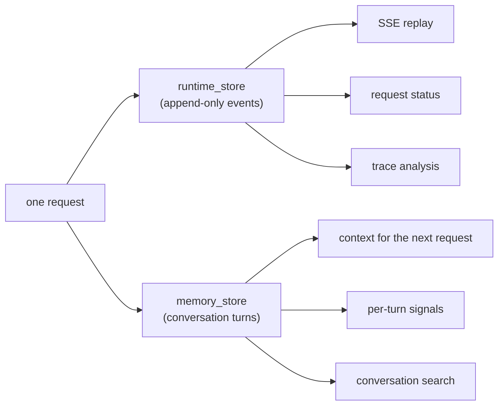

# Two Stores, On Purpose

Construct an `AgentRuntime` and you have to hand it two stores:

```python
runtime = AgentRuntime(
    spec=spec,
    memory_store=memory_store,    # conversation truth
    runtime_store=runtime_store,  # request truth
    ...
)
```

Two Postgres-backed stores, owned by the same runtime, often living in the same database. The split is deliberate: each store serves different readers with a different write pattern, and merging them would force one schema to serve both — every boundary in the runtime that leans on these contracts would blur. This post covers what each store owns and the rule that keeps them separate.

## What each store owns

**`runtime_store` holds the record of what happened during a request.** It's the append-only event log from [the first post in this series](request-lifecycle.md) — every accepted request, every think phase, every tool call, every terminal state, in order, forever. Its interface is deliberately small:

```python
# src/mash/runtime/events/store.py — the RuntimeStore boundary
append_event(...)
list_events(...)
list_request_events(...)
has_request(...)
is_request_terminal(...)
get_latest_trace(...)
list_recent_traces(...)
```

The contract is append and read. That's what makes SSE replay, status reconstruction, and trace analysis trivial: they're all reads over an immutable sequence.

**`memory_store` holds what the conversation has established.** It owns turns, per-turn signals, compaction summaries, and the search index over past conversations. This is the store the *next* request reads when it loads context — when the agent "remembers" what you discussed, this is where the memory came from.



## Forty events, one turn

The clearest way to see the boundary is to count writes. A request that takes five agent steps with a few tool calls each produces a few dozen runtime events — accepted, trace started, context loaded, five thinks, the tool completions, turn persisted, completed.

It produces **exactly one turn**.

It's enforced by where in the workflow the memory write lives — `persist_completed_turn` runs once, only after the loop reaches a terminal state:

```python
# src/mash/runtime/engine/workflow.py (trimmed)
if bool(workflow_state.get("done")):
    turn_payload = await DBOS.run_step_async(
        {"name": "turn.persist"},
        persist_completed_turn, ...,
    )
    await DBOS.run_step_async(
        {"name": "request.complete"},
        complete_request, ...,
    )
    return
```

Intermediate steps are never written as turns. A request that fails on step 4 of 12 leaves a complete forensic trail in the event log — and contributes *nothing* to conversation history. The next request in that session sees the conversation as if the failed attempt never happened: history contains what the agent actually concluded.

The turn that does get written is dense. `save_turn` persists the user message, the final response, aggregate token usage, the trace id (which doubles as the turn id — your bridge from a conversation back to its full event trail), and a bag of **signals**: small structured values collected at the end of the run, like token counts and tool activity, that let you query sessions without parsing transcripts.

## Different readers, different rules

Side by side, the two contracts barely overlap:

| | `runtime_store` | `memory_store` |
|---|---|---|
| Unit | event | turn |
| Written | continuously, during execution | once, at request completion |
| Mutability | append-only | summarized over time (compaction) |
| Primary readers | SSE clients, telemetry, trace analysis | context loading, conversation search |
| Holds | what happened, in what order | what the session has established |
| Failed request leaves | full partial trail | nothing |

The mutability row deserves a word. The event log never changes shape — replay depends on it. Conversation memory does the opposite: when a session's token count crosses the compaction threshold, the runtime summarizes earlier turns into a checkpoint and future context loads read the summary instead of the full history. Memory is *allowed* to be lossy because its job is to keep context useful and bounded; the log is *forbidden* from being lossy because its job is to be the record. One store can't have both properties.

There's also a third kind of state worth placing on this map, from [the previous post](durable-agent-loop.md): DBOS workflow state, which carries the serialized context between checkpoints while a request is in flight. It's execution scaffolding — alive for the duration of one request, never a public surface. In-flight state belongs to the engine, history belongs to the log, knowledge belongs to memory.

## One pool for the whole host

The two stores share their connection infrastructure. In a multi-agent host, `AgentHost` creates one shared `PostgresRuntimeStore` and one shared `PostgresStore` and injects them into every runtime that uses the default `build_memory_store()`:

```python
# the host owns store lifecycle, not the runtimes
host = (
    HostBuilder()
    .primary(PilotSpec())
    .subagent(CliCopilot(), metadata=...)
    .subagent(ApiCopilot(), metadata=...)
    .build()
)
```

Pilot's host above runs three agents but holds one connection pool, one LISTEN connection for event wakeups, and one memory connection — the same count it would have with one agent or ten. Runtimes never open or close their stores; the host opens the shared stores before any runtime starts and closes them after all runtimes shut down. (A spec that overrides `build_memory_store()` opts out and gets its own instance — useful when one agent's memory genuinely must live elsewhere.)

This is also why the design rule at the top of the runtime package reads the way it does: *`memory_store` and `runtime_store` stay separate.* Every layer above them — replay, compaction, trace analysis, search — leans on one of the two contracts being exactly what it claims to be.

## Where this leads

You now have the full skeleton: events record a request, the engine executes it durably, and two stores keep "what happened" and "what we know" from contaminating each other. Everything else in Mash is built on top of these seams — starting with the pauses for people built into the loop: tool approval and `AskUser`.

*Next: [Human-in-the-Loop](human-in-the-loop.md) — durable approval and ask-user interactions.*
