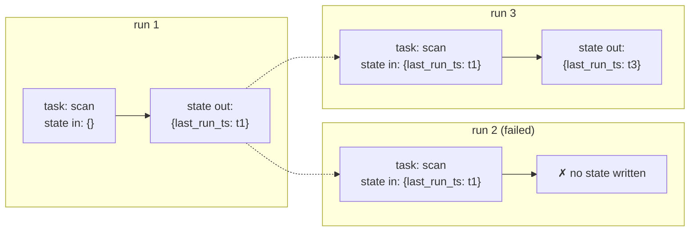

# Workflows and Task State

A Mash workflow is an ordered list of tasks, and each task is one request to one registered agent. That's a deliberately thin definition: durable execution, retries, event streaming, and structured results already exist underneath every Mash request, and the workflow layer composes them.

```python
from mash.workflows import TaskSpec, WorkflowSpec

CHANGELOG_WORKFLOW = WorkflowSpec(
    workflow_id="changelog",
    tasks=[
        TaskSpec(
            task_id="scan-codebase-and-append-changelog",
            agent_spec=changelog_agent_spec,
        ),
    ],
)

host = HostBuilder().primary(PilotSpec()).workflow(CHANGELOG_WORKFLOW).build()
```

A `TaskSpec` carrying an `agent_spec` registers that spec as a [workflow-only agent](composing-agents.md) — a full runtime, hidden from delegation and public listings. A `TaskSpec` with just an `agent_id` reuses an agent that's already registered. Either way, when the task runs, the target agent receives a normal request and executes it through the [same durable loop](durable-agent-loop.md) as everything else.

## The task contract is JSON in, JSON out

The request message a task agent receives is JSON text with a fixed shape:

```json
{
  "workflow_id": "changelog",
  "workflow_run_id": "mw:h_example:changelog:abc",
  "task_id": "scan-codebase-and-append-changelog",
  "workflow_input": { "commit_count": 5 },
  "task_state": { "last_run_ts": "2026-06-01T00:00:00Z" }
}
```

The agent must respond with JSON that decodes to an object. That object becomes the task's state for the *next* run. Respond with prose, malformed JSON, or a bare array, and the run fails — and the previous state stands.

The two payload fields carry a distinction worth keeping sharp:

- **`workflow_input`** is per-run trigger data — immutable for the run, passed to every task. Which commits to scan, which agent to target.
- **`task_state`** is the checkpoint — what the last successful run of *this task* returned. The changelog task above uses it for incremental behavior: it reads `last_run_ts`, processes only what's newer, and returns a fresh timestamp.

Task state is append-only in a specific sense: Mash never edits it. Before a task runs, the framework finds the most recent *successful* DBOS run output for that workflow and hands the task its slice; failed runs leave state untouched. State moves forward only through successful completions — the same principle as [turn persistence](two-stores.md), at workflow scale.



Getting reliable JSON out of a model is the obvious weak point, and `TaskSpec.structured_output` closes it: attach a JSON schema and it's forwarded as request-level [structured output](one-llm-contract.md), so the next task state comes from a schema-enforced payload.

## Orchestration is DBOS

`WorkflowService.run_workflow(...)` starts a DBOS workflow (`mash.workflow.execute`); run status, history, and recovery are DBOS workflow status, projected through the API. A `dedup_key` becomes a DBOS queue deduplication id — a second trigger while a run is active is rejected, which makes workflows safe to fire from schedules and webhooks.

Runs are observable the same way requests are: `POST /api/v1/workflow/{id}/run` returns a `run_id`, and the events endpoint replays each task agent's normal runtime events over SSE — the [same frames](request-lifecycle.md), wrapped in task lifecycle markers. In the REPL, `/workflow run changelog` streams the task's chain of thought as it executes.

## Dynamic publishing

Everything above is code-defined: workflows registered in `build_host()`, versioned with the application. The second mode targets a different author — systems that *generate* workflows at runtime:

```python
host.register_agent_skill("pilot", Skill(
    type="dynamic",
    name="workflow:experiment-readout:v1",
    content=generated_instructions_markdown, ...,
))

host.register_agent_workflow("pilot", WorkflowSpec(
    workflow_id="experiment-readout",
    tasks=[TaskSpec(task_id="analyze-experiment", agent_id="pilot")],
    task_message=WorkflowTaskMessageSpec(
        skill_name="workflow:experiment-readout:v1",
    ),
))
```

The two registrations work as a pair, and `task_message` is the hinge: when the task runs, the runtime instructs the agent to invoke the `Skill` tool with that name *before* executing. The workflow definition stays a thin pointer; the actual task instructions live in [skill markdown](skills-on-demand.md), generated and versioned by whoever authored the workflow. Both are published over HTTP too (`POST /api/v1/agent/{agent_id}/skill` and `.../workflow`, upsert semantics).

Dynamic definitions follow the same rule as dynamic skills: live host state, forgotten on restart, republished by the owning application. Mash owns execution; authoring systems own persistence.

## The layer's edges

The package keeps its boundaries tight: agents own any artifacts they produce, and run history is DBOS output plus the task turns already sitting in [agent memory](memory-and-compaction.md). A workflow is, in the end, a naming convention over things this series has already covered — requests, agents, skills, structured output — with task state as the one genuinely new primitive.

Every task run, like every request before it in this series, left a trail of runtime events. The last post is about turning that trail into answers: where the time went, which tool was slow, and what actually happened inside a delegation.

*Next: [Reading a Trace](reading-a-trace.md).*
