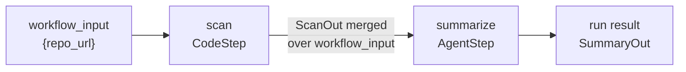

# Workflows as Step Pipelines

A Mash workflow is an ordered pipeline of steps. A step is either a `CodeStep`, a deterministic Python function, or an `AgentStep`, one run of a registered agent's loop. Every step declares a pydantic input and output, data threads from each step into the next, and the last step's output is the run result.

```python
from pydantic import BaseModel
from mash.workflows import AgentStep, CodeStep, StepContext, WorkflowSpec

class ScanIn(BaseModel):
    repo_url: str

class ScanOut(BaseModel):
    files_changed: list[str]
    head_sha: str

class SummaryOut(BaseModel):
    summary: str
    head_sha: str

def scan(inp: ScanIn, ctx: StepContext) -> ScanOut:
    ...

CHANGELOG = WorkflowSpec(
    workflow_id="changelog",
    input_model=ScanIn,
    steps=[
        CodeStep(step_id="scan", run=scan, input=ScanIn, output=ScanOut),
        AgentStep(step_id="summarize", agent_id="writer", input=ScanOut, output=SummaryOut),
    ],
)

pool = HostBuilder().agent(WriterSpec(), metadata=...).workflow(CHANGELOG).build()
```

The changelog job above has one deterministic part and one part that needs a model. Scanning the repo is Python: it should run exactly as written, and a retry should re-run the function, with no LLM in the path. Writing the summary is agent work. The two step kinds keep that boundary explicit in the definition, and two of the Masher workflows that ship with Mash (trace digest, online eval curation) are all `CodeStep`.

An `AgentStep` targets an agent already in the pool by `agent_id`, or carries its own `agent_spec`, which the builder registers as a [workflow-only agent](composing-agents.md) hidden from listings and delegation. When the step runs, that agent receives a normal request and executes it through the [same durable loop](durable-agent-loop.md) as everything else.

## Output threading

Each run starts from `workflow_input`, the JSON payload the trigger supplied. `input_model` types it, and it stays immutable for the whole run. Before each step, the framework merges the previous step's output over `workflow_input` and coerces the merged dict into the step's input model. The `summarize` step above receives `repo_url` from the workflow input and `files_changed` and `head_sha` from `scan`.



`WorkflowSpec` checks the whole pipeline at build time: step ids must be unique, both edges of every step must be typed, and when `input_model` is set the check goes field by field, so a step that expects a field no earlier step provides fails when the pool is built.

## The agent-step contract

The request message an agent step receives is JSON with a fixed shape:

```json
{
  "workflow_id": "changelog",
  "workflow_run_id": "mw:h_example:changelog:abc",
  "step_id": "summarize",
  "workflow_input": { "repo_url": "https://..." },
  "input": { "files_changed": ["src/loop.py"], "head_sha": "4431751" }
}
```

`input` is the coerced step input. The agent must return structured output matching the step's `output` schema; the schema rides the request as request-level [structured output](one-llm-contract.md), and the validated payload becomes the next step's threaded input. `output` takes a pydantic model or a plain JSON-schema dict. An optional `skill_name` on the step tells the agent to load that [skill](skills-on-demand.md) before doing the step's work, which keeps long task instructions in skill markdown instead of the step definition.

Every run is a clean slate. State never carries from one run to the next; what a run needs arrives in `workflow_input`, and what it produces leaves through the run result or through the effects its steps perform.

## Durability and resume

DBOS orchestrates the run. Each step body and each store write executes as its own memoized DBOS step, so recovery replays a run without redoing completed work. Execution is at-least-once: a step interrupted mid-flight runs again. Pure transforms replay safely. A step with external effects dedupes on a stable key, and `StepContext` hands it `run_id`, `step_id`, `workflow_input`, and `attempt`, all stable across retries. The framework never invents an idempotency key on the author's behalf.

A failed run resumes. `resume_run(run_id)` replays the completed steps from their stored outputs and re-drives the pipeline from the failed step, under the same `run_id`. Agent steps interlock with their own durable request through a deterministic `request_id`, so a resumed agent step continues mid-loop rather than resubmitting the request. A step may declare `timeout_s`; exceeding it fails the step, and the run stays resumable.

A `dedup_key` on submission becomes a DBOS queue deduplication id, so a second trigger while a run is active is rejected. That makes workflows safe to fire from schedules and webhooks.

## The step audit trail

Three tables in the shared [Postgres schema](persistence-store.md) belong to the workflow layer. `workflow_runs` holds one row per run with status, `workflow_input`, result, and timing. `workflow_steps` holds one row per step with status, input and output snapshots, the attempt count, and the `agent_request_id` for agent steps. `workflow_step_events` is an append-only lifecycle audit keyed by run, step, attempt, and event type. Step events make code steps observable, since a plain Python function emits no agent runtime events of its own.

Runs stream the same way requests do. `POST /api/v1/workflow/{id}/run` returns a `run_id`, and the events endpoint replays agent-step runtime events and code-step lifecycle events over SSE, the [same frames](request-lifecycle.md) the request endpoints use. In the REPL, `/workflow run changelog` streams the pipeline as it executes, and `/workflow status` and `/workflow resume` cover the rest of a run's life.

## Fan-out

A step pipeline is a straight line, but a `CodeStep` may use ordinary Python
control flow internally. The [experiment runner](synthetic-evals.md) uses three
linear CodeSteps; its execution and judging steps use async fan-out over a
durable experiment-row ledger. `WorkflowStrategy` remains available as an
extension escape hatch when application code truly needs a different runtime.

Masher's built-in workflows (trace digest, synthetic eval generation, online eval curation) are step pipelines on this same layer. Workflows, like requests, are driven entirely over the host's HTTP surface. That surface, and the CLI built on it, is the next post.

*Next: [The Host API and CLI](host-api-and-cli.md).*
