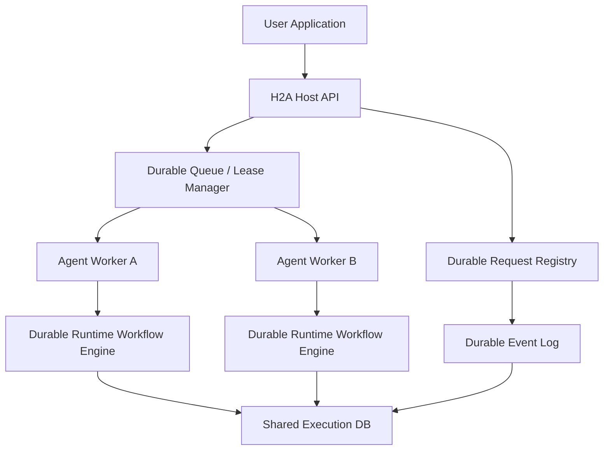

# H2A Durable Execution Proposal

Status: Draft

Last Updated: 2026-04-26

## 1. Summary

This proposal argues that durable execution in H2A should be introduced at two layers:

- the `Host` should own durable request admission, idempotency, retained event streaming, and distributed scheduling
- the `Agent Server` / runtime should own durable workflow execution, step checkpointing, retries, and crash recovery

The `Client` should remain thin. It can support reconnectable streaming and request idempotency headers, but it should not become the system of record for execution state.

The core recommendation is:

1. keep H2A as the protocol boundary
2. add a durable execution profile to H2A rather than making all implementations durable by default
3. move Mash from in-memory request tasks to a persisted workflow engine with explicit step boundaries
4. back the durable path with a shared database, ideally Postgres for multi-node deployments
5. treat DBOS as a strong implementation candidate for the runtime execution engine, not as the protocol itself

## 2. Problem

The current H2A RFC is explicit that v1 does not define:

- request cancellation
- request replay or resume
- idempotent request submission

The current Mash runtime also does not satisfy durable execution guarantees:

- request state is kept in process memory
- SSE replay is buffered in memory and bounded by TTL cleanup
- per-session serialization uses local `asyncio.Lock`
- runtime shutdown cancels in-flight tasks
- conversation turns and logs are persisted, but execution progress is not

That means Mash currently has persistent history, not durable execution.

## 3. Required Guarantees

For this proposal, durable execution means:

- state is persisted, not only held in memory or prompt state
- execution resumes from the exact step where it failed
- completed steps are never re-run
- retries and transient failures are handled automatically
- the system can scale horizontally across multiple workers

These guarantees are stronger than "resume the chat" or "reconnect the SSE stream." They require workflow semantics.

## 4. What Current Products Suggest

Two adjacent product patterns are useful here.

### 4.1 Codex

OpenAI documents Codex cloud as background task execution in isolated cloud environments, including parallel execution, and Codex automations can return to the same conversation context later.

That is useful evidence for:

- durable task admission
- background execution
- resumable user-facing context
- automation and scheduling

But the public docs do not describe step-level workflow checkpointing guarantees like "never re-run a completed tool call after process crash." That is an inference boundary we should respect.

### 4.2 Claude Code

Anthropic documents:

- resumable sessions with `--continue` and `--resume`
- GitHub Actions / Agent SDK based automation
- checkpointing for rewinding file changes

Again, that shows session continuity, automation, and programmable agents. It does not by itself imply DBOS-style durable workflow recovery from the exact last completed step.

### 4.3 DBOS

DBOS is the clearest match to the guarantees we want. Its architecture is explicitly:

- Postgres-backed workflow and step checkpointing
- recovery from the last completed step
- completed steps are not re-executed after checkpoint
- durable queues for multi-worker execution
- automatic recovery and retry policies

DBOS is therefore a good reference model for the runtime layer.

## 5. Design Principle

Durability should live where side effects and control flow are known.

That leads to three conclusions:

### 5.1 Do not put durable execution primarily in the client

The `Client` only knows transport details:

- submit request
- reconnect stream
- parse events

It does not know:

- what the runtime has already done
- which tool call or subagent call succeeded
- what the next deterministic step should be

So the client can improve transport resilience, but it cannot be the durable execution engine.

### 5.2 Host-only durability is insufficient

A host can durably persist:

- request submission
- routing
- queue state
- event retention

But the host does not know enough about the agent's internal loop to safely resume from the exact failed step. At best, it can re-submit the whole request, which violates "completed steps are not re-run."

### 5.3 Runtime durability is necessary but not sufficient

The runtime is the only layer that can safely checkpoint:

- LLM call boundaries
- tool call boundaries
- subagent invocation boundaries
- memory writes
- turn finalization

But runtime-only durability is not enough for horizontal scale. We also need the host to own:

- durable request registry
- idempotent submission
- distributed work dispatch
- retained stream/event access
- cross-agent observability

## 6. Recommendation

Use a combined model:

- `Host` = durable control plane
- `Runtime` = durable workflow engine
- `Client` = thin transport adapter

This is the only placement that satisfies all five guarantees without overloading the protocol client.

## 7. Proposed Stack

### 7.1 High-level topology



### 7.2 New responsibilities by layer

#### Host

- Accept `submit_request`
- Persist request record before acknowledging acceptance
- Enforce idempotency keys
- Write canonical request lifecycle events to a retained event log
- Enqueue work for the target `agent_id`
- Manage worker claims / leases for distributed execution
- Serve stream replay and reconnect from durable event storage

#### Client

- Submit requests with idempotency metadata
- Stream events with cursor / `Last-Event-ID` support
- Stay stateless with respect to workflow recovery

#### Runtime / Agent Server

- Execute one request as a deterministic workflow
- Define explicit step boundaries
- Checkpoint completed step outputs
- Retry retryable steps automatically
- Recover incomplete workflows after crash or failover
- Emit durable lifecycle and trace events

## 8. Step Model

Durability depends on explicit steps. A whole agent turn is too large a unit if we need exact crash recovery.

At minimum, a request workflow should be decomposed into durable steps like:

1. resolve or create session
2. load required conversation state
3. run one LLM inference
4. execute one tool call
5. execute one subagent call
6. persist turn result
7. emit terminal completion

For multi-step agent loops, `run one LLM inference` and `execute one tool call` should repeat as separate checkpointed steps, not be wrapped into one giant "process request" step.

This is the main architectural change. Right now `process_user_message(...)` is effectively one opaque execution unit.

## 9. Why The Current Runtime Cannot Recover Exactly

The current runtime can persist:

- conversation turns
- structured logs
- trace metadata

But it cannot recover exact request execution because it does not persist:

- a request record with durable status and ownership
- workflow inputs separate from final turn output
- completed step outputs
- retry state
- worker lease / ownership
- stream event sequence numbers
- resumable timers

Today, a crash during a tool or subagent call loses execution progress even if logs survive.

## 10. Proposed Persistence Model

The durable profile should add persisted records conceptually equivalent to:

- `requests`
  - `request_id`
  - `agent_id`
  - `session_id`
  - `idempotency_key`
  - `status`
  - `submitted_at`
  - `started_at`
  - `completed_at`
  - `workflow_version`
  - `lease_owner`
  - `lease_expires_at`

- `request_events`
  - `request_id`
  - `seq`
  - `event_type`
  - `payload`
  - `created_at`

- `workflow_steps`
  - `request_id`
  - `step_id`
  - `step_kind`
  - `attempt`
  - `status`
  - `input_hash`
  - `output_ref`
  - `error`
  - `retry_at`
  - `completed_at`

- `session_locks` or `session_leases`
  - `session_id`
  - `owner`
  - `lease_expires_at`

- optional `blobs`
  - large step outputs or artifacts stored out of line

Small outputs can live inline. Large outputs should be stored in blob storage and referenced by pointer.

## 11. Protocol Changes To H2A

These changes should be introduced as a durable execution capability, not forced on every minimal implementation.

### 11.1 Submission

Add optional durable submission metadata:

- `idempotency_key`
- `request_timeout`
- `retry_policy`
- `execution_profile`

### 11.2 Event stream

Add replayable event semantics:

- monotonically increasing `seq`
- stream resume by `Last-Event-ID` or explicit cursor
- retained event resource independent of live SSE connection

### 11.3 New events

Potential new canonical events:

- `request.recovered`
- `request.retrying`
- `request.timed_out`
- `step.started`
- `step.completed`
- `step.failed`
- `step.skipped`

We do not need all of these to be mandatory for every client UI, but the protocol should have room for them.

### 11.4 Discovery

Expose a capability flag such as:

```json
{
  "capabilities": {
    "durable_execution": true
  }
}
```

That lets simple in-memory H2A runtimes remain valid while durable runtimes advertise stronger guarantees.

## 12. Horizontal Scale

Horizontal scale is not possible in a meaningful durable sense with the current local in-memory coordination model.

To scale horizontally we need:

- a shared database for workflow state
- worker leases rather than local task ownership
- session serialization enforced through the shared database, not `asyncio.Lock`
- event retention independent of a single runtime process

This strongly suggests:

- SQLite remains acceptable for local dev or non-durable mode
- Postgres becomes the default backend for durable mode

## 13. DBOS Fit

DBOS is promising because it matches the execution semantics we need and keeps orchestration in-process with the application code.

### 13.1 Where DBOS fits best

DBOS fits best inside the runtime worker layer:

- the H2A host remains our request protocol and routing layer
- each agent request becomes a DBOS workflow
- LLM/tool/subagent/persistence operations become DBOS steps
- DBOS queues can distribute work across worker nodes

This preserves H2A as the public protocol while using DBOS as the recovery engine.

### 13.2 Why not make DBOS the host protocol

DBOS is an execution model and library, not a host-to-agent interoperability protocol. Replacing H2A with DBOS would collapse two concerns that should stay separate:

- external host/agent protocol contract
- internal execution durability implementation

### 13.3 DBOS caveats

Using DBOS imposes real constraints:

- workflow code must be deterministic
- step outputs must be serializable and reasonably small
- long-running workflows need upgrade/versioning discipline
- non-deterministic operations must move into steps
- prompt/model/tool version drift needs explicit pinning or workflow versioning

These are good constraints, but they are not free.

## 14. Native Implementation Alternative

If we do not want to depend on DBOS, we should still copy its architectural shape:

- deterministic workflow function
- checkpointed steps
- durable queue
- recovery scanner
- lease-based execution
- idempotency keys

In other words: even if we build it ourselves, we should build a DBOS-shaped engine.

## 15. Recommended Implementation Plan

### Phase 1: durable host request registry

- persist accepted requests and retained events
- add idempotency keys
- add stream replay by cursor
- keep current runtime execution model temporarily

This improves reliability, but it still does not provide exact-step recovery.

### Phase 2: durable runtime workflow engine

- split `process_user_message(...)` into explicit durable steps
- persist step outputs and retry state
- recover incomplete requests from the last completed step
- persist sequence-numbered request events

This is the point where we actually achieve durable execution.

### Phase 3: distributed workers and shared leases

- move from local runtime task ownership to worker leases
- replace session `asyncio.Lock` with database-backed session serialization
- scale workers horizontally per agent or per queue

### Phase 4: protocol capability surface

- formalize durable execution capability in H2A
- expose request inspection / replay semantics
- optionally expose step-level observability endpoints for operators

## 16. Open Questions

- What is the exact durable step granularity for the agent loop?
- Do we checkpoint every LLM call, every tool call, or every think/act iteration?
- How do we version workflows so in-flight requests survive code upgrades?
- How much of step output do we store inline versus as external blobs?
- Do subagent invocations become child workflows with their own recovery semantics?
- Should the host own queueing for all agents, or should each agent runtime own its own queue namespace?
- Do we want durable execution only for server-side agents, or also for local/embedded runtimes?

## 17. Bottom Line

If we want real durable execution guarantees, the durable boundary must be introduced at both the host and runtime:

- host for durable admission, replay, idempotency, and distributed scheduling
- runtime for exact step checkpointing and recovery

Putting durability only in the host is too shallow.
Putting durability only in the runtime is too narrow.
Putting it in the client is the wrong abstraction boundary.

The most credible path is:

- keep H2A as the protocol
- add a durable execution capability/profile
- move Mash runtime execution onto a workflow engine
- strongly consider DBOS for the runtime implementation
- require Postgres for horizontally scaled durable mode

## 18. References

- H2A RFC: [docs/rfcs/host-to-agent-protocol.md](host-to-agent-protocol.md)
- DBOS Architecture: [docs.dbos.dev/architecture](https://docs.dbos.dev/architecture)
- DBOS Workflows (Python): [docs.dbos.dev/python/tutorials/workflow-tutorial](https://docs.dbos.dev/python/tutorials/workflow-tutorial)
- Codex cloud: [developers.openai.com/codex/cloud](https://developers.openai.com/codex/cloud)
- Codex automations: [openai.com/academy/codex-automations](https://openai.com/academy/codex-automations/)
- Claude Agent SDK overview: [code.claude.com/docs/en/agent-sdk/overview](https://code.claude.com/docs/en/agent-sdk/overview)
- Claude Code tutorials: [code.claude.com/docs/en/tutorials](https://code.claude.com/docs/en/tutorials)
- Claude Code GitHub Actions: [code.claude.com/docs/en/github-actions](https://code.claude.com/docs/en/github-actions)
