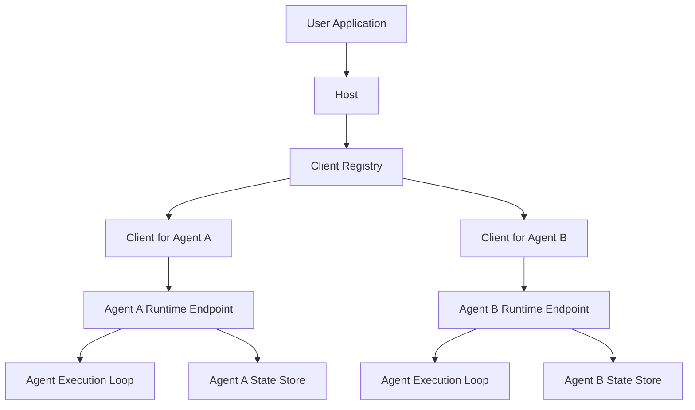
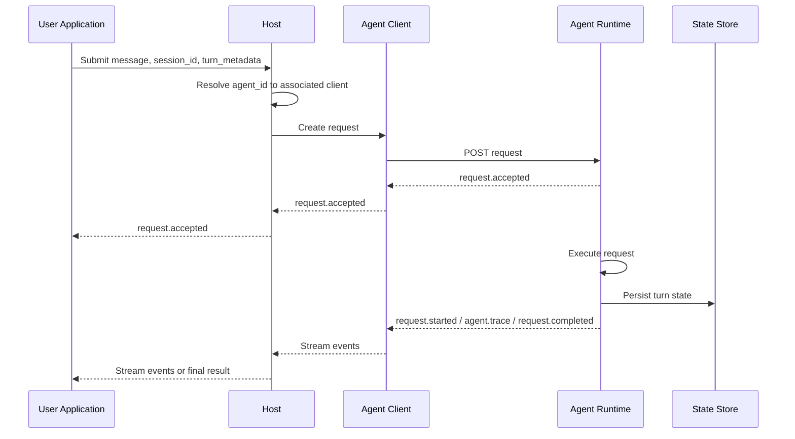

# Host-to-Agent Protocol (H2A)

Status: Draft

Version: 0.1.0

Last Updated: 2026-03-22

## 1. Overview

The Host-to-Agent Protocol (H2A) defines an interoperability protocol for interaction between host applications and agents.

In the H2A model, each addressable agent is exposed as a runtime endpoint and has an associated client used to communicate with it. A host keeps track of the available clients and uses them to interact with one or more agents on behalf of user applications.

The protocol semantics are defined independently of any specific transport. This document defines HTTP plus Server-Sent Events (SSE) as the first standard transport binding.

H2A assumes a user-facing application interacts with a host, and the host acts as the bridge to one or more agents. H2A therefore standardizes the host-facing surface that user applications and orchestration layers depend on, rather than agent internals or tool interoperability.

The key words "MUST", "MUST NOT", "REQUIRED", "SHALL", "SHALL NOT", "SHOULD", "SHOULD NOT", "RECOMMENDED", "NOT RECOMMENDED", "MAY", and "OPTIONAL" in this document are to be interpreted as described in RFC 2119 and RFC 8174.

## 2. Goals, Non-Goals, And Positioning

### 2.1 Goals

- Define a deterministic host-to-agent request lifecycle.
- Define canonical protocol objects and event envelopes.
- Standardize a host-facing state model for preferences and application data.
- Allow multiple transport bindings while preserving one protocol core.
- Support host-managed deployments that expose one or more agents behind one host.
- Leave room for agent-to-agent extensions without making them part of the core topology.

### 2.2 Non-Goals

- H2A does not standardize an agent reasoning model.
- H2A does not standardize model-provider APIs.
- H2A does not standardize tool invocation protocols or external context access.
- H2A does not require peer-to-peer agent meshes.
- H2A does not define a universal UI protocol.

### 2.3 Positioning

H2A is complementary to MCP. MCP is primarily concerned with tool, resource, and context interoperability between AI applications and external systems. H2A is concerned with host-to-agent execution, lifecycle, and host-managed state.

H2A is adjacent to agent-to-agent protocols such as A2A. H2A is host-to-agent first. Agent-to-agent delegation MAY be layered on top of H2A through an extension profile, but that is not the primary v1 topology.

## 3. Architecture And Conformance

### 3.1 Roles

H2A defines the following roles:

- `User Application`: a UI, client, automation, or orchestration surface that talks to a host.
- `Host`: the protocol participant that exposes H2A operations, manages sessions, and brokers access to one or more agents.
- `Client`: a protocol-facing component associated with one agent and used by a host to invoke that agent over H2A transports.
- `Agent`: an execution target selected by a host and exposed as an addressable runtime endpoint.

### 3.2 Topology

H2A is host-centric in v1:

- A host MAY expose one agent or many agents.
- A user application SHOULD address the host, not agents directly.
- A host SHOULD maintain a registry of available clients for the agents it exposes.
- A host MUST expose stable `agent_id` values for addressable agents.
- Each addressable agent MUST have an associated client.
- A host-facing client MUST target exactly one agent at a time.
- Agent-to-agent relationships are out of core scope and belong to an extension profile.

In a typical deployment:

- an agent is exposed over one or more concrete transports such as HTTP plus SSE
- a client communicates with exactly one agent endpoint
- the host tracks the set of available clients and selects the appropriate client for a requested `agent_id`

Illustrative runtime topology:



### 3.3 Conformance Classes

An implementation claiming H2A conformance MUST implement:

- the H2A Core
- the Required Host State profile
- at least one transport binding

A host implementation MAY embed transport servers internally, but H2A conformance is defined in terms of hosts, agents, clients, and protocol behavior rather than a separate server role.

Optional profiles MAY be implemented independently unless this specification states otherwise.

## 4. Protocol Structure

### 4.1 H2A Core

The H2A Core consists of:

- host-exposed agent discovery
- client resolution
- session descriptors and session scope
- request submission
- event streaming
- request lifecycle semantics
- control operations
- error taxonomy
- transport binding requirements

### 4.2 Required Host State Profile

The Required Host State profile consists of:

- `preferences/get`
- `preferences/set`
- `appdata/list`
- `appdata/get`
- `appdata/set`
- `appdata/delete`

This profile is mandatory because H2A standardizes the host-facing surface used by user applications, and host-managed state is part of that surface.

### 4.3 Optional Profiles

This specification defines the following optional profiles:

- History profile
- Compaction profile
- Topology profile
- Agent-to-Agent extension profile

## 5. Lifecycle

H2A defines five lifecycle phases.

### 5.1 Discovery

The host discovers or exposes the set of available agents and associated clients before request execution begins.

### 5.2 Client Resolution

The host resolves the requested `agent_id` to the associated client before request submission begins.

### 5.3 Request Submission And Session Resolution

The host submits a request to the resolved agent client using:

- `message`
- optional `session_id`
- optional `turn_metadata`

If `session_id` is omitted or empty, the target agent resolves the request into its default session before execution begins. The agent returns a `request.accepted` payload containing `request_id`, `agent_id`, `session_id`, and `status`.

### 5.4 Runtime Execution And Event Streaming

After acceptance, the runtime executes the request and exposes request lifecycle state through a streamed event sequence.

Illustrative request flow:



### 5.5 Completion And Retention

Request execution ends with exactly one terminal event: `request.completed` or `request.error`.

The current runtime retains accepted requests and buffered events for an implementation-defined time window. The runtime binding guarantees live streaming of request events, but does not currently define a separate retained request resource or replay API.

## 6. Runtime Objects

This section defines the runtime objects currently exposed by H2A. These objects are grounded in the existing host, client, server, and HTTP transport contracts.

### 6.1 AgentRecord

Required fields:

- `agent_id: string`
- `role: string`
- `metadata: object | null`

Example:

```json
{
  "agent_id": "planner",
  "role": "primary",
  "metadata": null
}
```

For subagents, `metadata` MAY include:

- `display_name`
- `description`
- `capabilities`
- `usage_guidance`

### 6.2 DefaultSessionIdResult

Returned by the default-session control operation.

```json
{
  "default_session_id": "sess_123"
}
```

### 6.3 SessionInfo

Returned by the session-info control operation.

Required fields:

- `app_id: string`
- `agent_id: string`
- `session_id: string`
- `primary_agent_id: string`
- `subagent_ids: array<string>`
- `model: string`
- `max_steps: integer`
- `session_total_tokens: integer`

Example:

```json
{
  "app_id": "planner",
  "agent_id": "planner",
  "session_id": "sess_123",
  "primary_agent_id": "planner",
  "subagent_ids": [
    "research"
  ],
  "model": "gpt-5.4",
  "max_steps": 32,
  "session_total_tokens": 14820
}
```

### 6.4 SessionsListResult

Returned by the session-list control operation.

```json
{
  "sessions": [
    {
      "session_id": "sess_123"
    }
  ]
}
```

The current runtime does not define a stricter schema for session list entries beyond returning an array of objects.

### 6.5 SubmitRequest

`SubmitRequest` is the runtime request body accepted by the request submission endpoint.

Required field:

- `message: string`

Optional fields:

- `session_id: string`
- `turn_metadata: object`

Example:

```json
{
  "message": "Plan a release for the next sprint.",
  "session_id": "sess_123",
  "turn_metadata": {
    "source": "web"
  }
}
```

### 6.6 RequestAccepted

Required fields:

- `request_id`
- `agent_id`
- `session_id`
- `status`

Example:

```json
{
  "request_id": "req_123",
  "agent_id": "planner",
  "status": "accepted",
  "session_id": "sess_123"
}
```

### 6.7 StreamEvent

The client exposes streamed request events as objects with:

- `event: string`
- `data: object`

Example:

```json
{
  "event": "request.started",
  "data": {
    "request_id": "req_123",
    "agent_id": "planner",
    "session_id": "sess_123",
    "status": "started"
  }
}
```

### 6.8 RequestStarted

`RequestStarted` appears in the `data` field of a `StreamEvent` whose `event` is `request.started`.

Required fields:

- `request_id`
- `agent_id`
- `session_id`
- `status`

### 6.9 RequestCompleted

`RequestCompleted` appears in the `data` field of a `StreamEvent` whose `event` is `request.completed`.

Required fields:

- `request_id`
- `agent_id`
- `session_id`
- `status`
- `response: object`
- `session_total_tokens: integer`

Optional fields:

- `compaction_summary_text`
- `compaction_summary_turn_id`

The `response` object includes:

- `text`
- `signals`
- `metadata`

### 6.10 RequestError

`RequestError` appears in the `data` field of a `StreamEvent` whose `event` is `request.error`.

Required fields:

- `request_id`
- `agent_id`
- `session_id`
- `status`
- `error`

Optional fields:

- `error_code`
- `retryable`

### 6.11 AgentTrace

`AgentTrace` appears in the `data` field of a `StreamEvent` whose `event` is `agent.trace`.

The current runtime emits one of two trace payload shapes:

- agent trace payloads with fields such as `event_type`, `trace_id`, `step_id`, `duration_ms`, `action_type`, `tool_calls`, `token_usage`, and `payload`
- LLM trace payloads with fields such as `event_type`, `trace_id`, `provider`, `model`, `duration_ms`, `input_tokens`, `output_tokens`, `total_tokens`, `finish_reason`, `error`, `tools`, and `betas`

### 6.12 ControlRequest

The control endpoint accepts:

- `action: string`
- `payload: object`

Example:

```json
{
  "action": "get_session_info",
  "payload": {
    "session_id": "sess_123"
  }
}
```

### 6.13 ControlResult

The control endpoint returns an object whose shape depends on `action`.

Current runtime result shapes include:

- `{"default_session_id": "..."}`
- `{"sessions": [...]}`
- `{"subagent_ids": [...]}`
- `{"preferences": {...} | null}`
- `{"items": [...]}`
- `{"value": ...}`
- `{"deleted": true | false}`
- `{"turns": [...]}`
- `{"summary_text": "...", "turn_id": "..."}`
- `{"ok": true}`

### 6.14 HistoryTurn

`HistoryTurn` belongs to the optional History profile and is returned inside `{"turns": [...]}`.

The current runtime stores history turns as dictionaries. Common fields include:

- `turn_id`
- `session_id`
- `user_message`
- `agent_response`
- `signals`
- `metadata`
- `session_total_tokens`

## 7. Core Operations

Operation names in this section are logical names, not route names.

### 7.1 Host And Agent Discovery

The current runtime model assumes the host already knows its registered agents and associated clients.

Hosts MAY expose higher-level discovery APIs, but the per-agent runtime transport defined here does not currently standardize a separate discovery or initialization object.

### 7.2 Agent Operations

- `agents/list`
- `agents/get`

`agents/list` SHOULD return `AgentRecord` objects when the host exposes discovery.

`agents/get` SHOULD return one `AgentRecord` when the host exposes discovery.

### 7.3 Session Operations

- `sessions/get_default`
- `sessions/get_info`
- `sessions/list`

`sessions/get_default` returns `DefaultSessionIdResult`.

`sessions/get_info` returns `SessionInfo`.

`sessions/list` returns `SessionsListResult`.

### 7.4 Request Operations

- `requests/create`
- `requests/stream`

`requests/create`:

- MUST accept `SubmitRequest`
- MUST return `RequestAccepted`

`requests/stream` MUST stream `StreamEvent` items for one request.

The current runtime does not define a separate `requests/get` resource or a `requests/cancel` operation.

### 7.5 Control Operations

The current runtime exposes non-request operations through a control action endpoint whose request body is `ControlRequest`.

Defined action names include:

- `get_default_session_id`
- `get_session_info`
- `list_sessions`
- `get_subagent_ids`
- `set_subagent_ids`
- `get_latest_preferences`
- `get_preferences`
- `set_preferences`
- `list_app_data`
- `get_app_data`
- `set_app_data`
- `delete_app_data`
- `get_history_turns`
- `compact_session`
- `emit_command_event`

## 8. Request Lifecycle

H2A defines the following runtime lifecycle:

`request.accepted -> request.started -> zero or more agent.trace -> request.completed | request.error`

Rules:

- `request.accepted` MUST be the first event recorded for an accepted request.
- `request.started` MUST NOT occur before `request.accepted`.
- `agent.trace` MAY occur zero or more times after `request.started`.
- `request.completed` and `request.error` are mutually exclusive terminal events.
- A request MUST NOT emit additional protocol events after a terminal event.

Event mapping:

- `request.accepted` carries a `RequestAccepted` payload.
- `request.started` carries a `RequestStarted` payload.
- `request.completed` carries a `RequestCompleted` payload.
- `request.error` carries a `RequestError` payload.
- `agent.trace` carries an `AgentTrace` payload.

## 9. Eventing And Retention

### 9.1 Event Types

Core event types:

- `request.accepted`
- `request.started`
- `request.completed`
- `request.error`
- `agent.trace`

Bindings MAY define additional non-terminal events, but the current runtime only standardizes the event types above.

### 9.2 Ordering

- Events MUST be delivered in the order they are appended to the request buffer.
- Terminal events MUST be the final protocol events for a request.
- The client-visible stream event object is always `{"event": ..., "data": ...}`.

### 9.3 Replay And Resume

The current runtime buffers events internally and supports cursor-based access inside the server runtime, but the HTTP plus SSE binding does not currently define a client-facing replay or resume mechanism.

### 9.4 Retention

Accepted requests and buffered events MAY expire according to host-defined retention policy.

## 10. Cancellation And Future Request Controls

The current runtime does not define request cancellation, request idempotency, or a separate retained request descriptor resource.

Future revisions MAY add:

- request cancellation
- request retrieval
- replay or resume semantics
- idempotent submission semantics

## 11. Required Host State Profile

### 11.1 Model

The Required Host State profile standardizes host-managed state that user applications commonly need.

This state is session-authoritative within the host surface:

- preferences are authoritative host-managed user or session settings for the session scope
- app data is authoritative host-managed application state stored for the session scope

This profile does not define how an agent internally consumes that state.

### 11.2 Preference Operations

- `preferences/get_latest`
- `preferences/get`
- `preferences/set`

`preferences/get_latest` returns:

- `{"preferences": {...}}`
- or `{"preferences": null}`

`preferences/get` returns the current preference record for a session.

`preferences/set` MUST replace or merge preferences according to host-documented semantics. Hosts SHOULD document whether writes are replace or merge semantics. If not documented, they MUST be replace semantics.

### 11.3 App Data Operations

- `appdata/list`
- `appdata/get`
- `appdata/set`
- `appdata/delete`

App data values MAY be arbitrary structured values encodable by the binding.

## 12. Optional Profiles

### 12.1 History Profile

The History profile defines:

- `history/list`

`history/list`:

- MUST return `{"turns": [...]}` where each entry is a `HistoryTurn`
- MUST support `session_id`
- MAY support `limit`

The current runtime does not define pagination or richer history item kinds at the protocol layer.

### 12.2 Compaction Profile

The Compaction profile defines `sessions/compact`, which returns:

- `{"summary_text": string | null, "turn_id": string | null}`

### 12.3 Topology Profile

The Topology profile defines:

- `topology/get`

This profile MAY expose:

- host-managed relationships between agents
- routing metadata
- visibility rules for user applications

### 12.4 Agent-to-Agent Extension Profile

The Agent-to-Agent extension profile MAY:

- treat a calling agent as a host for the duration of a delegated request
- correlate parent and child request IDs
- define delegated cancellation semantics
- define derived subordinate session behavior

## 13. Error Model

The current runtime uses two error shapes.

Transport and validation errors are returned as:

```json
{
  "error": {
    "code": "INVALID_REQUEST",
    "message": "message is required"
  }
}
```

Terminal request execution errors are returned inside `request.error` events as:

```json
{
  "request_id": "req_123",
  "agent_id": "planner",
  "status": "error",
  "session_id": "sess_123",
  "error": "request failed",
  "error_code": "context_length_exceeded",
  "retryable": false
}
```

Current runtime HTTP errors use uppercase codes such as:

- `INVALID_REQUEST`
- `INVALID_JSON`
- `ROUTE_NOT_FOUND`
- `REQUEST_NOT_FOUND`

## 14. Transport Bindings

### 14.1 Binding Requirements

Every binding MUST define:

- operation addressing
- request and response encoding
- event stream encoding
- error mapping

A binding specification SHOULD describe:

- how one agent is exposed over that binding
- how an associated client interacts with that agent for request submission, control operations, and streaming

### 14.2 HTTP Plus SSE Binding

This document defines HTTP plus SSE as the first standard binding.

In the HTTP plus SSE binding:

- one agent is exposed over HTTP endpoints and SSE event streams
- the associated client invokes those endpoints for exactly that agent
- the host selects and uses the appropriate client for the target `agent_id`

#### 14.2.1 Endpoint Shape

- `POST /agents/{agent_id}/control`
- `GET /agents/{agent_id}/control?action=...`
- `POST /agents/{agent_id}/requests`
- `GET /agents/{agent_id}/requests/{request_id}`

Equivalent shapes are permitted if they preserve H2A semantics.

#### 14.2.2 Submission And Streaming

For HTTP:

- `requests/create` returns `202 Accepted` with a `RequestAccepted` payload
- the request stream is fetched by `GET /agents/{agent_id}/requests/{request_id}`
- the stream emits `request.accepted`, `request.started`, zero or more `agent.trace`, and one terminal event

#### 14.2.3 SSE Encoding

Each SSE event MUST be encoded using:

```text
event: <event-name>
data: <json-object>
```

The JSON payload in `data` is the event `data` object from `StreamEvent`.

Bindings MAY emit keep-alive comments.

#### 14.2.4 HTTP Status Codes

Recommended status codes:

- `200 OK` for successful control operations and stream establishment
- `202 Accepted` for asynchronous request submission
- `400 Bad Request` for validation errors
- `401 Unauthorized` for missing authentication
- `403 Forbidden` for denied authorization
- `404 Not Found` for unknown agent, request, or route
- `500 Internal Server Error` for unexpected failures

## 15. Security And Trust Considerations

Implementations SHOULD:

- authenticate user applications and hosts appropriately for the deployment model
- authorize access at least at the agent and session scope
- validate all identifiers and content parts
- enforce request size and stream duration limits
- rate limit abusive clients
- avoid leaking internal stack traces in protocol errors
- log security-relevant failures

If topology, history, preferences, or app data are exposed, hosts SHOULD make that exposure configurable.

## 16. Related Protocols

This section is informative.

### 16.1 MCP

MCP is complementary to H2A. MCP focuses on tools, resources, prompts, and external context interoperability and includes explicit initialization and capability negotiation. H2A focuses on host-to-agent execution, lifecycle, and host-facing state.

### 16.2 A2A

Google A2A is the closest adjacent public protocol. It emphasizes agent-to-agent communication, task lifecycle, structured messages, artifacts, and long-running execution. H2A is narrower and host-to-agent first.

### 16.3 OpenAI Public APIs

OpenAI publicly exposes related primitives, including typed streaming events, persistent conversation state, and multi-agent SDK patterns. H2A adopts similar concerns at the interoperability layer, but does not assume a vendor-specific runtime model.

### 16.4 Anthropic Public APIs

Anthropic publicly points to MCP as its main interoperability standard in this area. H2A therefore positions itself as complementary to MCP rather than parallel to an existing Anthropic host-to-agent standard.

## 17. Implementation Notes

The following are compatible implementation choices, not protocol requirements:

- single-flight execution with an internal queue
- bounded request retention
- event fan-out to durable logs and live streams
- host-local session summaries
- transport-specific optimizations that preserve H2A semantics
