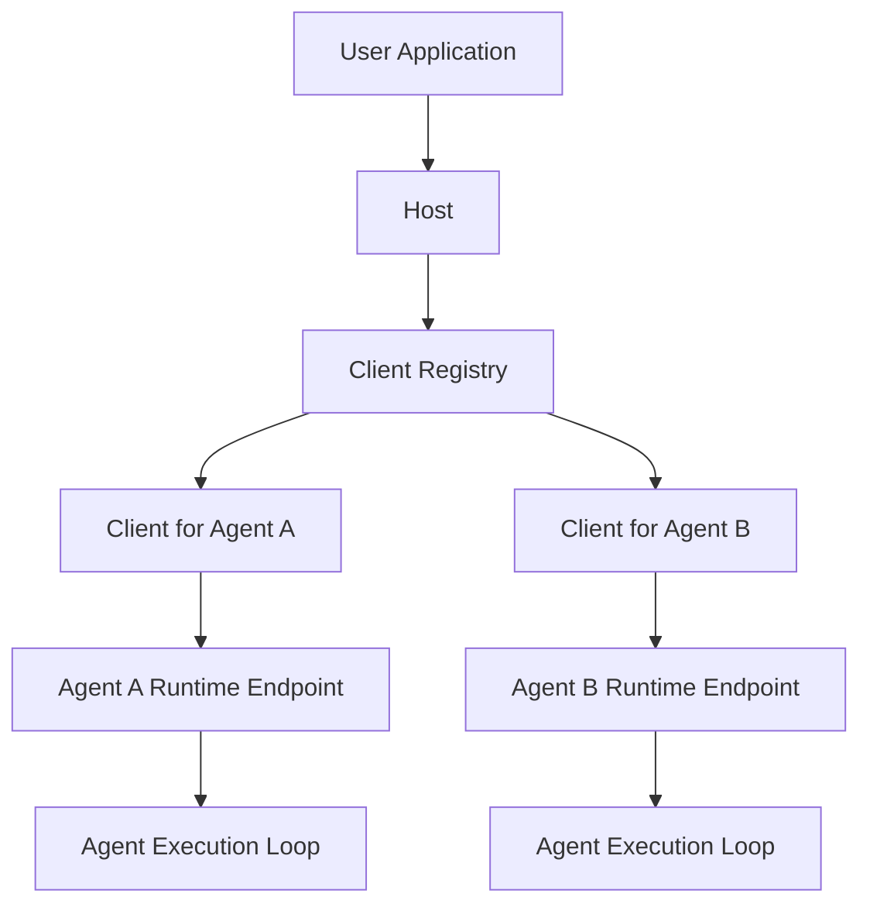
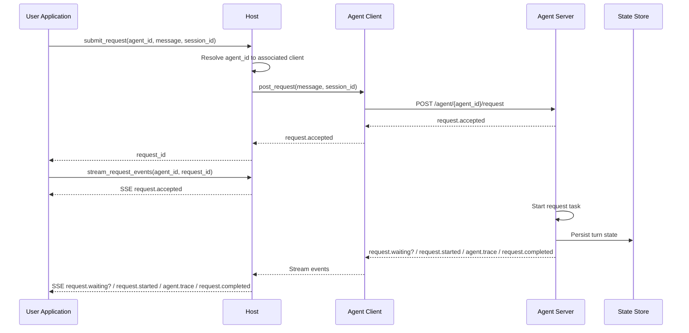
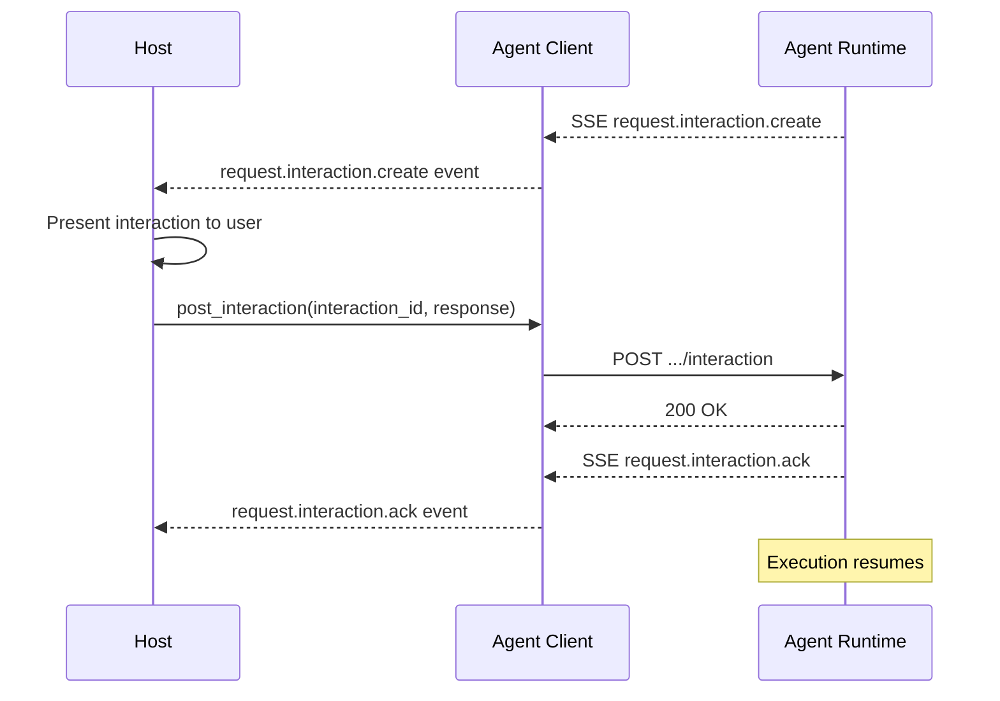

# Host-to-Agent Protocol (H2A)

Status: Draft

Version: 0.2.0

Last Updated: 2026-04-04

## 1. Overview

The Host-to-Agent Protocol (H2A) defines an interoperability protocol for interaction between host applications and agents.

In the H2A model, each addressable agent is exposed as a runtime endpoint and has an associated client used to communicate with it. A host keeps track of the available clients and uses them to interact with one or more agents on behalf of user applications.

The protocol semantics are defined independently of any specific transport. This document defines HTTP plus Server-Sent Events (SSE) as the first standard transport binding.

H2A assumes a user-facing application interacts with a host, and the host acts as the bridge to one or more agents. H2A therefore standardizes the host-to-client and client-to-agent lifecycle that user-facing hosts depend on, rather than agent internals or tool interoperability.

## 2. Goals, Non-Goals, And Positioning

### 2.1 Goals

- Define a deterministic host-to-agent request lifecycle.
- Define canonical request and event envelopes.
- Allow multiple transport bindings while preserving one protocol core.
- Support host-managed deployments that expose one or more agents behind one host.
- Leave room for future extensions without making them part of the core topology.

### 2.2 Non-Goals

- H2A does not standardize an agent reasoning model.
- H2A does not standardize model-provider APIs.
- H2A does not standardize tool invocation protocols or external context access.
- H2A does not require peer-to-peer agent meshes.
- H2A does not define a universal UI protocol.

### 2.3 Positioning

H2A is complementary to MCP. MCP is primarily concerned with tool, resource, and context interoperability between AI applications and external systems. H2A is concerned with host-to-agent execution, lifecycle, and transport semantics.

H2A is adjacent to agent-to-agent protocols such as A2A. H2A is host-to-agent first. Agent-to-agent delegation MAY be layered on top of H2A in future revisions, but that is not the primary v1 topology.

## 3. Architecture And Conformance

### 3.1 Roles

H2A defines the following roles:

- `User Application`: a UI, client, automation, or orchestration surface that talks to a host.
- `Host`: the protocol participant that exposes H2A operations, manages sessions, and brokers access to one or more agents.
- `Client`: a protocol-facing component associated with one agent and used by a host to invoke that agent over H2A transports.
- `Agent`: an execution target selected by a host and exposed as an addressable runtime endpoint.

### 3.2 Topology

H2A is host-centric in v1:

- A host MAY expose one agent or many agents.
- A user application SHOULD address the host, not agents directly.
- A host MUST expose stable `agent_id` values for addressable agents.
- Each addressable agent MUST have an associated client.
- A host MUST be able to resolve `agent_id` to the associated client.
- A host-facing client MUST target exactly one agent at a time.
- Agent-to-agent relationships are out of core scope.

In a typical deployment:

- an agent is exposed over one or more concrete transports such as HTTP plus SSE
- a client communicates with exactly one agent endpoint
- the host tracks the set of available clients and selects the appropriate client for a requested `agent_id`

Illustrative runtime topology:



### 3.3 Conformance

An implementation claiming H2A conformance MUST implement the H2A request flow defined by this specification and at least one supported transport binding.

H2A conformance is defined in terms of hosts, agents, clients, and protocol behavior rather than a separate deployment boundary. A host MAY embed transport servers internally, including running one per-agent HTTP server in the same process.

## 4. Protocol Structure

At a high level, H2A standardizes three communication standards:

- `User Application -> Host`
- `Host -> Client`
- `Client -> Agent`

### 4.1 User Application To Host

The user application talks to a host that accepts request submission and exposes streamed request events.

### 4.2 Host To Client

The host resolves `agent_id` to the associated client and uses that client to create requests and consume request streams for one agent.

### 4.3 Client To Agent

The client talks directly to the per-agent runtime endpoint that accepts HTTP requests and emits SSE events.

## 5. Lifecycle

H2A request flow proceeds through the three communication standards in sequence.

### 5.1 User Application To Host

The user application submits work to the host using a host-facing request operation such as `submit_request`.

The host-facing submission includes:

- `agent_id`
- `message`
- optional `session_id`

The host returns a host-facing request identifier after the downstream agent request has been accepted.

After submission, the user application consumes the resulting lifecycle from the host using a host-facing stream operation such as `stream_request_events`.

### 5.2 Host To Client

The host resolves the requested `agent_id` to the associated client before request submission begins.

The host submits a request to the resolved client using:

- `message`
- optional `session_id`

### 5.3 Client To Agent

The client turns the host request into a transport request for exactly one agent runtime.

If `session_id` is omitted or empty, the agent runtime resolves the request into its default session before execution begins. The runtime returns a `request.accepted` payload containing `request_id`, `agent_id`, `session_id`, and `status`.

### 5.4 Agent Execution And Streaming

After acceptance, the runtime executes the request and exposes request lifecycle state through a streamed event sequence. The client consumes those events and the host relays them back to the user application.

Illustrative request flow:



### 5.5 Completion And Retention

Request execution ends with exactly one terminal event: `request.completed` or `request.error`.

The current runtime retains accepted requests and buffered events for an implementation-defined time window and count bound. The runtime binding guarantees live streaming of request events, but does not currently define a separate retained request resource or replay API.

## 6. Host To Client Interaction

This section defines the second communication standard: `Host -> Client`.

At this layer, H2A centers interaction on two operations:

- `post_request`
- `stream_response`

These two operations are sufficient for a host to submit work to one agent and observe the resulting lifecycle until completion.

### 6.1 `post_request`

`post_request` creates one asynchronous request for one agent.

Inputs:

- `message: string`
- optional `session_id: string`

Rules:

- The client MUST submit `post_request` as an HTTP `POST`.
- The request body MUST be a JSON object.
- `message` MUST be present and MUST be a non-empty string.
- `session_id` MAY be omitted.
- If `session_id` is omitted or empty, the agent runtime MUST resolve the request into its default session before execution begins.
- Same-session overlap MUST be accepted rather than rejected. If execution cannot begin immediately because another request for the same `session_id` is in flight, the runtime MAY emit a later `request.waiting` event.

The server response MUST be `202 Accepted` with a JSON object containing:

- `request_id: string`
- `agent_id: string`
- `session_id: string`
- `status: "accepted"`

Example:

```json
{
  "message": "Plan the next release.",
  "session_id": "sess_123"
}
```

Accepted response:

```json
{
  "request_id": "req_123",
  "agent_id": "planner",
  "session_id": "sess_123",
  "status": "accepted"
}
```

### 6.2 `stream_response`

`stream_response` consumes the event stream for one previously accepted request.

Inputs:

- `request_id: string`

Rules:

- The client MUST open `stream_response` as an HTTP `GET` against the request stream endpoint for that `request_id`.
- The server MUST respond with `200 OK` and `Content-Type: text/event-stream` when the request exists.
- Each event MUST be encoded as an SSE event with `event:` and `data:` lines.
- The `data:` payload MUST be a JSON object.
- The client MUST yield events in the order received.
- The stream terminates after exactly one terminal event: `request.completed` or `request.error`.

Example SSE frame:

```text
event: request.started
data: {"request_id":"req_123","agent_id":"planner","session_id":"sess_123","status":"started"}
```

Optional waiting frame:

```text
event: request.waiting
data: {"request_id":"req_123","agent_id":"planner","session_id":"sess_123","status":"waiting","reason":"session_busy"}
```

### 6.3 `post_interaction`

`post_interaction` delivers a user response to a blocked agent.

Inputs:

- `interaction_id: string`
- `response: any`

Rules:

- The client MUST submit `post_interaction` as an HTTP `POST` to the interaction endpoint for that request.
- The request body MUST be a JSON object containing `interaction_id` and `response`.
- `interaction_id` MUST match an outstanding `request.interaction.create` event for the given request.

The server response MUST be `200 OK` with a JSON object containing:

- `ok: true`
- `interaction_id: string`

Error responses:

- `404 Not Found` if `request_id` or `interaction_id` is unknown.
- `409 Conflict` if `interaction_id` has already been responded to.
- `410 Gone` if the interaction timed out.

Example:

```json
{
  "interaction_id": "itr_abc123",
  "response": "approve"
}
```

### 6.4 Event Contract

H2A defines this canonical event sequence:

- `request.accepted`
- optional `request.waiting`
- `request.started`
- zero or more `agent.trace`
- zero or more `request.interaction.create` / `request.interaction.ack` pairs
- terminal `request.completed` or `request.error`

Rules:

- `request.accepted` MUST be the first event for a request.
- `request.waiting` MUST be non-terminal.
- `request.waiting` indicates that the request has been accepted but is blocked behind another in-flight request for the same `session_id`.
- `request.started` MUST be emitted before any `agent.trace` or terminal event.
- `request.interaction.create` MUST be non-terminal.
- `request.interaction.create` MUST be followed by exactly one `request.interaction.ack` with the same `interaction_id`.
- `request.interaction.create` and `request.interaction.ack` MAY appear zero or more times between `request.started` and the terminal event.
- Exactly one terminal event MUST be emitted.
- `request.error` payloads SHOULD include `error_code` and `retryable` fields to indicate the failure class and whether the error was transient. Transient errors are retried automatically at the step level before `request.error` is emitted; the `retryable` field indicates the original classification.

### 6.5 Client Contract

For one addressable agent:

- one client MUST target exactly one `agent_id`
- one client MUST use exactly one base URL for that agent server
- `post_request`, `stream_response`, and `post_interaction` together form the complete asynchronous request contract
- `get_request_status` — query the current execution state of a request
- `resume_request` — restart a failed or cancelled request for recovery

H2A does not define:

- request cancellation
- idempotent request submission

## 7. Interactions

An interaction is a mid-execution pause where the agent requests information or approval from the host before continuing. Interactions enable human-in-the-loop workflows without breaking the streaming event model.

### 7.1 Interaction Types

H2A defines three interaction types:

| Type | Schema | Description |
|------|--------|-------------|
| `approval` | `{ "type": "enum", "options": ["approve", "deny", "skip"] }` | Request permission before a destructive or significant action |
| `info` | `{ "type": "text" }` | Request free-form text input from the user |
| `choice` | `{ "type": "multi_select", "options": [...] }` | Request one or more selections from a set of options |

### 7.2 `request.interaction.create`

Emitted on the SSE stream when the agent blocks waiting for a response.

```text
event: request.interaction.create
data: {"request_id":"req_123","agent_id":"planner","session_id":"sess_123","interaction_id":"itr_abc123","type":"approval","prompt":"Delete 47 files from production. Proceed?","schema":{"type":"enum","options":["approve","deny","skip"]},"timeout_seconds":300}
```

Fields:

- `request_id: string` — the parent request
- `agent_id: string` — the agent requesting interaction
- `session_id: string` — current session
- `interaction_id: string` — unique identifier for this interaction
- `type: string` — one of `approval`, `info`, `choice`
- `prompt: string` — human-readable question or description
- `schema: object` — describes the expected response shape
- `timeout_seconds: number` — how long the agent will wait

### 7.3 `request.interaction.ack`

Emitted after the agent receives the host's response and resumes execution.

```text
event: request.interaction.ack
data: {"request_id":"req_123","agent_id":"planner","session_id":"sess_123","interaction_id":"itr_abc123","response":"approve"}
```

Fields:

- `request_id: string`
- `agent_id: string`
- `session_id: string`
- `interaction_id: string` — matches the originating `request.interaction.create`
- `response: any` — the user's response (string for approval/info, array for choice)
- `timed_out: boolean` (optional) — true if the agent proceeded after timeout with a default

### 7.4 Interaction Flow



### 7.5 Timeout Behavior

If the host does not respond within `timeout_seconds`:

- The agent MUST emit `request.interaction.ack` with `timed_out: true`.
- Default timeout responses: `"deny"` for approval, `""` for info, `[]` for choice.
- After timeout, POST to that `interaction_id` MUST return `410 Gone`.

### 7.6 Durability

Interaction blocking MUST be durable. If the agent runtime restarts while waiting for a response, it MUST resume waiting for the same `interaction_id` without re-emitting `request.interaction.create`. This enables interactions that span hours or days.

## 8. Client To Agent HTTP Server

This section defines the third communication standard: `Client -> Agent`.

Each agent is exposed by one HTTP server that handles health checks, request creation, and request event streaming.

### 8.1 Endpoint Shape

The HTTP plus SSE binding defines these endpoints for one agent:

- `GET /health`
- `POST /agent/{agent_id}/request`
- `GET /agent/{agent_id}/request/{request_id}`
- `POST /agent/{agent_id}/request/{request_id}/interaction`
- `GET /agent/{agent_id}/request/{request_id}/status`
- `POST /agent/{agent_id}/request/{request_id}/resume`

Equivalent route shapes are permitted if they preserve the same semantics.

### 8.2 POST Request Handling

For `POST /agent/{agent_id}/request`, the server MUST:

1. match the route for the target `agent_id`
2. read the request body as JSON
3. reject non-object JSON bodies
4. validate that `message` is a non-empty string
5. validate that `session_id`, if present, is a string
6. call the runtime request-submission operation
7. return `202 Accepted` with the accepted payload

Validation failures MUST return a JSON error object.

Example transport error:

```json
{
  "error": {
    "code": "INVALID_REQUEST",
    "message": "message is required"
  }
}
```

### 8.3 GET Stream Handling

For `GET /agent/{agent_id}/request/{request_id}`, the server MUST:

1. validate the route and extract `request_id`
2. reject missing or unknown request ids
3. establish an SSE response with `Content-Type: text/event-stream`
4. fetch buffered request events from the runtime in order
5. write each event as one SSE frame
6. stop after the runtime reports completion or the client disconnects

If no new events are available and the request is not yet complete, the server MAY emit SSE keep-alive comments.

### 8.4 POST Interaction Handling

For `POST /agent/{agent_id}/request/{request_id}/interaction`, the server MUST:

1. match the route for the target `agent_id` and `request_id`
2. read the request body as JSON
3. validate that `interaction_id` is a non-empty string
4. deliver the response to the blocked workflow
5. return `200 OK` with the acknowledged payload

### 8.5 GET Request Status

For `GET /agent/{agent_id}/request/{request_id}/status`, the server MUST:

1. match the route for the target `agent_id` and `request_id`
2. query the underlying workflow engine for the request's execution state
3. return `200 OK` with a JSON object containing:
   - `request_id: string`
   - `workflow_id: string`
   - `status: string` — one of `pending`, `completed`, `failed`, `cancelled`, `queued`
   - optional `error: string` — error message if failed
   - optional `recovery_attempts: number` — number of auto-recovery attempts
4. return `404 Not Found` if the `request_id` is unknown

This endpoint is useful when the SSE stream goes silent after a process crash. The client can check whether the request is still pending (will auto-recover), completed, or permanently failed.

### 8.6 POST Resume Request

For `POST /agent/{agent_id}/request/{request_id}/resume`, the server MUST:

1. match the route for the target `agent_id` and `request_id`
2. query the underlying workflow engine for the request's execution state
3. if the request is in a terminal failure state (`failed`, `cancelled`), set the workflow back to `pending` for automatic recovery
4. return `200 OK` with a JSON object containing:
   - `request_id: string`
   - `workflow_id: string`
   - `status: string` — `resumed` if recovery was triggered, or the current status if no action was needed
   - optional `previous_status: string` — the status before resume
   - `message: string` — human-readable description
5. return `404 Not Found` if the `request_id` is unknown

If the request is already `completed` or `pending`, the server MUST return the current status without modifying state.

### 8.7 Runtime Requirements Behind The Server

The runtime attached to one agent HTTP server MUST provide:

- request submission
- request existence checks
- ordered event streaming for one request

The server/runtime boundary MUST preserve request ordering and terminal-event semantics.

The runtime execution model MAY vary internally, but the current H2A reference behavior is:

- every accepted request creates an execution task immediately
- requests sharing the same `session_id` are serialized
- different sessions MAY run concurrently up to an implementation-defined limit
- the runtime MAY emit `request.waiting` when same-session contention delays execution start

## 9. Per-Agent HTTP Runtime Binding

H2A is per-agent at the transport boundary.

### 9.1 One Server Per Agent

- Each addressable agent MUST be exposed through its own HTTP server instance or an equivalent per-agent endpoint surface.
- Each server instance MUST bind exactly one runtime and exactly one `agent_id`.
- A host with multiple agents MUST maintain one client per agent server.
- Separate processes or containers are not required by the protocol. An implementation MAY run per-agent servers in the same process.

### 9.2 Server Startup

When an agent runtime starts its HTTP server:

- it MUST bind a host and port
- it MUST associate the bound server with exactly one `agent_id`
- it MUST return a base URL that clients can use for subsequent `post_request`, `stream`, and `post_interaction` calls

### 9.3 Binding Summary

The resulting interaction model is:

1. the host resolves `agent_id` to the associated client
2. the client calls `post_request`
3. the per-agent HTTP server accepts the request
4. the client calls `stream`
5. the per-agent HTTP server streams the lifecycle for that request
6. if `request.interaction.create` is received, the client calls `post_interaction`
7. the per-agent HTTP server delivers the response and resumes execution

## 10. Error Model

Transport and validation errors MUST be returned as JSON objects of the form:

```json
{
  "error": {
    "code": "INVALID_REQUEST",
    "message": "message is required"
  }
}
```

Request execution failures after acceptance MUST be emitted as `request.error` events rather than converted into a different HTTP response. Transient errors (rate limits, timeouts, network errors) are retried automatically at the step level before `request.error` is emitted. The `request.error` payload SHOULD include `error_code` and `retryable` fields so clients can distinguish transient failures (retries exhausted) from permanent ones.

Failed requests MAY be resumed by the host via `POST .../resume`, which sets the workflow back to pending for re-execution.

Recommended HTTP status codes:

- `200 OK` for successful stream establishment
- `200 OK` for successful health checks
- `202 Accepted` for successful request submission
- `400 Bad Request` for validation failures
- `404 Not Found` for unknown routes or request ids
- `500 Internal Server Error` for unexpected transport failures

## 11. Related Protocols

This section is informative.

### 11.1 MCP

MCP is complementary to H2A. MCP focuses on tools, resources, prompts, and external context interoperability and includes explicit initialization and capability negotiation. H2A focuses on host-to-agent execution, lifecycle, and transport semantics.

### 11.2 A2A

Google A2A is the closest adjacent public protocol. It emphasizes agent-to-agent communication, task lifecycle, structured messages, artifacts, and long-running execution. H2A is narrower and host-to-agent first.
