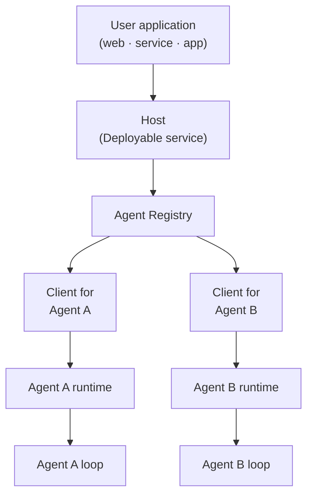
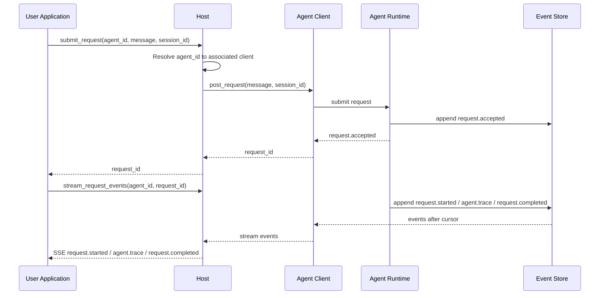
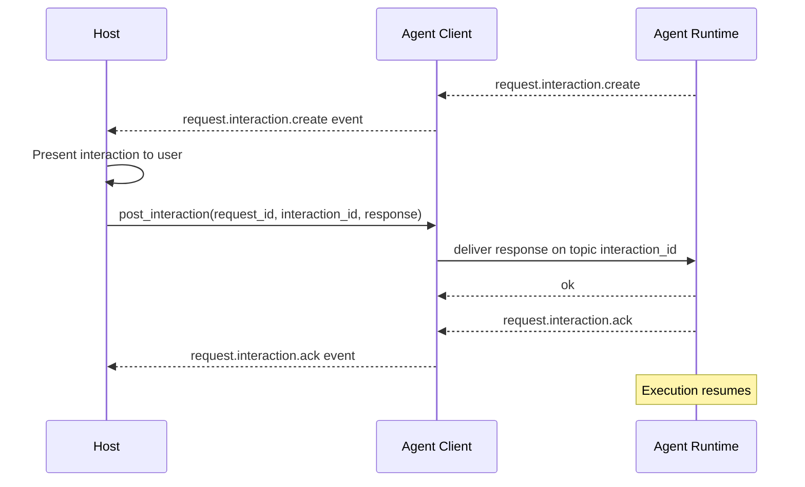

# Host-to-Agent Protocol (H2A)

Status: Draft

Version: 0.3.0

Last Updated: 2026-10-04

## 1. Overview

The Host-to-Agent Protocol (H2A) defines an interoperability protocol for interaction between host applications and agents.

In the H2A model, each addressable agent is exposed as a runtime endpoint and has an associated client used to communicate with it. A host keeps track of the available clients and uses them to interact with one or more agents on behalf of user applications.

The protocol semantics are defined independently of any specific transport. This document defines two bindings: HTTP plus Server-Sent Events (SSE) for the per-agent endpoint, and an in-process binding for hosts that run their agents in the same process.

H2A assumes a user-facing application interacts with a host, and the host acts as the bridge to one or more agents. H2A therefore standardizes the host-to-client and client-to-agent lifecycle that user-facing hosts depend on, rather than agent internals or tool interoperability.

## 2. Goals, Non-Goals, And Positioning

### 2.1 Goals

- Define a deterministic host-to-agent request lifecycle.
- Define canonical request and event envelopes.
- Allow multiple transport bindings while preserving one protocol core.
- Support host-managed deployments that expose one or more agents behind one host.
- Leave room for future extensions without making them part of the core topology.

### 2.2 Non-Goals

- H2A does not standardize an agent reasoning model.
- H2A does not standardize model-provider APIs.
- H2A does not standardize tool invocation protocols or external context access.
- H2A does not require peer-to-peer agent meshes.
- H2A does not define a universal UI protocol.

### 2.3 Positioning

H2A is complementary to MCP. MCP is primarily concerned with tool, resource, and context interoperability between AI applications and external systems. H2A is concerned with host-to-agent execution, lifecycle, and transport semantics.

H2A is adjacent to agent-to-agent protocols such as A2A. H2A is host-to-agent first. Agent-to-agent delegation MAY be layered on top of H2A in future revisions, but that is not the primary v1 topology.

## 3. Architecture And Conformance

### 3.1 Roles

H2A defines the following roles:

- `User Application`: a UI, client, automation, or orchestration surface that talks to a host.
- `Host`: the protocol participant that exposes H2A operations, manages sessions, and brokers access to one or more agents.
- `Client`: a protocol-facing component associated with one agent and used by a host to invoke that agent over an H2A binding.
- `Agent`: an execution target selected by a host and exposed as an addressable runtime endpoint.

### 3.2 Topology

H2A is host-centric in v1:

- A host MAY expose one agent or many agents.
- A user application SHOULD address the host, not agents directly.
- A host MUST expose stable `agent_id` values for addressable agents.
- Each addressable agent MUST have an associated client.
- A host MUST be able to resolve `agent_id` to the associated client.
- A host-facing client MUST target exactly one agent at a time.
- Agent-to-agent relationships are out of core scope.

In a typical deployment:

- an agent is exposed over one binding, such as HTTP plus SSE or in-process calls
- a client communicates with exactly one agent endpoint
- the host tracks the set of available clients and selects the appropriate client for a requested `agent_id`

Illustrative runtime topology:


```mermaid
flowchart TD
    U["User application<br/>(web · service · app)"] --> H["Host<br/>(Deployable service)"]
    H --> R["Agent Registry"]
    R --> C1["Client for <br/>Agent A"]
    R --> C2["Client for <br/>Agent B"]
    C1 --> A1["Agent A runtime"]
    C2 --> A2["Agent B runtime"]
    A1 --> E1["Agent A loop"]
    A2 --> E2["Agent B loop"]
```

### 3.3 Conformance

An implementation claiming H2A conformance MUST implement the H2A request flow defined by this specification and at least one supported binding.

H2A conformance is defined in terms of hosts, agents, clients, and protocol behavior rather than a separate deployment boundary. A host MAY run its agents in the same process and reach them through the in-process binding (section 9.2).

## 4. Protocol Structure

At a high level, H2A standardizes three communication standards:

- `User Application -> Host`
- `Host -> Client`
- `Client -> Agent`

### 4.1 User Application To Host

The user application talks to a host that accepts request submission, exposes streamed request events, delivers interaction responses, and controls requests after submission (status, cancel, resume, rerun). Section 10 defines the HTTP binding for this layer.

### 4.2 Host To Client

The host resolves `agent_id` to the associated client and uses that client to create requests, consume request streams, deliver interaction responses, and control requests for one agent.

### 4.3 Client To Agent

The client reaches one agent runtime through a binding: the per-agent HTTP plus SSE server (section 8) or direct calls into an in-process runtime (section 9.2).

## 5. Lifecycle

H2A request flow proceeds through the three communication standards in sequence.

### 5.1 User Application To Host

The user application submits work to the host using a host-facing request operation such as `submit_request`.

The host-facing submission includes:

- `agent_id`, or a host composition id that resolves to a primary agent (section 10.3)
- `message`
- `session_id`

The host returns a request identifier after the downstream agent request has been accepted.

After submission, the user application consumes the resulting lifecycle from the host using a host-facing stream operation such as `stream_request_events`.

### 5.2 Host To Client

The host resolves the requested `agent_id` to the associated client before request submission begins.

The host submits a request to the resolved client using:

- `message`
- `session_id`
- optional `structured_output`
- optional `metadata`

### 5.3 Client To Agent

The client turns the host request into one request for exactly one agent runtime.

`session_id` MUST be a non-empty string. The runtime does not assign a default session. The runtime records a `request.accepted` event and starts execution, then returns the accepted payload containing `request_id`, `agent_id`, `session_id`, and `status`.

Requests that share a `session_id` are not serialized. Each accepted request starts executing immediately as its own durable execution.

### 5.4 Agent Execution And Streaming

After acceptance, the runtime executes the request and records its lifecycle as an ordered, durable event sequence. The client consumes those events and the host relays them back to the user application.

Illustrative request flow:


```mermaid
sequenceDiagram
    participant App as User Application
    participant Host
    participant Client as Agent Client
    participant Agent as Agent Runtime
    participant Store as Event Store

    App->>Host: submit_request(agent_id, message, session_id)
    Host->>Host: Resolve agent_id to associated client
    Host->>Client: post_request(message, session_id)
    Client->>Agent: submit request
    Agent->>Store: append request.accepted
    Agent-->>Client: request.accepted
    Client-->>Host: request_id
    Host-->>App: request_id
    App->>Host: stream_request_events(agent_id, request_id)
    Agent->>Store: append request.started / agent.trace / request.completed
    Store-->>Client: events after cursor
    Client-->>Host: stream events
    Host-->>App: SSE request.started / agent.trace / request.completed
```

### 5.5 Completion And Retention

An execution attempt ends with one terminal event: `request.completed`, `request.error`, or `request.cancelled`.

Events are stored durably and are not discarded after completion. A stream opened at any time, including after the request has finished, replays the request's events from the first one.

## 6. Host To Client Interaction

This section defines the second communication standard: `Host -> Client`.

At this layer, H2A centers interaction on three operations:

- `post_request`
- `stream_response`
- `post_interaction`

These three operations are sufficient for a host to submit work to one agent, observe the resulting lifecycle until completion, and answer interactions along the way. Section 6.5 lists the control operations a client also provides.

### 6.1 `post_request`

`post_request` creates one asynchronous request for one agent.

Inputs:

- `message: string`
- `session_id: string`
- optional `structured_output: object`: a JSON schema the final response must satisfy
- optional `metadata: object`: opaque caller context stored with the request and readable by tools; it is never shown to the model

Rules:

- `message` MUST be present and MUST be a non-empty string.
- `session_id` MUST be present and MUST be a non-empty string.
- Requests that share a `session_id` MUST be accepted. The runtime does not wait for an earlier request in the same session to finish.

The accepted payload contains:

- `request_id: string`
- `agent_id: string`
- `session_id: string`
- `status: "accepted"`

Example:

```json
{
  "message": "Plan the next release.",
  "session_id": "sess_123"
}
```

Accepted payload:

```json
{
  "request_id": "req_123",
  "agent_id": "planner",
  "session_id": "sess_123",
  "status": "accepted"
}
```

### 6.2 `stream_response`

`stream_response` consumes the event stream for one previously accepted request.

Inputs:

- `request_id: string`

Rules:

- The stream MUST start from the request's first event.
- The client MUST yield events in the order they were recorded.
- Each event MUST have a name and a JSON object payload.
- The stream ends once the client has yielded a terminal event: `request.completed`, `request.error`, or `request.cancelled`.

Example SSE frame:

```text
event: request.started
data: {"request_id":"req_123","agent_id":"planner","session_id":"sess_123","status":"started"}
```

### 6.3 `post_interaction`

`post_interaction` delivers a user response to a request that is waiting on an interaction.

Inputs:

- `request_id: string`
- `interaction_id: string`
- `response: any`

Rules:

- `interaction_id` MUST be a non-empty string.
- The response is delivered to the waiting execution under the topic `interaction_id`. A response for an interaction that is no longer waiting (already answered, timed out, or cancelled) is accepted and has no effect on the request.

The result is a JSON object containing:

- `ok: true`
- `interaction_id: string`

Example:

```json
{
  "interaction_id": "itr_abc123",
  "response": "approve"
}
```

### 6.4 Event Contract

Every recorded runtime event is published under one of these names:

| Event | Terminal | Meaning |
|---|---|---|
| `request.accepted` | No | The request was recorded and execution was started |
| `request.started` | No | Execution began and the request's `trace_id` was assigned |
| `agent.trace` | No | A step in the agent loop: context loaded, model call, tool call, subagent call, step completed, turn persisted |
| `request.interaction.create` | No | Execution is waiting for a response (section 7) |
| `request.interaction.ack` | No | The waiting execution received a response, timed out, or was cancelled |
| `request.resumed` | No | A cancelled request, or one whose automatic recovery ran out, was resumed (section 10.4) |
| `request.completed` | Yes | The request finished and its turn was saved |
| `request.error` | Yes | The request failed |
| `request.cancelled` | Yes | The request was cancelled |

Rules:

- `request.accepted` MUST be the first event for a request.
- `request.started` MUST be emitted before any `agent.trace` or terminal event of the first attempt.
- `request.interaction.create` MUST be followed by exactly one `request.interaction.ack` with the same `interaction_id`.
- `request.interaction.create` and `request.interaction.ack` MAY appear zero or more times between `request.started` and the terminal event.
- Each execution attempt MUST end with exactly one terminal event.
- `request.resumed` MAY follow `request.cancelled`, or appear for a request whose automatic recovery ran out, and starts a new attempt, which ends with its own terminal event. A request's lifecycle state is the state set by its latest lifecycle event.

Payloads:

- `request.accepted`, `request.started`: `request_id`, `agent_id`, `session_id`, `status` (`"accepted"` or `"started"`).
- `agent.trace`: `event_type` (the stored runtime event type, such as `runtime.tool.call.completed`), `trace_id`, `session_id`, `loop_index`, `step_key`, `created_at`, and `payload`.
- `request.completed`: `request_id`, `agent_id`, `session_id`, `status: "completed"`, `trace_id`, and the saved turn, including `response` with `text`, `signals`, and `metadata`, plus `structured_output` when one was requested.
- `request.error`: `request_id`, `agent_id`, `session_id`, `status: "error"`, `error`, and when known `error_type`, `error_code`, `retryable`, and `stop_reason`.
- `request.cancelled`: `request_id`, `agent_id`, `session_id`, `status: "cancelled"`.
- `request.resumed`: `request_id`, `agent_id`, `session_id`, `status: "resumed"`, `previous_status`.

Transient errors (rate limits, timeouts, network errors, provider overload) in model calls and tool calls are retried automatically at the step level before `request.error` is emitted. `retryable` reports the original classification of the error that ended the request.

### 6.5 Client Contract

For one addressable agent:

- one client MUST target exactly one `agent_id`
- one client MUST use exactly one endpoint for that agent: a base URL for the HTTP binding, or a runtime reference for the in-process binding
- `post_request`, `stream_response`, and `post_interaction` together form the asynchronous request contract

A client also provides these control operations:

- `get_request_status`: report the execution state of a request (section 10.4)
- `cancel_request`: stop a running request
- `resume_request`: continue a cancelled request from its last recorded step
- `rerun_request`: start a previous request over as a new request

H2A does not define idempotent request submission.

## 7. Interactions

An interaction is a mid-execution pause where the agent requests information or approval from the host before continuing. Interactions enable human-in-the-loop workflows without breaking the streaming event model.

### 7.1 Interaction Types

H2A defines three interaction types:

| Type | Schema | Description |
|------|--------|-------------|
| `approval` | `{ "type": "enum", "options": ["approve", "deny", "skip"] }` | Request permission before running tools that require approval |
| `info` | `{ "type": "text" }` | Request free-form text input from the user |
| `choice` | `{ "type": "multi_select", "options": [...] }` | Request one or more selections from a set of options |

An `approval` interaction covers every tool call the agent planned in that step. A response of `"deny"` or `"skip"` denies all of them, and each call returns an error result to the agent in place of running.

### 7.2 `request.interaction.create`

Emitted when execution starts waiting for a response.

```text
event: request.interaction.create
data: {"request_id":"req_123","agent_id":"planner","session_id":"sess_123","interaction_id":"itr_abc123","type":"approval","prompt":"Approve execution of: deploy?","schema":{"type":"enum","options":["approve","deny","skip"]},"timeout_seconds":300}
```

Fields:

- `request_id: string`: the parent request
- `agent_id: string`: the agent requesting interaction
- `session_id: string`: current session
- `interaction_id: string`: unique identifier for this interaction
- `type: string`: one of `approval`, `info`, `choice`
- `prompt: string`: human-readable question or description
- `schema: object`: describes the expected response shape
- `timeout_seconds: number`: how long execution will wait

### 7.3 `request.interaction.ack`

Emitted after the waiting execution receives a response, times out, or is cancelled.

```text
event: request.interaction.ack
data: {"request_id":"req_123","agent_id":"planner","session_id":"sess_123","interaction_id":"itr_abc123","response":"approve"}
```

Fields:

- `request_id: string`
- `agent_id: string`
- `session_id: string`
- `interaction_id: string`: matches the originating `request.interaction.create`
- `response: any`: the user's response (string for approval and info, array for choice), the default on timeout, or `null` on cancel

### 7.4 Interaction Flow


```mermaid
sequenceDiagram
    participant Host
    participant Client as Agent Client
    participant Agent as Agent Runtime

    Agent-->>Client: request.interaction.create
    Client-->>Host: request.interaction.create event
    Host->>Host: Present interaction to user
    Host->>Client: post_interaction(request_id, interaction_id, response)
    Client->>Agent: deliver response on topic interaction_id
    Agent-->>Client: ok
    Agent-->>Client: request.interaction.ack
    Client-->>Host: request.interaction.ack event
    Note over Agent: Execution resumes
```

### 7.5 Timeout Behavior

If no response arrives within `timeout_seconds`:

- Execution continues with the default response for the type: `"deny"` for approval, `""` for info, `[]` for choice.
- The agent MUST emit `request.interaction.ack` carrying the default response.

### 7.6 Durability

Interaction waiting MUST be durable. If the agent runtime restarts while waiting, it MUST resume waiting for the same `interaction_id` without re-emitting `request.interaction.create`. A response delivered before waiting resumes MUST be received once it does. This enables interactions that span hours or days.

### 7.7 Cancellation

If a request is cancelled while waiting on an interaction, the agent MUST emit `request.interaction.ack` for that interaction with `response: null`, followed by `request.cancelled`. If the request is later resumed, execution issues a new interaction with a new `interaction_id` and a new `request.interaction.create`.

## 8. Client To Agent HTTP Server

This section defines the HTTP plus SSE binding for the third communication standard: `Client -> Agent`.

Each agent is exposed by one HTTP server that handles health checks, request creation, request event streaming, and interaction delivery.

### 8.1 Endpoint Shape

The HTTP plus SSE binding defines these endpoints for one agent:

- `GET /health`
- `POST /agent/{agent_id}/request`
- `GET /agent/{agent_id}/request/{request_id}`
- `POST /agent/{agent_id}/request/{request_id}/interaction`

Equivalent route shapes are permitted if they preserve the same semantics. Request control (status, cancel, resume, rerun) is exposed by the host (section 10.4).

### 8.2 POST Request Handling

For `POST /agent/{agent_id}/request`, the server MUST:

1. return `404 ROUTE_NOT_FOUND` if `agent_id` is not the agent it serves
2. read the request body as JSON, returning `400 INVALID_JSON` if it does not parse
3. return `400 INVALID_REQUEST` for a non-object body
4. validate that `message` is a non-empty string, returning `400 INVALID_REQUEST` otherwise
5. validate that `session_id` is a non-empty string, returning `400 INVALID_REQUEST` otherwise
6. call the runtime request-submission operation with `message` and `session_id`
7. return `202 Accepted` with the accepted payload as the body

Example error:

```json
{
  "error": {
    "code": "INVALID_REQUEST",
    "message": "message is required"
  }
}
```

### 8.3 GET Stream Handling

For `GET /agent/{agent_id}/request/{request_id}`, the server MUST:

1. return `404 ROUTE_NOT_FOUND` if `agent_id` is not the agent it serves
2. return `404 REQUEST_NOT_FOUND` for an unknown `request_id`
3. respond `200 OK` with `Content-Type: text/event-stream`
4. read the request's events in order from the first event, writing each as one SSE frame with `event:` and `data:` lines
5. stop once the runtime reports the request terminal and the terminal event has been written, or the client disconnects

When no new events arrive for 15 seconds and the request is not terminal, the server writes an SSE keep-alive comment (`: keep-alive`).

### 8.4 POST Interaction Handling

For `POST /agent/{agent_id}/request/{request_id}/interaction`, the server MUST:

1. return `404 ROUTE_NOT_FOUND` if `agent_id` is not the agent it serves
2. return `404 REQUEST_NOT_FOUND` for an unknown `request_id`
3. read the request body as JSON, returning `400 INVALID_JSON` or `400 INVALID_REQUEST` for a body that does not parse or is not an object
4. validate that `interaction_id` is a non-empty string, returning `400 INVALID_REQUEST` otherwise
5. deliver `response` to the request's execution on topic `interaction_id`
6. return `200 OK` with `{"ok": true, "interaction_id": ...}`

### 8.5 Runtime Requirements Behind The Server

The runtime attached to one agent HTTP server MUST provide:

- request submission
- request existence checks
- ordered event reads for one request, from a cursor, together with whether the request is terminal

Reading new events and terminality in one operation guarantees that a server which stops on terminality has already written the terminal event.

The runtime execution model MAY vary internally. The reference behavior is:

- every accepted request starts a durable execution immediately
- requests that share a `session_id` run concurrently; they are not serialized
- each step of the execution is checkpointed, so a runtime restart resumes the request from its last completed step

## 9. Bindings

### 9.1 Per-Agent HTTP Binding

H2A is per-agent at the HTTP transport boundary.

- Each agent exposed over HTTP MUST have its own HTTP server instance or an equivalent per-agent endpoint surface.
- Each server instance MUST bind exactly one runtime and exactly one `agent_id`.
- A host with multiple HTTP-exposed agents MUST maintain one client per agent server.
- Separate processes or containers are not required by the protocol.

When an agent runtime starts its HTTP server, it MUST bind a host and port, associate the server with exactly one `agent_id`, and provide a base URL that clients use for `post_request`, `stream_response`, and `post_interaction`.

The resulting interaction model is:

1. the host resolves `agent_id` to the associated client
2. the client calls `post_request`
3. the per-agent HTTP server accepts the request
4. the client calls `stream_response`
5. the per-agent HTTP server streams the lifecycle for that request
6. if `request.interaction.create` is received, the client calls `post_interaction`
7. the per-agent HTTP server delivers the response and execution resumes

### 9.2 In-Process Binding

A host that runs its agents in its own process MAY give each agent an in-process client in place of an HTTP server and client. The in-process client calls the runtime directly and MUST preserve the semantics of sections 6 and 7:

- `post_request` submits through the runtime's request-submission operation and returns `request_id`.
- `stream_response` reads events from the runtime from cursor 0 until the runtime reports the request terminal.
- `post_interaction` delivers the response to the request's execution on topic `interaction_id`.
- The control operations of section 6.5 call the runtime's corresponding operations.

The Mash pool deployment uses this binding for every agent.

## 10. User Application To Host HTTP Binding

This section defines the HTTP binding for the first communication standard. Routes are relative to the host's API prefix (`/api/v1` by default).

### 10.1 Envelope

Successful responses wrap the result in `{"data": ...}`. Errors return:

```json
{
  "error": {
    "code": "REQUEST_NOT_FOUND",
    "message": "...",
    "details": {}
  }
}
```

A body that fails schema validation, including an empty `message` or `session_id`, returns `422 VALIDATION_ERROR` with the validation errors in `details`. A `message` or `session_id` that is only whitespace returns `400 INVALID_REQUEST`.

### 10.2 Agent Requests

- `POST /agent/{agent_id}/request`: body `{message, session_id, structured_output?, metadata?}`. Returns `200` with `{"data": {"request_id": ...}}`.
- `GET /agent/{agent_id}/request/{request_id}/events`: the SSE stream for the request (section 6.2). The host closes the stream after writing `request.completed`, `request.error`, or `request.cancelled`.
- `POST /agent/{agent_id}/request/{request_id}/interaction`: body `{interaction_id, response}`. Returns `200` with `{"data": {"ok": true, "interaction_id": ...}}`.

### 10.3 Host Compositions

A host MAY expose named compositions of a primary agent and its subagents. A request submitted to a composition runs on the primary agent with a snapshot of the composition taken at submit time, so redefining the composition does not affect requests already accepted.

- `POST /hosts/{host_id}/request`: body `{message, session_id, structured_output?, context?, metadata?}`. `context` is prompt text added for this request. Returns `200` with `{"data": {"request_id", "agent_id", "session_id"}}`, where `agent_id` is the primary. An unknown `host_id` returns `404 HOST_NOT_FOUND`.

The caller streams and answers interactions through the agent routes using the returned `agent_id`.

### 10.4 Request Control

- `GET /agent/{agent_id}/request/{request_id}/status` returns `request_id`, `workflow_id`, `status`, and the engine's raw `dbos_status`, plus `error` and `recovery_attempts` when present. `status` is one of `pending`, `queued`, `completed`, `failed`, `cancelled`. A request the engine does not know returns `404 REQUEST_NOT_FOUND`. This is useful when a stream goes silent after a process crash: `pending` means the request will continue once the runtime recovers it.
- `POST /agent/{agent_id}/request/{request_id}/cancel` stops a running request at its next step boundary. The step in flight finishes and is recorded. If the request is waiting on an interaction, that interaction is acked with `response: null` (section 7.7). The runtime then appends `request.cancelled`. Returns `request_id`, `workflow_id`, `status: "cancelled"`, and `message`. A request that is already terminal is left unchanged and its current status is returned.
- `POST /agent/{agent_id}/request/{request_id}/resume` continues a cancelled request, or one whose automatic recovery attempts ran out, from its last recorded step, and appends `request.resumed`. Returns `request_id`, `workflow_id`, `status: "resumed"`, `previous_status`, and `message`. A completed or pending request returns its current status without changes. A failed request cannot be resumed; the response reports `status: "failed"` and the request must be rerun. If the request's session has a newer saved turn than the request, resume returns `409 REQUEST_STALE`, because resuming would replay context the session has moved past.
- `POST /agent/{agent_id}/request/{request_id}/rerun` starts the request over as a new request with a new `request_id`, from the original message and request metadata, against the session's current history. It works for a request in any state. Returns the new request's accepted payload.

Unknown request ids return `404 REQUEST_NOT_FOUND` on all four routes.

## 11. Error Model

Transport and validation errors MUST be returned as JSON objects of the form:

```json
{
  "error": {
    "code": "INVALID_REQUEST",
    "message": "message is required"
  }
}
```

The host binding adds a `details` object (section 10.1).

Request execution failures after acceptance MUST be emitted as `request.error` events rather than converted into a different HTTP response. Transient errors (rate limits, timeouts, network errors, provider overload) in model calls and tool calls are retried automatically at the step level before `request.error` is emitted. The `request.error` payload SHOULD include `error_code` and `retryable` fields so clients can distinguish transient failures (retries exhausted) from permanent ones.

A failed request is started over with rerun (section 10.4).

HTTP status codes used by the bindings:

- `200 OK` for successful stream establishment, health checks, interaction delivery, and host responses
- `202 Accepted` for request submission on the per-agent HTTP server
- `400 Bad Request` for invalid JSON or invalid field values
- `404 Not Found` for unknown routes, agents, hosts, or request ids
- `409 Conflict` for resuming a stale request
- `422 Unprocessable Entity` for host request bodies that fail schema validation
- `500 Internal Server Error` for unexpected failures

## 12. Related Protocols

This section is informative.

### 12.1 MCP

MCP is complementary to H2A. MCP focuses on tools, resources, prompts, and external context interoperability and includes explicit initialization and capability negotiation. H2A focuses on host-to-agent execution, lifecycle, and transport semantics.

### 12.2 A2A

Google A2A is the closest adjacent public protocol. It emphasizes agent-to-agent communication, task lifecycle, structured messages, artifacts, and long-running execution. H2A is narrower and host-to-agent first.
