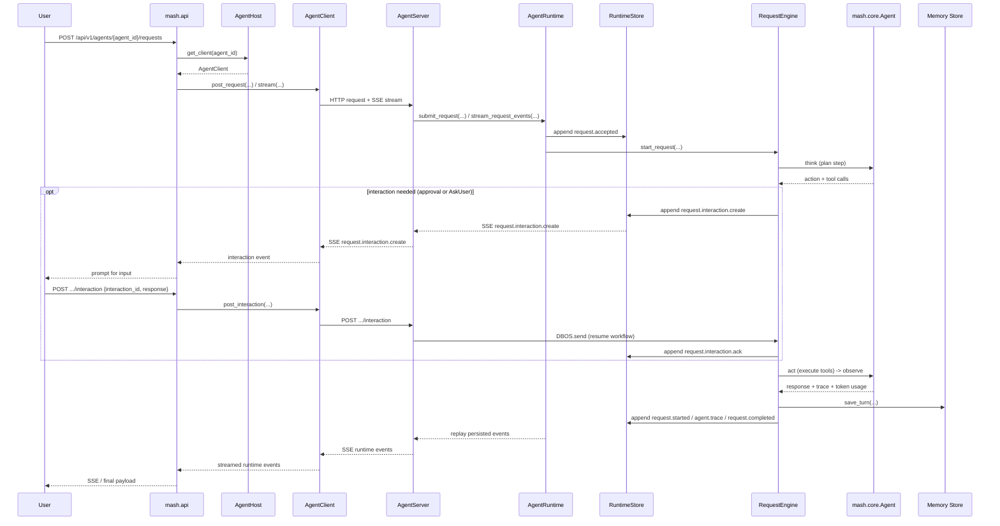

# Runtime

`src/mash/runtime` turns an [`AgentSpec`](./spec.py) into a hosted, request-driven agent runtime.

This package exists to do three jobs cleanly:

- run one agent instance as an addressable service
- preserve request progress as an append-only runtime event log
- delegate request execution to a durable workflow engine

The core design goal is to keep **event sourcing** and **runtime durability** separate.

- **Event sourcing** answers: "What happened during this request, in what order, and how do we replay it?"
- **Runtime durability** answers: "How does work continue safely across retries, restarts, and workflow boundaries?"

Those are related concerns, but they are not the same concern. The package is organized so developers can reason about each boundary independently.

## Public Surface

Import the public API from `mash.runtime`:

- `AgentSpec`: build contract for one agent
- `AgentRuntime`: per-agent execution core
- `AgentServer`: per-agent HTTP/SSE adapter
- `AgentHost`: multi-agent host
- `HostBuilder`: host construction API
- `AgentClient`: client for one addressable runtime
- `SubAgentMetadata`: host-side subagent description type

Everything else under `src/mash/runtime` is internal implementation detail unless a test is explicitly targeting internals.

Workflow task `AgentSpec` objects passed through `HostBuilder.workflow(...)` are
registered as workflow-only runtimes. They can be targeted by `mash.workflows`
tasks but are hidden from public agent listings and subagent delegation.

Related READMEs:

- [`src/mash/workflows/README.md`](../workflows/README.md) — workflow layer,
  including dynamic publishing and per-task structured output.
- [`src/mash/skills/README.md`](../skills/README.md) — agent skills, including
  runtime registration.
- [`src/mash/core/llm/README.md`](../core/llm/README.md) — how provider
  adapters translate a structured-output schema into their native shape.

## Architecture

The runtime is intentionally split into four layers:

1. **Runtime core**
   - `service.py`
   - owns `AgentRuntime`
   - owns runtime state, lifecycle, request bookkeeping, and public runtime operations

2. **Event sourcing**
   - `events/types.py`
   - `events/store.py`
   - defines the append-only runtime event model and the store interface used for replay/streaming

3. **Workflow durability**
   - `engine/protocol.py`
   - `engine/dbos.py`
   - `engine/workflow.py`
   - `engine/steps.py`
   - defines the engine boundary for starting durable requests and the DBOS implementation of that boundary

4. **Supporting internal helpers**
   - `factory.py`
   - `context.py`
   - `requests.py`
   - `turns.py`
   - these are internal modules used by the runtime core and workflow code; they are not alternate public surfaces

## Request Flow

At a high level, a Mash request flows through the host API, into an agent
runtime, through the durable request engine, and back out as replayable runtime
events:



## Event Sourcing vs Durability

### Event Sourcing

Event sourcing in this package means every request is represented as an ordered stream of `RuntimeEvent` records.

The event log is used for:

- SSE replay
- request status reconstruction
- user-visible lifecycle streaming
- inspection/debugging of runtime progress

The event sourcing interface is:

- [`events/types.py`](./events/types.py)
  - `RuntimeEventType`
  - `RuntimeEvent`
- [`events/store.py`](./events/store.py)
  - `RuntimeStore` protocol
  - `PostgresRuntimeStore` implementation

The `RuntimeStore` boundary is intentionally small:

- `append_event(...)`
- `list_events(...)`
- `list_request_events(...)`
- `has_request(...)`
- `is_request_terminal(...)`
- `get_latest_trace(...)`
- `list_recent_traces(...)`

This is the replay/observation boundary. It should not know how a request is executed internally. It only records what happened.

### Runtime Durability

Durability in this package means accepted requests are executed by a workflow engine that can survive retry/restart semantics outside the in-memory `AgentRuntime` object.

The workflow durability interface is:

- [`engine/protocol.py`](./engine/protocol.py)
  - `RequestEngine`
- [`engine/dbos.py`](./engine/dbos.py)
  - `DBOSRequestEngine`
  - DBOS bootstrap and runtime registry
- [`engine/workflow.py`](./engine/workflow.py)
  - request workflow entrypoint and workflow id helpers
- [`engine/steps.py`](./engine/steps.py)
  - durable request steps

The `RequestEngine` boundary is also intentionally small:

- `open()`
- `close()`
- `start_request(...)`

This is the execution/durability boundary. It decides how work starts and resumes. It does not replace the runtime event log.

## Runtime Responsibilities

[`service.py`](./service.py) is the center of the package.

`AgentRuntime` is responsible for:

- owning one agent definition and its configured dependencies
- exposing the public runtime operations used by server/host layers
- coordinating the memory store, runtime event store, and request engine
- configuring subagents and MCP-backed remote tools

`AgentRuntime` intentionally does **not** own:

- in-process request shadow state
- per-session locks or local concurrency controls
- runtime loop binding
- in-memory SSE wakeup queues

`AgentRuntime` is **not** where all implementation logic lives. The goal is:

- `service.py` owns the public runtime surface and mutable state
- helper modules implement focused internal logic
- workflow code can call focused helper modules directly when that is clearer than routing everything back through `AgentRuntime`

Direct runtime usage is explicit:

- hosted paths (`AgentServer`, `AgentHost`) call `open()` during startup
- direct callers should `await runtime.open()` before submitting or streaming requests

## Stores

The runtime keeps two different stores on purpose.

### `memory_store`

Built by `AgentSpec.build_memory_store()`.

This store owns conversation-oriented state:

- saved turns
- signals
- summaries/compaction checkpoints
- logs and search-oriented memory data

This is the store used for conversation history and long-lived agent memory behavior.
By default it uses `MASH_DATABASE_URL` when set, otherwise it falls back
to the per-agent SQLite `state.db` file under `MASH_DATA_DIR`.

Signal definitions are runtime-owned metadata, not persisted rows. Hosted
runtimes expose those definitions from the same collector used during terminal
signal collection so session-signal readers see the exact built-in signal set
the runtime computes.

### `runtime_store`

Built in `service.py` as a `RuntimeStore` implementation.

This store owns request-oriented state:

- accepted request records
- progress events
- started/completed/failed state
- replayable event streams for API clients

This is intentionally append-only and request-scoped.

## File and Module Guide

### Root modules

- [`service.py`](./service.py)
  - `AgentRuntime`
  - runtime lifecycle, owned state, public runtime API
  - includes session history reads, session signal reads, and signal definition reads

- [`factory.py`](./factory.py)
  - builds/configures the in-process `Agent`
  - runtime tool wiring
  - MCP tool wiring
  - subagent tool wiring

- [`context.py`](./context.py)
  - session history loading
  - compaction
  - token accounting
  - context serialization/deserialization
  - action/result payload conversion

- [`requests.py`](./requests.py)
  - request submission helpers
  - polling-based event streaming helpers
  - runtime-event append and public event shaping

- [`turns.py`](./turns.py)
  - one-turn execution helpers
  - think/tool-call execution
  - signal collection
  - turn persistence

- [`server.py`](./server.py)
  - per-agent HTTP/SSE surface

- [`client.py`](./client.py)
  - H2A and in-process clients for request submission, event streaming, and interaction delivery

- [`spec.py`](./spec.py)
  - `AgentSpec` contract

- [`errors.py`](./errors.py)
  - runtime-facing error classification helpers

### `engine/`

- [`engine/protocol.py`](./engine/protocol.py)
  - `RequestEngine` protocol

- [`engine/dbos.py`](./engine/dbos.py)
  - DBOS-backed engine implementation
  - DBOS bootstrap
  - runtime registration for workflow callbacks

- [`engine/workflow.py`](./engine/workflow.py)
  - durable request workflow orchestration

- [`engine/steps.py`](./engine/steps.py)
  - granular workflow step implementations
  - interaction event emission helpers (`emit_interaction_create`, `emit_interaction_ack`)

### `events/`

- [`events/types.py`](./events/types.py)
  - runtime event schema

- [`events/store.py`](./events/store.py)
  - event store protocol and Postgres implementation

### `host/`

- `host/host.py`
  - `AgentHost`
  - in-process runtime composition and lifecycle

- `host/builder.py`
  - `HostBuilder`

- `host/types.py`
  - host registration records and bootstrap session ids

- `host/subagents.py`
  - subagent metadata
  - prompt augmentation helpers

## Request Lifecycle

At a high level, one request flows like this:

1. `AgentServer` receives a request and calls `AgentRuntime.submit_request(...)`.
2. `AgentRuntime` validates the required session id and appends `request.accepted`.
3. `AgentRuntime` delegates execution start to the configured `RequestEngine`.
4. The workflow engine runs durable steps from `engine/workflow.py` and `engine/steps.py`.
5. Those steps load/build context, run think/tool phases, persist turns, and append `RuntimeEvent`s.
6. API clients stream those events from `runtime_store` through polling-backed SSE replay in `server.py`.
7. Terminal state is represented by `request.completed` or `request.error`.

The key point is:

- **workflow durability executes the request**
- **event sourcing records the request**

Neither layer should absorb the other's responsibility.

## Structured Output

Requests can carry a JSON schema (or a Pydantic model) describing the shape
the agent's final response should match. After the agent produces its normal
free-text answer, the runtime makes a second LLM call —
[`finalize_structured_output`](./engine/steps.py) — that asks the model to
"produce the requested structured output for the preceding completed
assistant response. Preserve the answer's facts and do not add new
information." The returned JSON is attached to the response as
`structured_output` alongside the existing `text`, and persisted on the turn
by [`persist_completed_turn`](./engine/steps.py).

### Usage

Pydantic model:

```python
from pydantic import BaseModel

class ChangelogOutput(BaseModel):
    title: str
    commits_scanned: int

response = await runtime.submit_request(
    message="summarize recent commits",
    session_id="s1",
    structured_output=ChangelogOutput,
)
```

JSON schema dict:

```python
response = await runtime.submit_request(
    message="summarize recent commits",
    session_id="s1",
    structured_output={
        "title": "ChangelogOutput",
        "type": "object",
        "properties": {
            "title": {"type": "string"},
            "commits_scanned": {"type": "integer"},
        },
        "required": ["title", "commits_scanned"],
        "additionalProperties": False,
    },
)
```

Both paths go through
[`serialize_structured_output`](./structured_output.py); Pydantic models are
converted via `model_json_schema()`, dicts are passed through unchanged.
Anything else raises `TypeError`.

### Response shape

The structured payload appears alongside `text`:

```json
{
  "response": {
    "text": "I scanned the last five commits.",
    "structured_output": {"title": "Changelog", "commits_scanned": 5}
  }
}
```

### HTTP API

`POST /api/v1/agent/{agent_id}/request` accepts an optional
`structured_output` field on the body. The body must be a JSON-schema dict;
Pydantic models are serialized client-side by
[`src/mash/cli/client.py`](../cli/client.py) before being sent.

```bash
curl -X POST http://127.0.0.1:8000/api/v1/agent/primary/request \
  -H "Authorization: Bearer $MASH_API_KEY" \
  -H "Content-Type: application/json" \
  -d '{
    "message": "summarize recent commits",
    "session_id": "s1",
    "structured_output": {
      "title": "ChangelogOutput",
      "type": "object",
      "properties": {
        "title": {"type": "string"},
        "commits_scanned": {"type": "integer"}
      },
      "required": ["title", "commits_scanned"],
      "additionalProperties": false
    }
  }'
```

An invalid `structured_output` payload returns `400
INVALID_STRUCTURED_OUTPUT`.

### Per-task structured output

`WorkflowSpec` tasks can attach their own per-task schema. See
[`src/mash/workflows/README.md`](../workflows/README.md) (Per-Task Structured
Output) for the workflow-level usage and how task state derives from the
returned JSON.

## Interactions

Interactions allow an agent to pause mid-execution and request information or approval from the host before continuing. This supports human-in-the-loop workflows where tool execution requires explicit user consent, or the agent needs clarification.

### Interaction Types

| Type | Schema | Response shape |
|------|--------|----------------|
| `approval` | `{ "type": "enum", "options": ["approve", "deny", "skip"] }` | One of the enum values |
| `info` | `{ "type": "text" }` | Free-form string |
| `choice` | `{ "type": "multi_select", "options": [...] }` | Array of selected options |

### How Interactions Work

1. During the workflow loop, after `plan_request_step`, if the action payload contains an `interaction` field, the workflow initiates an interaction.
2. The workflow emits a `runtime.interaction.create` event (visible on SSE as `request.interaction.create`).
3. The workflow calls `DBOS.recv(interaction_id, timeout_seconds=...)` — this durably blocks execution.
4. The host delivers the user's response via `post_interaction` on the client, which calls `DBOS.send(workflow_id, response, topic=interaction_id)`.
5. The workflow resumes, emits `runtime.interaction.ack`, and continues to tool execution.

### Durability

Interactions use DBOS `recv`/`send` for durable blocking. If the process restarts while waiting for a response, the workflow automatically resumes at the same `recv` point. This enables interactions that span hours or days.

### Timeout Defaults

If no response arrives within `timeout_seconds`:
- `approval` → defaults to `"deny"`
- `info` → defaults to `""`
- `choice` → defaults to `[]`

### Client Operation

Both `AgentClient` (HTTP) and `InProcessAgentClient` expose `post_interaction(request_id, *, interaction_id, response)`. The HTTP client POSTs to `/agent/{agent_id}/request/{request_id}/interaction`. The in-process client calls `DBOS.send()` directly.

## Important Interfaces

### Runtime event interface

Use this when you need to change request replay/streaming behavior:

- `RuntimeEventType`
- `RuntimeEvent`
- `RuntimeStore`
- `PostgresRuntimeStore`

Questions that belong here:

- Do we need a new request lifecycle event?
- How should replay ordering or dedupe work?
- What should SSE clients be able to reconstruct from stored events?

### Request engine interface

Use this when you need to change how durable work is started or resumed:

- `RequestEngine`
- `DBOSRequestEngine`
- DBOS workflow registration/execution helpers

Questions that belong here:

- How is a request started durably?
- How are retries/resumptions handled?
- How do workflow ids map to request ids?

## Design Rules

These rules should keep the package understandable over time.

- `AgentRuntime` is the per-agent execution core.
- `AgentServer` is the per-agent transport wrapper.
- `AgentHost` is multi-agent composition and lifecycle.
- `RuntimeStore` is the append-only runtime event log boundary.
- `RequestEngine` is the workflow durability boundary.
- `memory_store` and `runtime_store` stay separate.
- Helper modules stay focused; they should not become a second public API.
- Event sourcing changes should usually land under `events/` or `requests.py`.
- Workflow durability changes should usually land under `engine/`.

## When Editing This Package

If you are making a change, ask first which boundary you are changing:

- **Agent behavior/configuration?**
  - start with `spec.py`, `factory.py`, or `context.py`

- **Request replay or streaming semantics?**
  - start with `events/` and `requests.py`

- **Durable execution semantics?**
  - start with `engine/`

- **HTTP/SSE contract?**
  - start with `server.py` or `client.py`

- **Multi-agent composition?**
  - start with `host/`

That separation is the point of this package layout.
