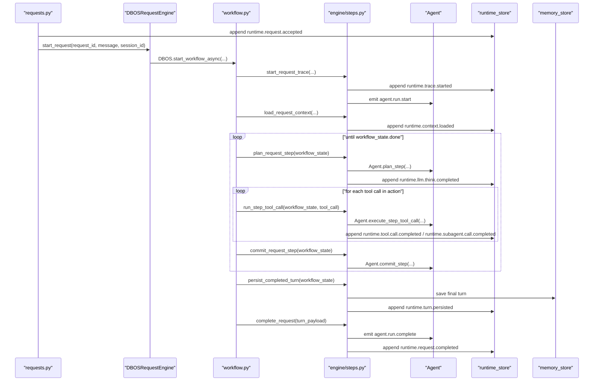

# Engine

`src/mash/runtime/engine` is the workflow-durability layer for hosted runtime execution.

Its job is narrow:

- start one durable workflow per accepted request
- resume that request safely across process failure or restart
- keep durability separate from both:
  - the core loop in [`src/mash/core/agent.py`](../../core/agent.py)
  - the append-only request event log in [`../events/`](../events)

The design rule is:

- **`Agent` owns loop semantics**
- **DBOS owns continuation and resume**
- **`runtime_store` owns observable request progress**

## What A DBOS Workflow Means Here

One DBOS workflow instance executes one accepted runtime request for one `(agent_id, request_id)` pair.

- registered workflow name: `mash.runtime.execute_request`
- workflow id: `"{agent_id}:{request_id}"`
- registration happens once in [`dbos.py`](./dbos.py)
- the workflow entrypoint is [`execute_request_workflow(...)`](./workflow.py)

The workflow does **not** call `Agent.run(...)` directly. It checkpoints progress around canonical agent-step boundaries.

## Files In This Layer

- [`protocol.py`](./protocol.py)
  - defines the `RequestEngine` interface
- [`dbos.py`](./dbos.py)
  - boots DBOS
  - registers live runtimes
  - registers the workflow
  - starts workflow instances
- [`workflow.py`](./workflow.py)
  - sequences DBOS boundaries and loop control
- [`steps.py`](./steps.py)
  - contains both:
    - DBOS-facing workflow entrypoints
    - runtime-side state transitions and turn persistence helpers

There is no separate runtime adapter file anymore. The engine implementation lives in `workflow.py` and `steps.py`.

## Where Workflow Start Fits In The Request Lifecycle

One boundary stays explicit:

- `runtime.request.accepted` is appended **before** the DBOS workflow starts
- durable execution begins only when the engine starts the workflow

The sequence is:

1. [`../requests.py`](../requests.py) creates `request_id`.
2. [`../requests.py`](../requests.py) appends `runtime.request.accepted`.
3. [`../requests.py`](../requests.py) calls `self.engine.start_request(...)`.
4. [`DBOSRequestEngine.start_request(...)`](./dbos.py) ensures DBOS is initialized and the workflow is registered.
5. [`DBOSRequestEngine.start_request(...)`](./dbos.py) sets the workflow id with `SetWorkflowID(...)`.
6. [`DBOSRequestEngine.start_request(...)`](./dbos.py) calls `DBOS.start_workflow_async(...)`.
7. DBOS invokes the registered workflow wrapper, which calls [`execute_request_workflow(...)`](./workflow.py).

## Why The Workflow Does Not Call `Agent.run(...)`

[`Agent.run(...)`](../../core/agent.py) is the full in-memory turn loop.

If the DBOS workflow called `run()` directly:

- a crash mid-turn would replay the whole turn
- already-completed tool calls could run again
- there would be no mid-turn resume point

Instead, the workflow checkpoints around canonical step primitives:

- `Agent.plan_step(...)`
- `Agent.execute_step_tool_call(...)`
- `Agent.commit_step(...)`

## How DBOS Is Bootstrapped

[`dbos.py`](./dbos.py) is responsible for runtime initialization:

- `ensure_dbos_ready(database_url)` validates `MASH_DATABASE_URL`
- DBOS is initialized with the shared Mash system database config
- `register_workflow(...)` installs the workflow once
- `DBOS.launch()` activates the runtime
- live `AgentRuntime` objects are stored in `_STATE.runtime_registry`
- workflow steps recover the current runtime via `require_runtime(agent_id)`

Important nuance:

- the workflow is durable
- the runtime object is still resolved from the local runtime registry
- DBOS is not the source of truth for agent configuration or memory stores

## Workflow Inputs And IDs

Workflow inputs:

- `agent_id`
- `request_id`
- `message`
- `session_id`
- `request_metadata`

Important ids:

- `request_id`: request lifecycle id
- `workflow_id`: DBOS instance id, built from `agent_id:request_id`
- `trace_id`: per-run trace id created in `start_request_trace(...)`
- `session_id`: conversation/session id used for history lookup and turn persistence

## Durable Workflow State

After `load_request_context(...)`, the workflow carries one durable state object between DBOS steps:

- `context`
  - serialized `Context`
- `compaction`
  - compaction metadata from context loading
- `loop_index`
  - current agent step index
- `aggregate_usage`
  - accumulated token usage across think phases
- `tool_usage`
  - accumulated per-tool token and invocation usage
- `action`
  - the current planned action payload
- `result_payloads`
  - completed tool results for the current step
- `signals`
  - final collected signals once the run becomes terminal
- `done`
  - whether the agent context has reached terminal completion

This state lives in workflow execution only. It is **not** written to the memory store as partial turns.

## Step-By-Step Workflow Execution

### 1. `request.start`

Implemented by `start_request_trace(...)`.

This step:

- creates `trace_id`
- appends `runtime.trace.started`
- emits `agent.run.start`

### 2. `context.load`

Implemented by `load_request_context(...)`.

This step:

- loads conversation history
- may compact the session first
- builds the initial serialized `Context`
- initializes durable workflow state
- appends `runtime.context.loaded`

### 3. `step.plan.<loop_index>`

Implemented by `plan_request_step(...)`.

This step:

- deserializes the current context
- builds a request-scoped agent
- calls `Agent.plan_step(...)`
- updates workflow state with:
  - the new serialized context
  - the current action payload
  - token usage deltas
  - merged tool usage
- appends `runtime.llm.think.completed`

Important behavior:

- assistant output is already reflected in the serialized context before the step returns
- this step does **not** enable DBOS automatic retries

### 4. `tool.call.<loop_index>.<call_index>`

Implemented by `run_step_tool_call(...)`.

This step:

- runs exactly one tool call through `Agent.execute_step_tool_call(...)`
- appends the result payload to workflow state
- updates tool usage in workflow state
- appends:
  - `runtime.tool.call.completed`, or
  - `runtime.subagent.call.completed`

Important behavior:

- tool calls run in order
- completed results remain in `result_payloads`, so already-finished tool calls in the current step are not rerun after resume
- this step does **not** enable DBOS automatic retries

### 5. `step.commit.<loop_index>`

Implemented by `commit_request_step(...)`.

This step is the core commit boundary. It calls `Agent.commit_step(...)`.

This step decides:

- whether `finish` marks the run complete
- whether tool results should be observed back into context
- whether max-step exhaustion should force completion
- when signals are collected

It returns the next workflow state with:

- updated serialized context
- next `loop_index`
- final `signals` if terminal
- cleared `action` and `result_payloads`
- `done`

This is the only place in the workflow that decides whether execution should continue.

### 6. `turn.persist`

Implemented by `persist_completed_turn(...)`.

This step runs only once the workflow is terminal.

It:

- reconstructs the final response from the completed context
- attaches aggregate token usage and trace metadata
- persists the final turn to the memory store
- appends `runtime.turn.persisted`

Important nuance:

- intermediate steps are never persisted as conversation turns
- only the final completed turn is written to long-term conversation memory

### 7. `request.complete`

Implemented by `complete_request(...)`.

This step:

- emits `agent.run.complete`
- appends `runtime.request.completed`

### 8. `request.fail`

Implemented by `fail_request(...)`.

This step:

- records terminal failure as `runtime.request.failed`
- preserves the request error contract

## Sequence Diagram

## Main Loop

At a high level, the workflow runs:

1. start request
2. load context
3. plan one canonical agent step
4. run each tool call for that step durably, in order
5. commit that step
6. if not done, repeat
7. once done, persist the final turn
8. complete request

This is a durable `plan -> tool calls -> commit` loop wrapped around the canonical core agent semantics.

## Relationship To Event Sourcing

The DBOS workflow is not the user-facing event stream.

- DBOS workflow state tracks execution progress for resume
- `runtime_store` records the observable request timeline
- workflow steps append `RuntimeEvent` records as execution proceeds

Typical successful event order:

1. `runtime.request.accepted`
2. `runtime.trace.started`
3. `runtime.context.loaded`
4. one or more `runtime.llm.think.completed`
5. zero or more `runtime.tool.call.completed` / `runtime.subagent.call.completed`
6. `runtime.turn.persisted`
7. `runtime.request.completed`

## Design Rules For Future Edits

- If you need to change loop semantics, start in [`src/mash/core/agent.py`](../../core/agent.py).
- If you need to change durable progression or resume boundaries, start in [`workflow.py`](./workflow.py) and [`steps.py`](./steps.py).
- If you need to change request streaming or replay semantics, start in [`../requests.py`](../requests.py) and [`../events/`](../events).
- Do not move partial turn persistence into the memory store.
- Do not let `workflow.py` grow runtime-state patching helpers that belong in `steps.py`.
- Do not reintroduce a second adapter layer unless there is a real new boundary to justify it.
